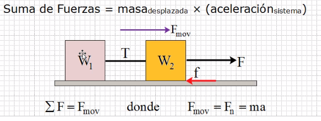
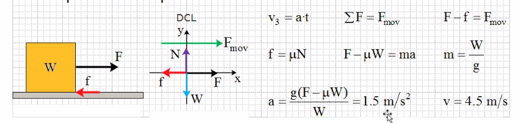

# ¿Qué es la fuerza?
> La fuerza puede estar relacionada con la energía, pero cada una es diferente

- La fuerza es la interacción de dos o mas cuerpos
- **Vector :** la acción de empujar. arrastrar, jalar, soportar, etc. tiene **magnitud, dirección y sentido.**

**Rugosidad**: al pasar un objeto se genera una resistencia generando fuerza de fricción, *todo material es rugoso a menos que este bien pulido*

A la representaciónm de fuerzas en el plano coordenado se le llama **Diagrama de Cuerpo Libre**

- La fuerza mínima para levantar un objeto, es proporcional al peso.
- La fuerza para desplazar un objeto sobre un asuperficie, es proporcional al peso más las fuerzas que se opongan

### Trazar diagrama de cuerpo libre
1. Trazar un eje de coordenadas sobre los objetos
2. Girar el sistema de modo que la mayor parte quedé alineada ya sea con eje x o eje y
3. Retiro objetos y dejo solamente vectores

### Posición normal de triangulo rectangulo
El cateto adyacente se alinea al eje x (coseno) y el cateto opuesto corresponde con eje y (seno)

# Fuerza y equilibro

La fuerza aplicada ocasiona mantener el equilibnrio o el no equilibro, tanto en sólidos como en fluidos. El estado de equilibro se da en el movimiento y no movimiento (estático)

> La fuerza o mueve el estado de resposo o lo mantiene

### Equilibrio en movimiento

La suma de fierzas en el desplazamiento están bajo la acción de una misma aceleración y cambio de velocidad.

#### Ejemplo

Imagina que no hay aceleración, esto provoca que 

Suma de fuerzas = masa(desplazada) x aceleración (sistema) |
--- |
Suma de fuerzas = n gramos x 0 m/s2 |
Suma de fuerzas = 0 N |

Por lo que las fuerzas estarían en equilibrio y el cuerpo en reposo

#### Ejemplo en una velocidad constante

#### Ejercicio 

- Un kp es un kilogramo fuerza o kilopondio, ejemplo de la vida es la presión en las llantas. Equivale a 9.81N a nivel del mar, se redondea a 10N por lo que **1kp=10N** 
- Presión: Fuerza sobre unidad de área
- EL coeficiente de rugosidad es µ, su valor va de 0 a 1.
- aceleración = v(final) - v(inicial) / tiempo
- se considera que la velocidad inicial es igual a 0 por lo que *a = vf/t y vf=at*
- fuerza de fricción en horizontal. f = µN
> En horizontal el peso es igual a la normal pero no cuando se encuentra en un ángulo 
- masa. m = W/g

v3= velocidad 3 segundos
a= aceleración
f= fuerza de fricción
µ= coeficiente de rugosidad
W= Peso
g= gravedad