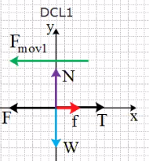
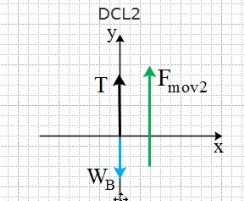
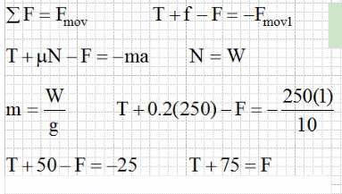
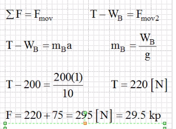

### Resolución del problema anterior

1. Trazar diagramas

> Diagrama 1

> Diagrama 2

2. Escribir ecuaciones a partir de los diagamas

> Diagrama 1

> Diagrama 2

> Con este profe casi todo se redondea, por ejemplo, la gravedad es 9.81 m/s2 pero la redondea a 10 m/s2