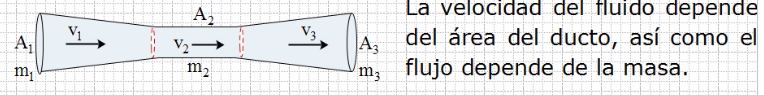
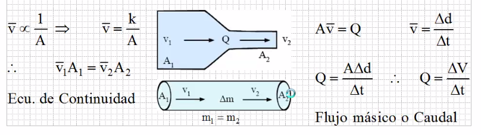
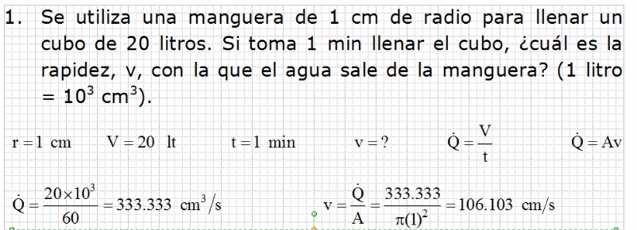
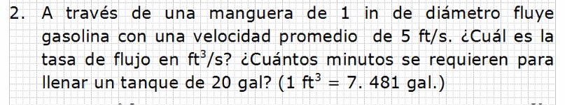

### Resolución del problema anterior

1. Trazar diagramas

> Diagrama 1

> Diagrama 2

2. Escribir ecuaciones a partir de los diagamas

> Diagrama 1

- La T siempre representa tensión, una manifestación de fuerza.
- La F mov es el resultado de la suma de fuerza, es la fuerza neta.
- El W y N son manifestaciones de fuerza.
- La fuerza normal es la que responde a un estimulo, en este caso el peso.
- En el resultado nos falta una variable, para obtenerla se tiene que resolver el segundo diagrama.

> Diagrama 2

### Fluidos de movimiento

Lo líquidoes en movimiento tienen su equilibrio cuando el flujo (caudal=Q) o la suma de todas las enerías que actúán debe ser constante

### Ecuación de continuidad y caudal

Para la dinámica de un fluido ideal, se considera como: flujo uniforme, irrotacional, no viscoso e incomprensible.

- A mayor area, menor velocidad.
- El caudal es la cantidad de volumen que pasa en un cierto tiempo.

### Ejercicio 1

# Tarea

