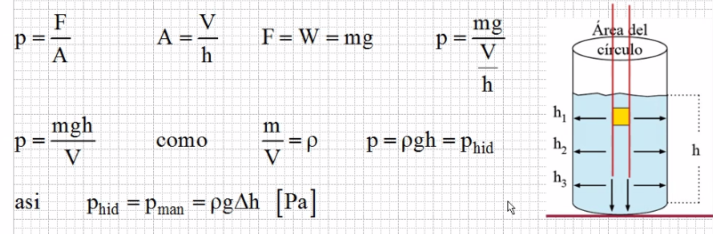
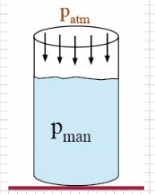
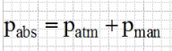
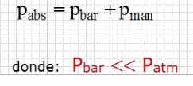
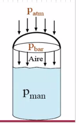
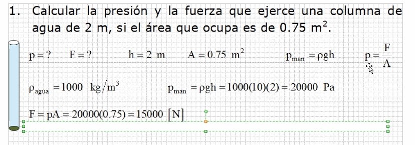
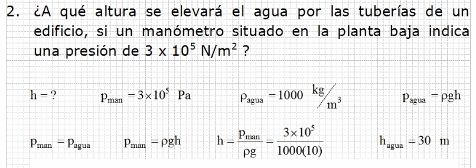
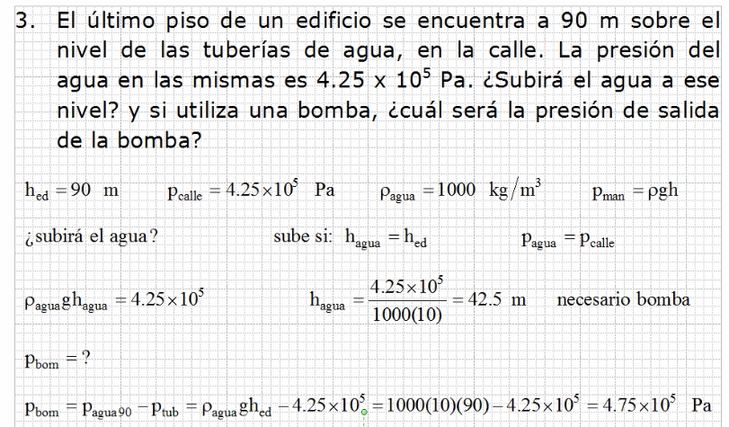

> El examen va a ser el 24 de septiembre, la hora aún esta por decidir

### Fuerza y Presión

> la p en realidad representa a la letra griega ro

La fuerza que ejerce un objeto en reposo que esta soportado en una superficie,su peso provoca una presion sólo en el área de contacto y recibe el nombre de presión.

Propiedades de los cuerpos regulares |
--- | 
Área = A = lado x lado = ancho x largo = a * b [m²] |
Volumen = V = ancho x largo x altura = a * b * h = A * h [m³] |
Densidad = p = masa / volumen = m / V [kg/m³] |
Densidad relativa = ð = p(sustancia) / p(agua) [adimensional]

La presión que ejerce un líquido sobre cualquier punto u objeto, se le llama presión hidrostática (p(hid)) o manométrica (p(man)).

#### La presión total o absoluta para un deposito abierto es:

 | 
--- | ---

> La presión atmosférica al nivel del mar es de 760 mmhH (milimetros de mercurio)

#### El deposito cerrado, el aire encerrado ejerce una presión llamada barométrica y la presión absoluta es:

 | 
--- | ---

#### Ejercicio 1 

#### Ejercicio 2

#### Ejercicio 3

## Notas sobre el classroom

Solo un integrante por equipo se mete al classroom, y este es el que junta todos los archivos de los integrantes para entregarlo.