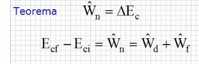
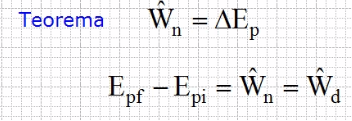
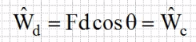
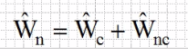
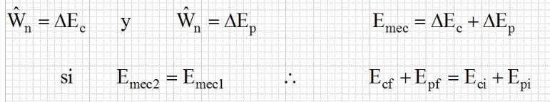
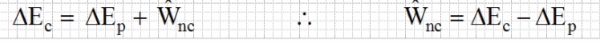
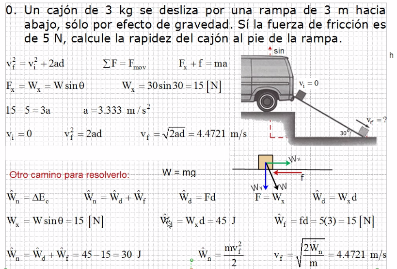
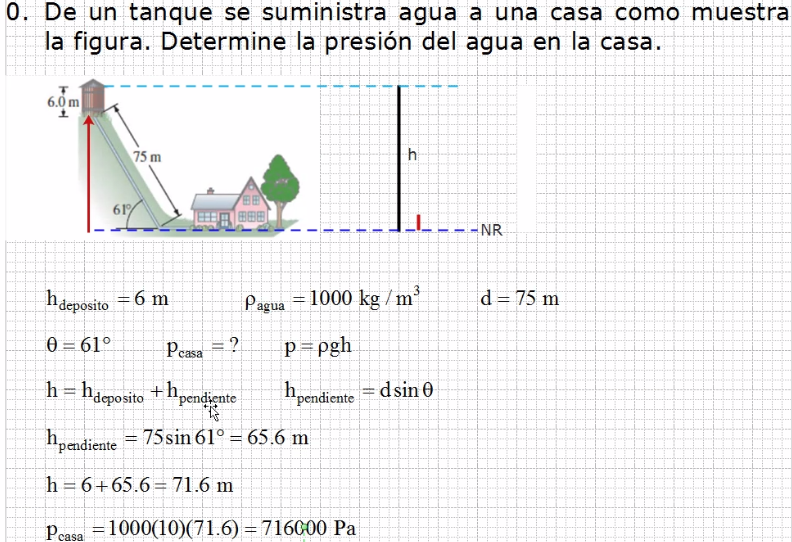

### Teorema de trabajo y energía

Este efecto físico de transformación de trabajo a energía cinetica o energía potencial, se conoce com oel teorema del trabajo y energía.

    El trabajo neto es igual a la suma de la energía cinética

> En el curso el trabajo se va a representar con W mayuscula con "gorro"

> Todo el trabajo que se genere, va a ser igual a la energíá que se manifieste

Fuerza conservativa | Fuerza no conservativa
--- | ---
 | 

- "Wd" es trabajo de desplazamiento
- Si existe fuerza de fricción, es fuerza conservativa

El trabajo neto o total, es la suma tanto de la fuerza conservativa (positiva) con la fuerza no conservativa (negativa) se expresa como:

### Conservación de la energía mecánica

El trabajo neto realizado en un sistema, bajo la aplicación de fuerzas conservativas es equivalente a la energía mecánica del sistema (E mec ) es decir:

> La energía cinética se transformna en energía potencial, y la energía mecánica es la suma de ambas fuerzas

Este efecto físico se conoce como la concervación de la energía Mecánica (CEM = Emec) del sistema.

Bajo fuerzas no conservativas, se deduce que el trabajo no conservativo es igual al cambio de la energía mecánica del sistema 

#### Ejercicio 1

    ¿Seno o coseno?

    El triangulo normal es el que se mide respecto al eje x.  Cuando un triangulo se mide respecto a "X", le corresponde un seno, si es medido respecto a "Y" se mide con el coseno.

[más_info](https://github.com/ENP-605/notas/blob/main/Fisica/2021-08-10-Fuerza%20y%20sus%20manifestaciones.md#posici%C3%B3n-normal-de-triangulo-rectangulo)

#### Ejercicio 2

