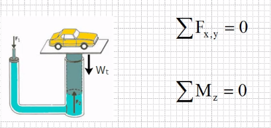
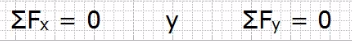
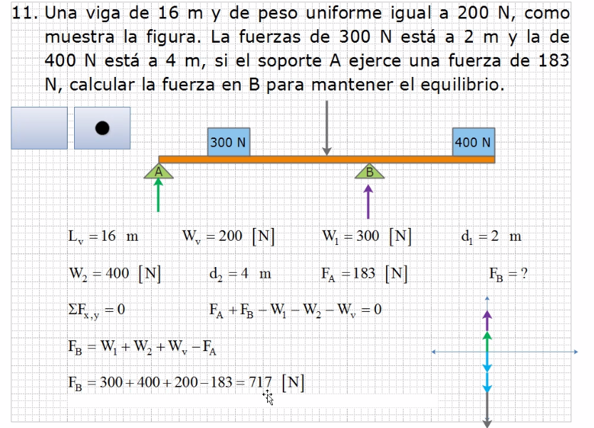
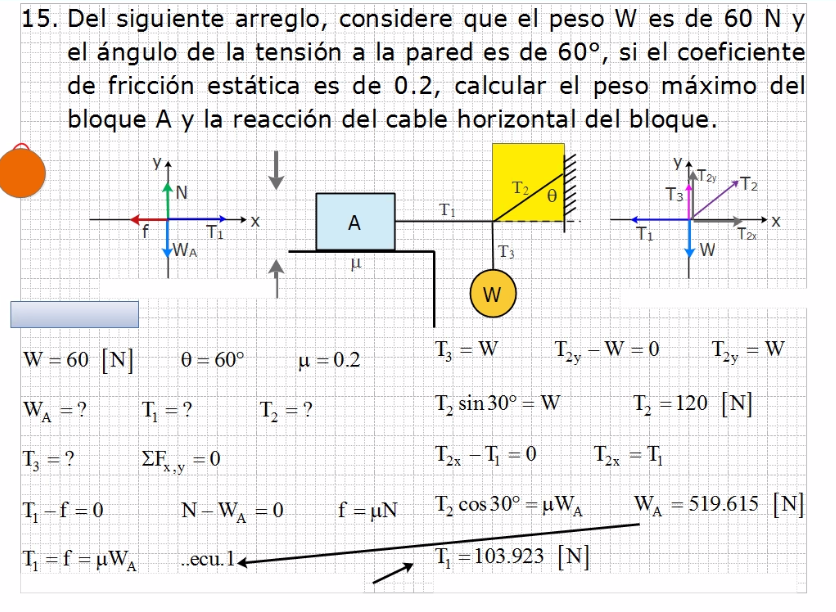
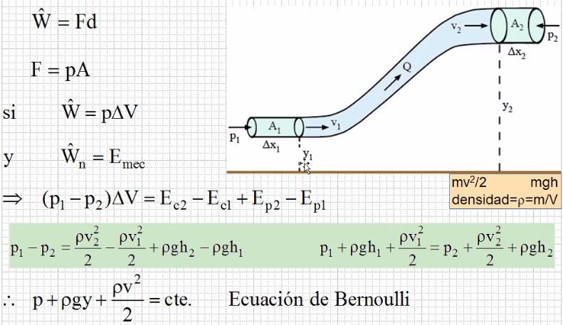
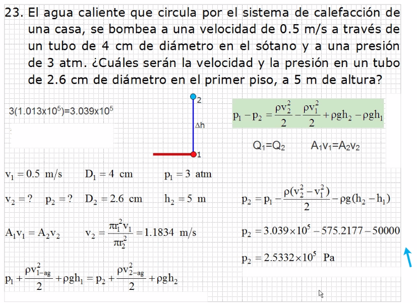

### Equilibrio en no movimiento

Cuando la suma de fuerzas que actúan sobre un objeto es cer, lo provoca un estado de reposo tanto horizontal como vertical de firo, teniendo entonces como equilibrio estático, así

#### Primera condición de la estática

La suma de fuerzas hoirizontales y verticales que actúan sobre un objeto debe ser igual a cero, para provocarle un equilibrio estático teniendo

###### Ejercicio 1

###### Ejercicio 2

Todas las fuerzas que sean diagonales tienen componente equis y componente

> Para que el triangulo se encuentre en psición normal, debe estar medido respecto al eje x

#### Principio de Bernoulli

El trabajo neto realizado en el desplazamiento de un fluido, es igual a la energíá total mecánica del sistema, es decir:

###### Ejercicio 1

###### Ejercicio 2

