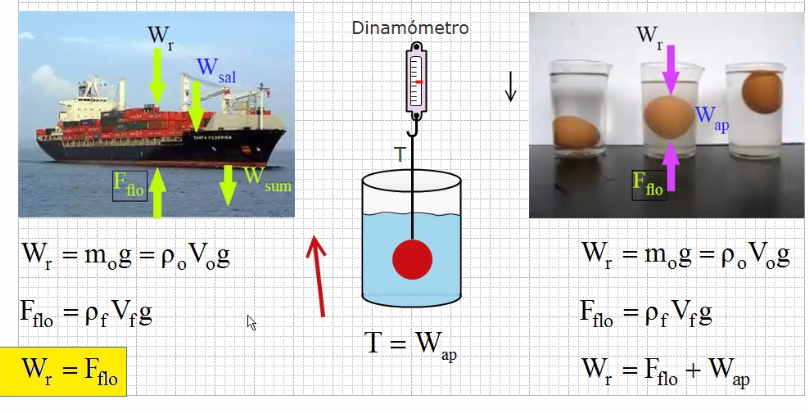
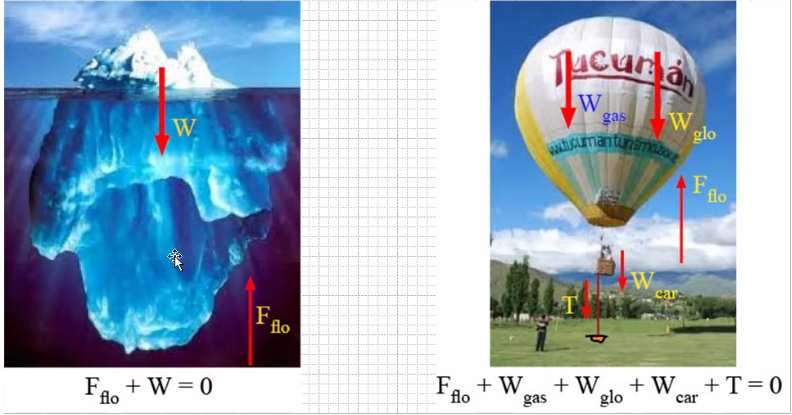
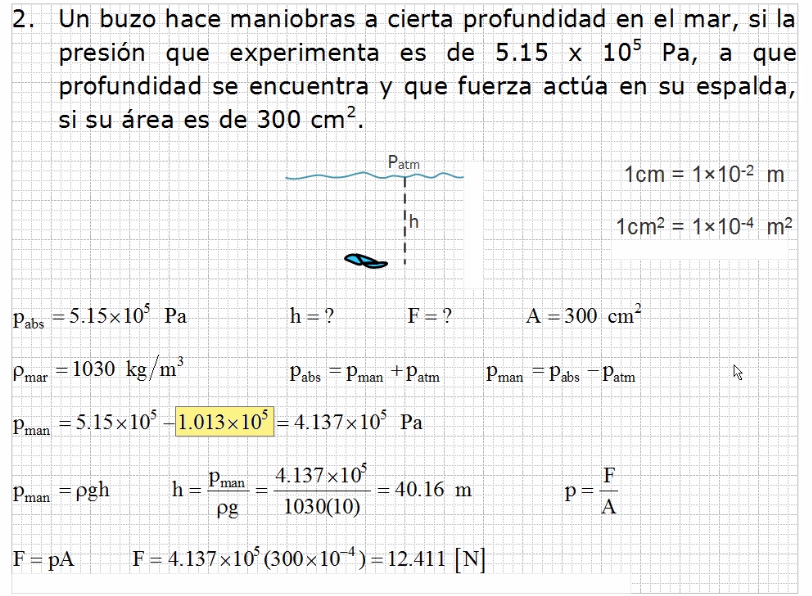
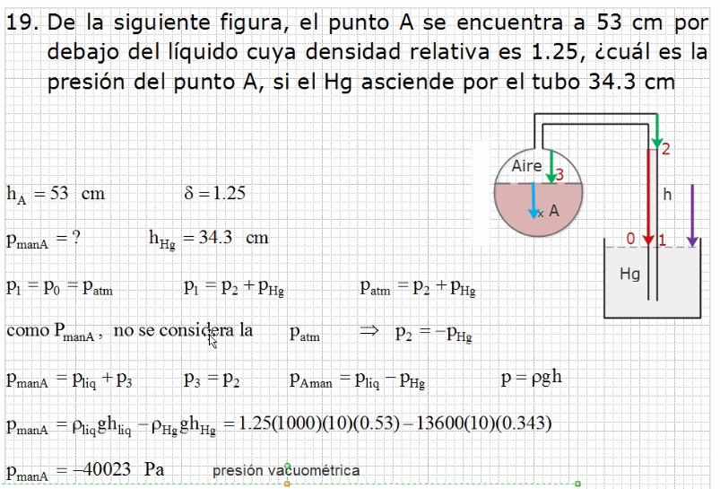
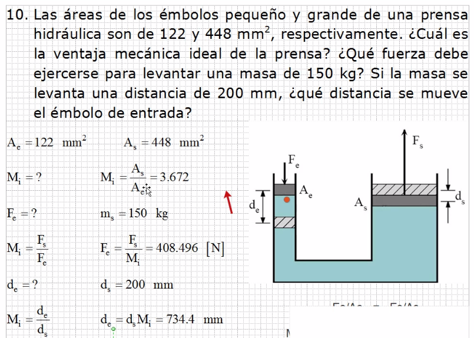
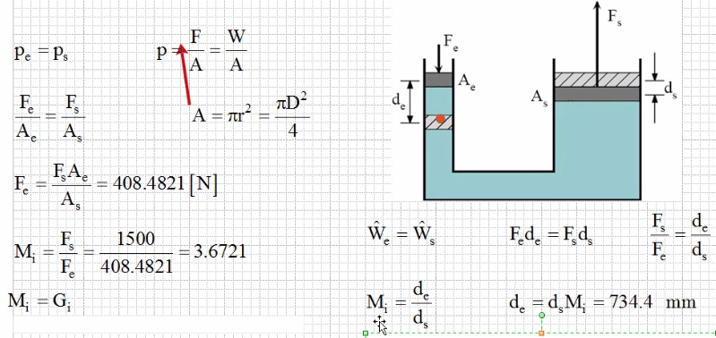

### Equilibrio y flotación

Ub objeto sumergido parcial o totalmente (FLotación) es un fluido, experimenta un equilibrio de fierzas donde la fuerza neta que actúa en el equilibrio se llama fuerza de flotación(F flo) (Principio de arquimedes), teniendo:

> Hundido es hasta el fondo y sumergido es solo cubierto por agua

- La fuerza de flotación solo considera al volumen del cuerpo sumergida en el líquido
- El equilibrio se da entre los líquidos, sólidosy gases, donde la suma de todas las fuerzas debe ser cero.

###### Ejercicio 1

###### Ejercicio 2

###### Ejercicio 3

 

otra respuesta 

La ventaja mecánica habla de la eficiencia de la máquina, la relación entre salida y entrada.