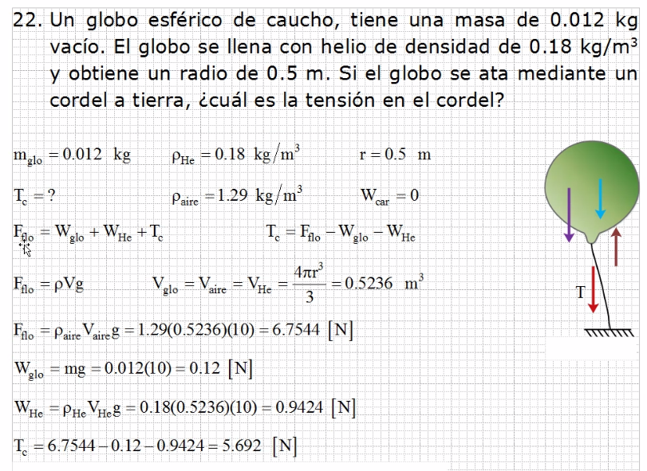
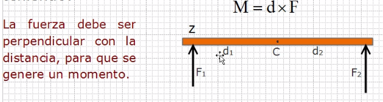
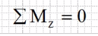
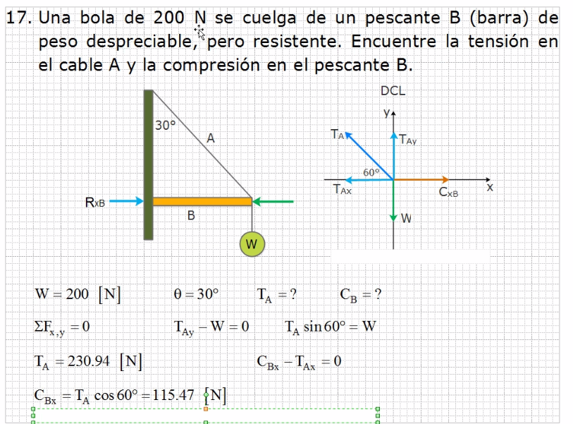
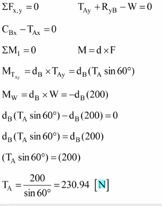

###### Ejercicio 6

## Segunda condición de la Estática

La fuerza que hace girar un objeto, le provoca un movimiento de torisón, que es igual a la distancia por la fuerza aplicada

- M = momento de la fuerza
- d = distancia
- F = fuerza

**Condiciones:**
- Toda fuerza aplicada en un sistema para obtener el momento de torsión debe ser perpendicular a la distancia.
- Toda fuerza que pase por el punto seleccionado, no produce momento por que no tiene distancia.
- Si una fuerza horizontal pasa por el punto seleccionado, no produce momento pues no es perpendicular.
- Si aplico una fuerza en posición inclinada, esta cuenta con componente tanto en el eje x como en y, por lo que solo tendría momento la perpendicular.

El movimiento es positivo si se hace un giro anti horario

El movimiento es negativo si se hace un giro horario

> Los valores pueden cambiar pero si se cambia debe de hacerse en todo el sistema

Para mantener su equilibrio estático, la suma de los momentos con respecto a un punto de referencia debe ser igual a cero, es decir:

###### Ejercicio 1

> En los traingulos al eje x se le asignan cosenos y al ejey y senos

Calculando por medio de momentos es

