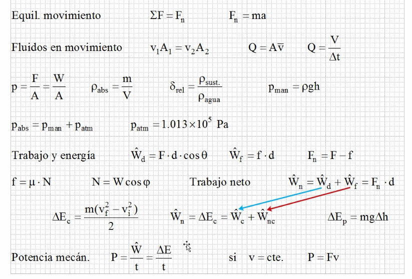
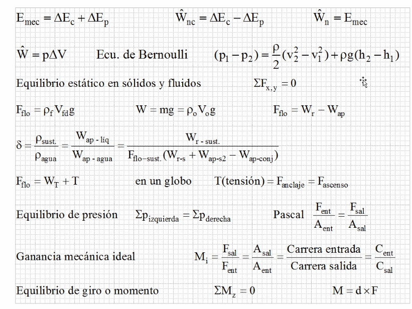
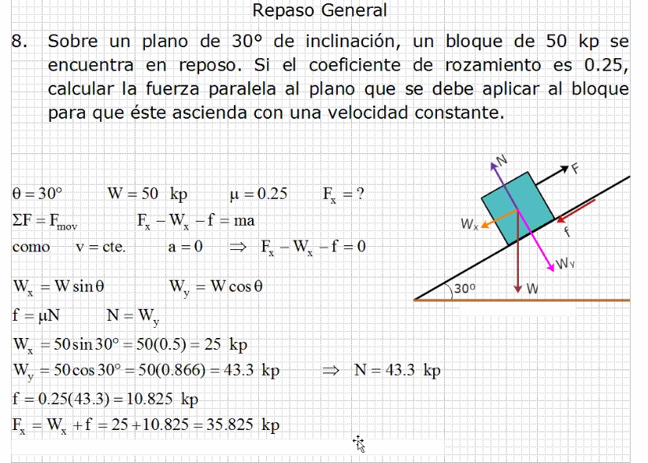
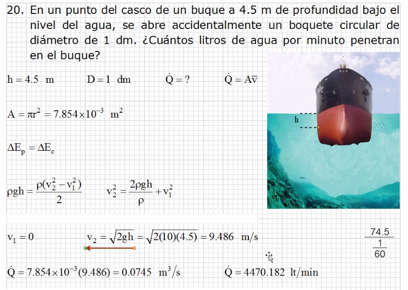
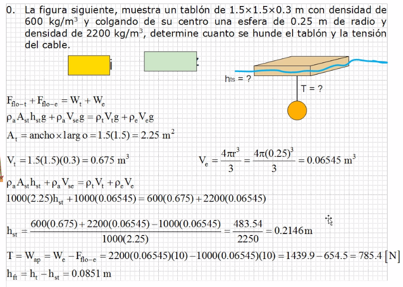

    W(peso) = m(masa)g(gravedad) = p(densidad)V(volumen)g(gravedad)

## Resumen de Equilibrio de Sólidos - Líquidos

###### Ejercicio 1

###### Ejercicio 2

###### Ejercicio 3

### Notas para el examen

- gravedad, g=10
- pi, no se quita decimal, es 3.1416
- Se trabajan 4 decimales.

### Que series hacer para repasar

Estatica, presión, flotación, hidrodinamica, diversos.