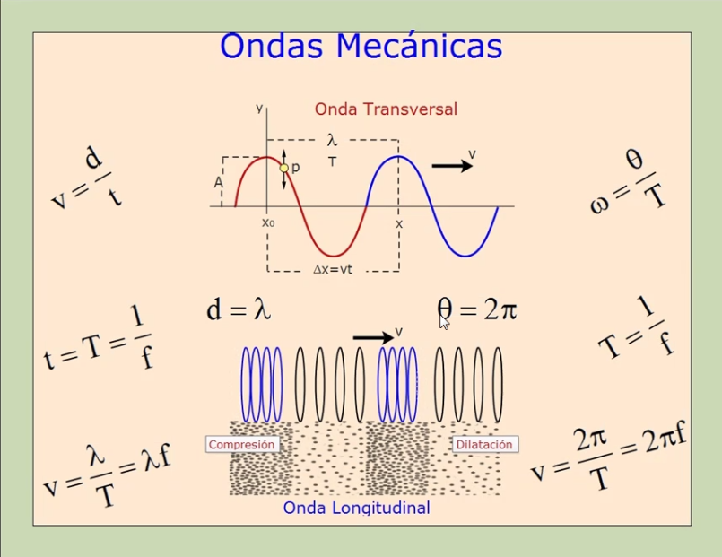
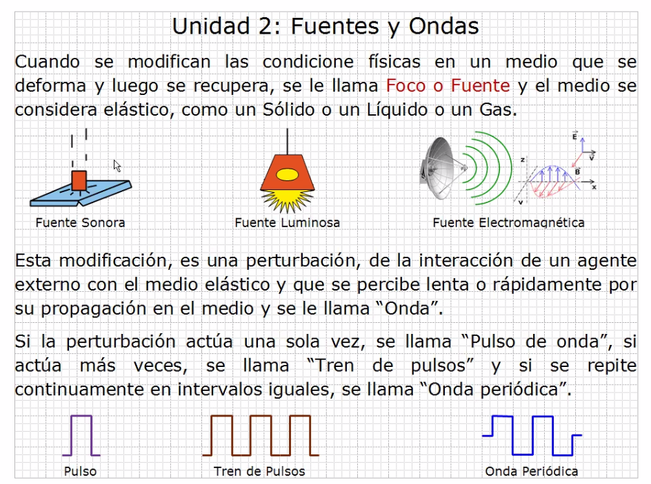
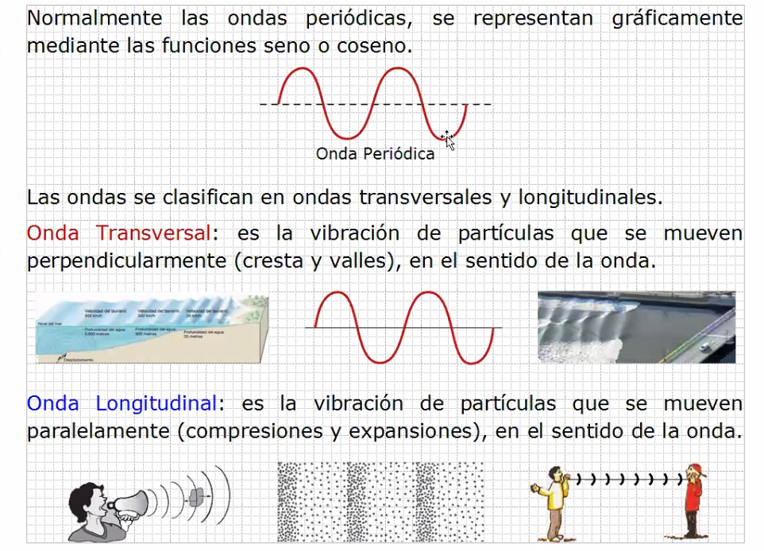
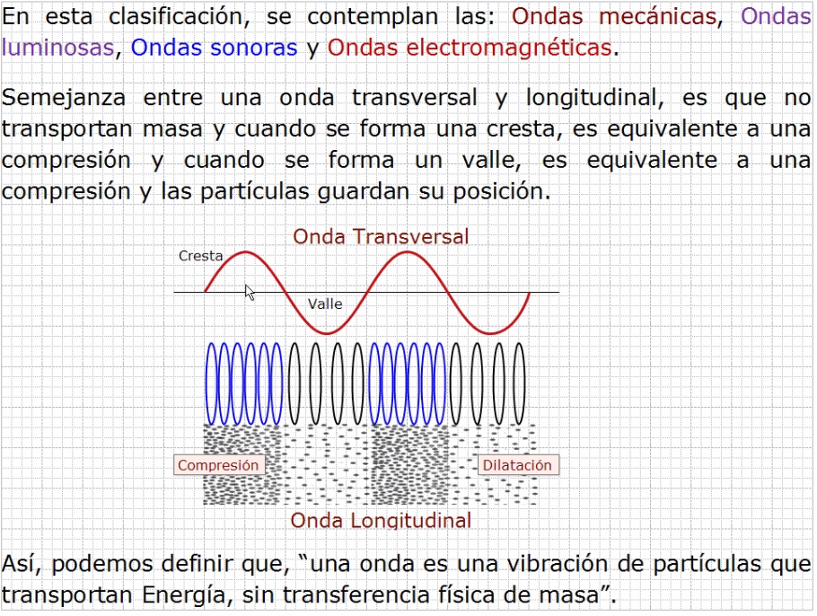

## Ondas

> Examen entre el 19 y 26 de noviembre

### Fuentes y ondas

- Las ondas transversales solo suben y bajan pero no se desplazan.
- Las ondas logitudinales se comprimen y dilatan pero no se mueven.

**Una onda es una vibración de partículas que transportan energía, sin transferencia física de masa.**