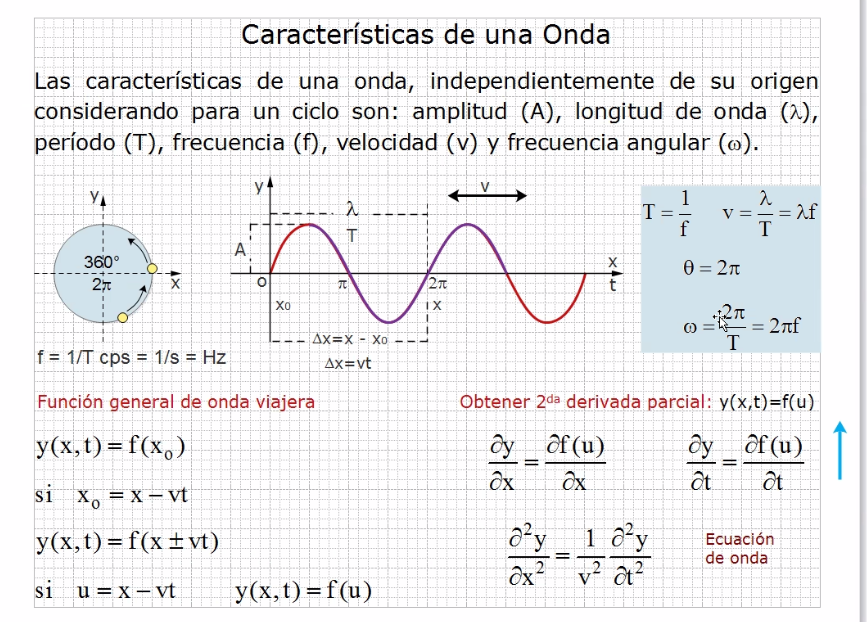
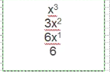
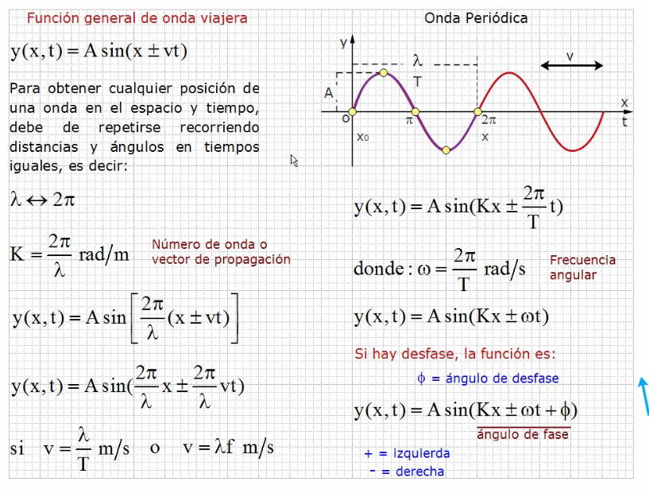
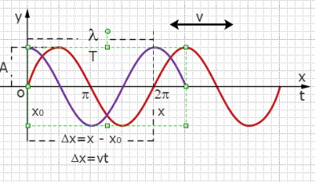
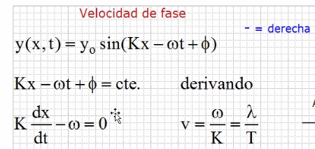
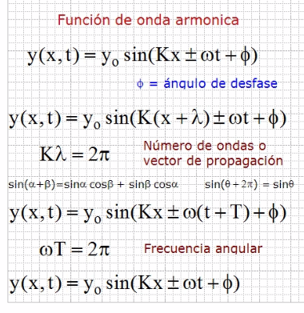
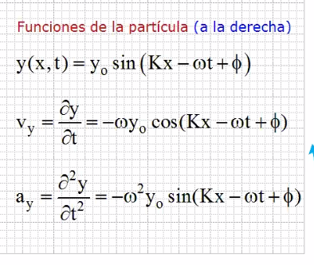
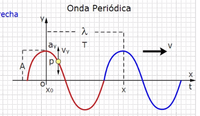
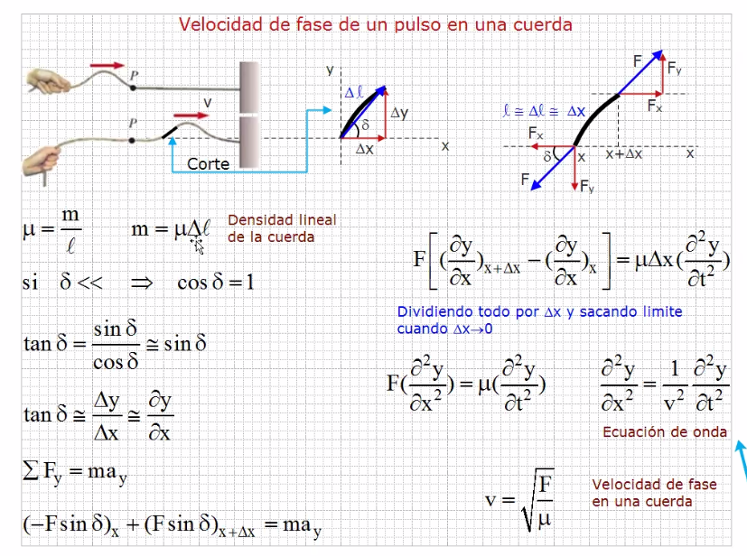
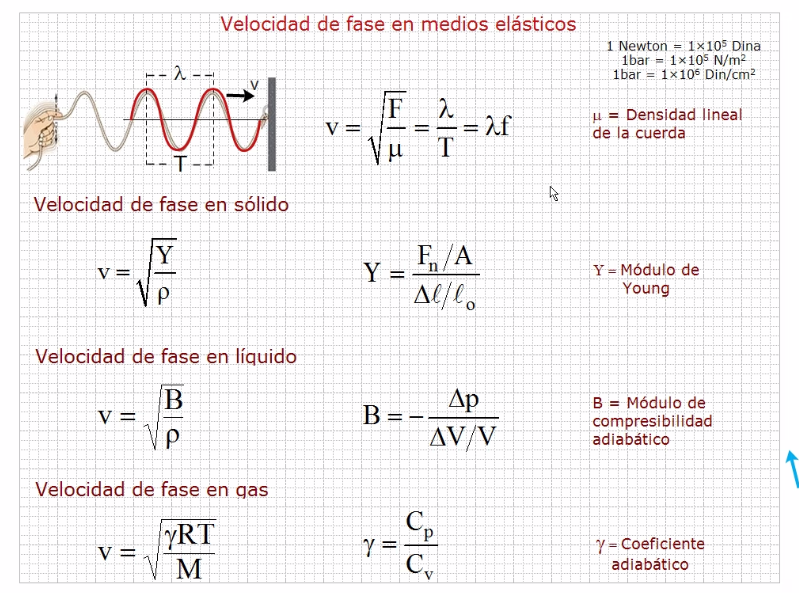

## Características de las Ondas

**2π = 360°**

- A = Amplitud
- λ = Longitud de onda
- T = Periodo
- f = Frecuencias
- v = Velocidad
- ω = Frecuencia angular

### En la función general de onda

Se usa el mas-menos por que no sabemos la dirección.

    y(x,t)=f(u)

Es la posición de "x" "y" apartir del tiempo.

### Obtener 2da derivada parcial

>Se dice parcial por que se hace respecto a dos variables

Lo que parece potencia de dos es solamente la forma de identipficar a la derivada, se le llama "segunda derivada"

#### Derivada normal

Se multiplica a la incognita por el exponente y al exponente se le resta 1.

## Onda viajera

Yo se la dirección de la onda, dependiendo del argumento o ángulo de fase. 

Si uso la función coseno, la función empieza arriba, si es la función seno, empieza abajo, en estos ejemplos es seno. (rojo seno)(morado coseno).

## Velocidad de fase

> Aqui se asume que va a la derecha por lo que se usa el (-)

Para obtenerla se toma el argumento, se iguala a una constante (comunmente 0), y se deriva.

La primer derivada de cualquier función, representa la velocidad, la segunda derivada representa a la aceleración.

## Función de onda armonica

y0=a= el espacio entre una cresta y el origen

## Función de la particula 

- La derivada del seno es el coseno positivo
- La derivada del coseno es el seno negativo. 

### Onda periodica

## Velocidad de fase de un pulso en una cuerda

Aquí µ es la densidad lineal de la cuerda.

## Velocidad de fase en medios elasticos

