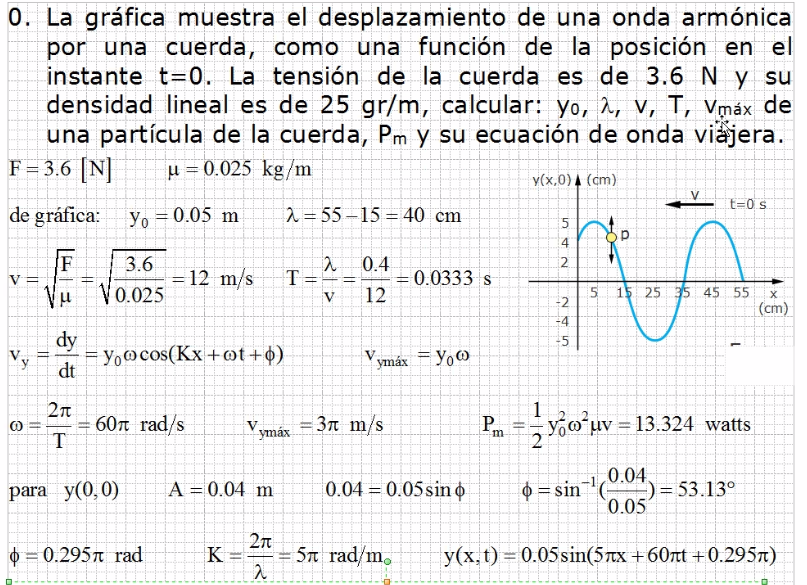
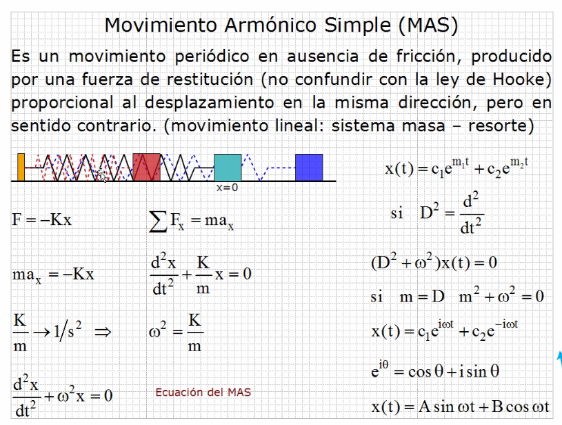
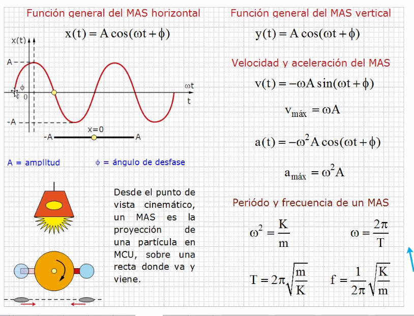
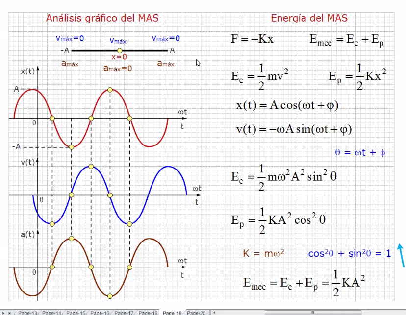

# Ondas

## Ejercicio 4

Cuando el coseno marque uno o menos uno, tiene el valor máximo si es (+)
 y tiene el valor mínimo si es (-).

La amplitud en este caso se obtiene de la gráfica,  pues la curva parte
 de 4 y su máxima es 5.

K es el número de onda.

## Movimiento Oscilatorio

Un movimiento circular no es una onda.

## Movimiento Armónico Simple (MAS)

- Para representar una onda se puede usar tanto seno como coseno.
- Ley de restitución o fuerza de restitución, no confundir con Ley de Hooke.
- Podemos recordar que la aceleración es la segunda derivada con respecto al tiempo.

> Recordar que (ωt) es un ángulo.

Cuando el valor es -1 o +1 es el máximo de velocidad.

