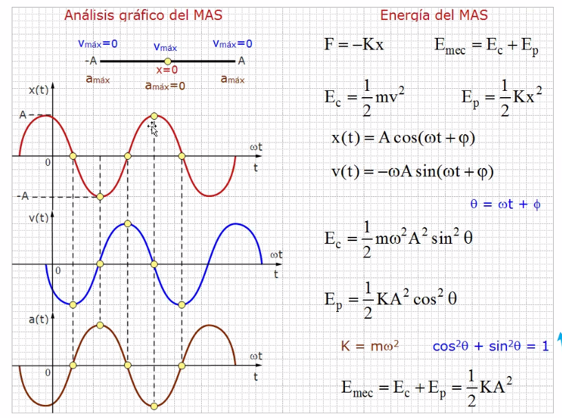
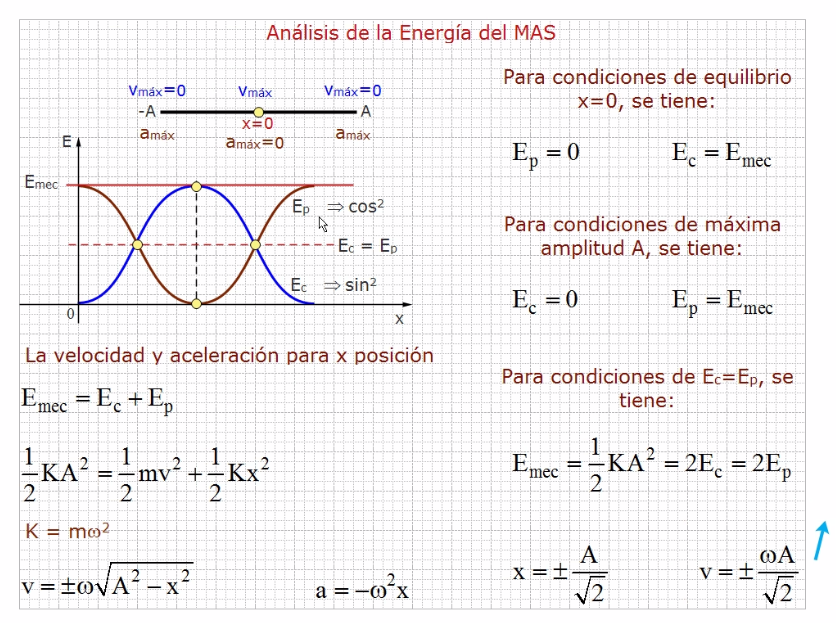
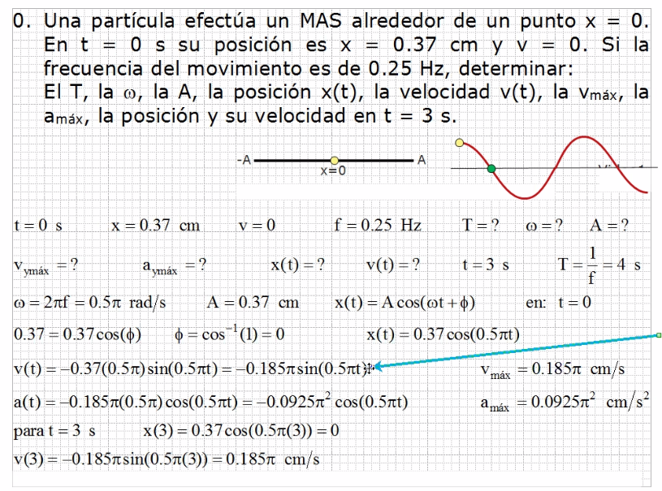
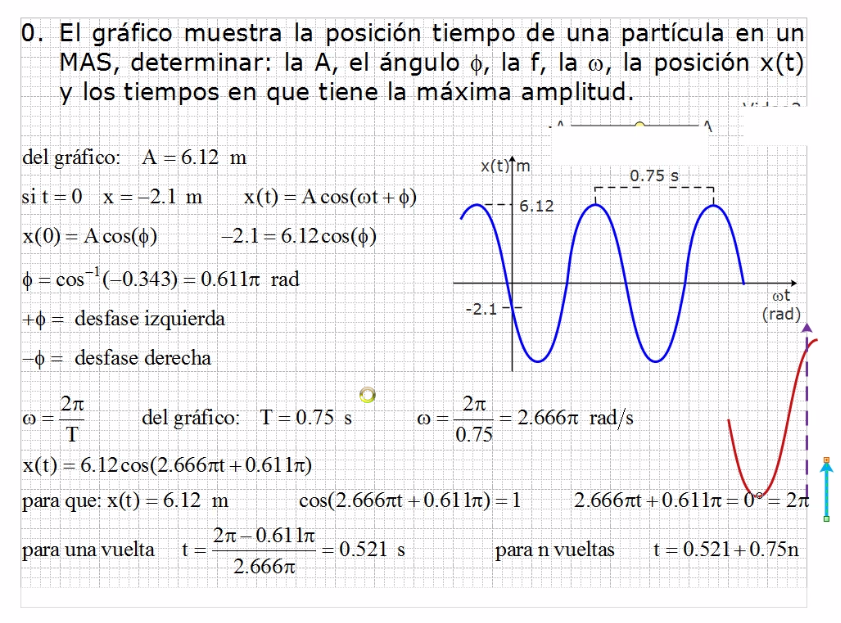

# Ondas

- Roja Posición
- Azul Velocidad
- Cafe Aceleración

Se puede observar que la variación es de 90°

El signo solo muestra la posición.

## Ejercicio 1

## Ejercicio 2

Se iguala a 1 pues cuando el coseno es 1 siempre se encuentra en la cresta.
