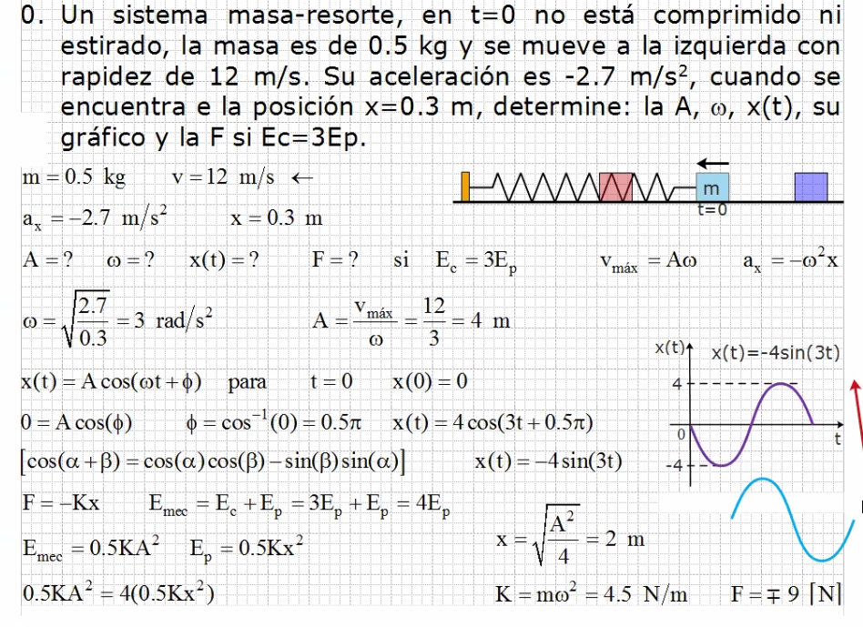
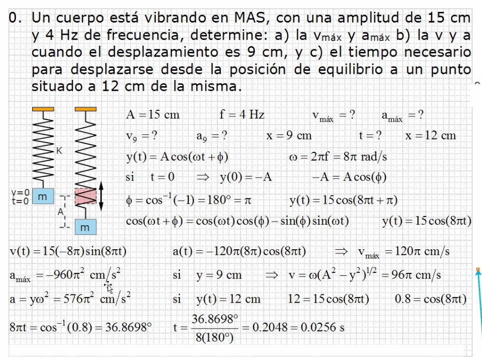
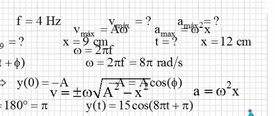
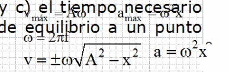
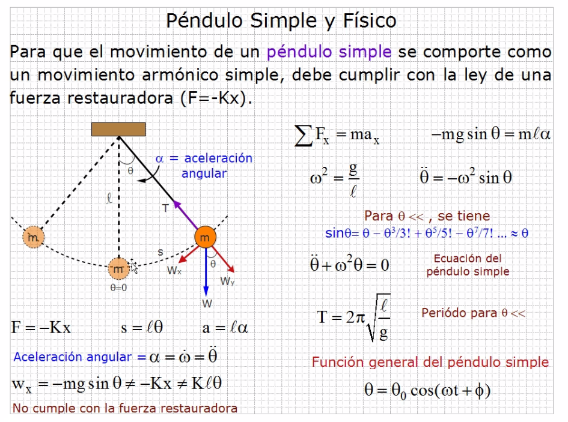

# Ondas

Recordar pasar radianes a grados y viceversa.

## Ejercicio 1

## Ejercicio 2

Se puede obtener la velocidad máxima sin usar la derivada desarrollando vmax= A\*ω

Otra forma de solución (estan sobre el resot :( pero asi lo puso el profe:

## Pendulo simpre y físico

