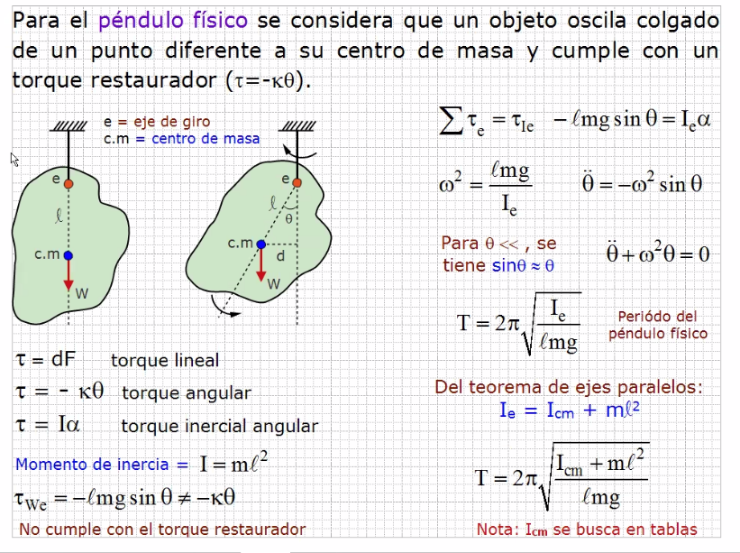
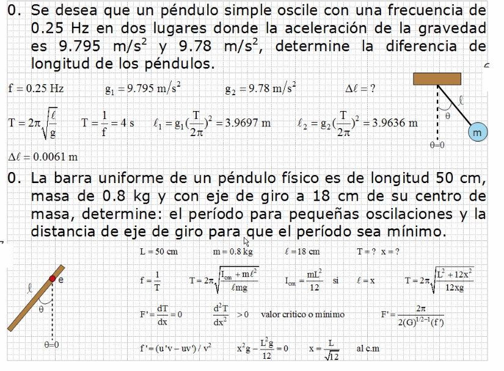
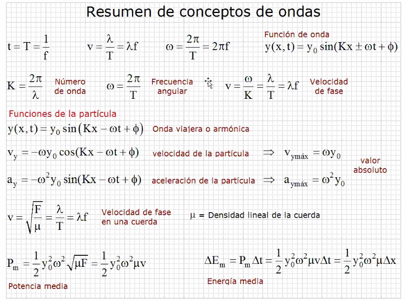
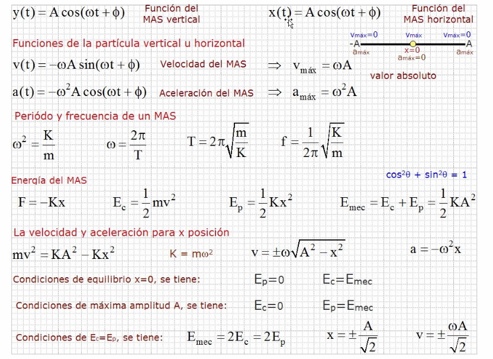
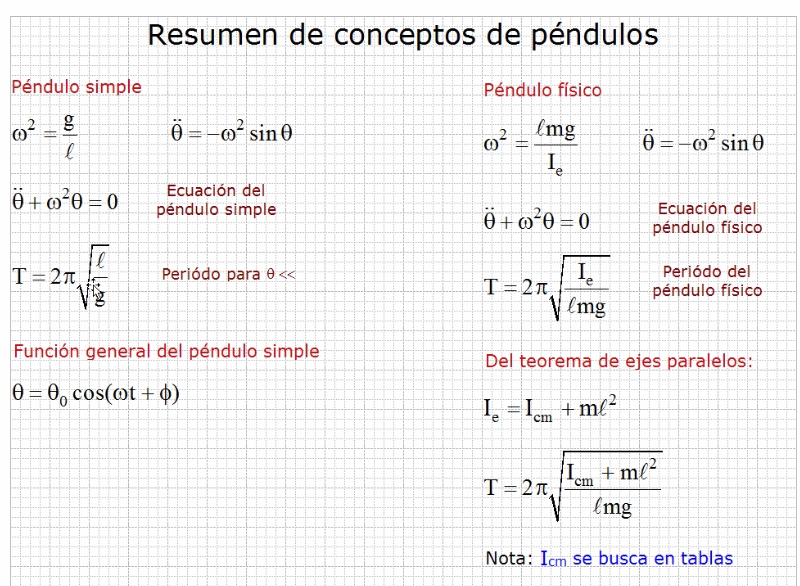
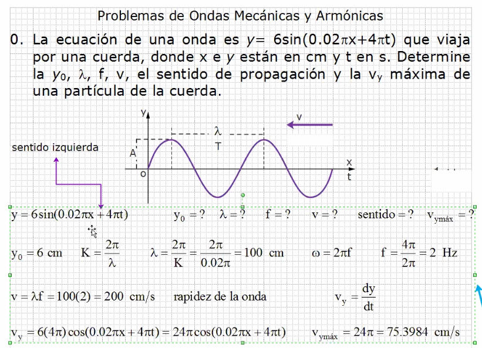
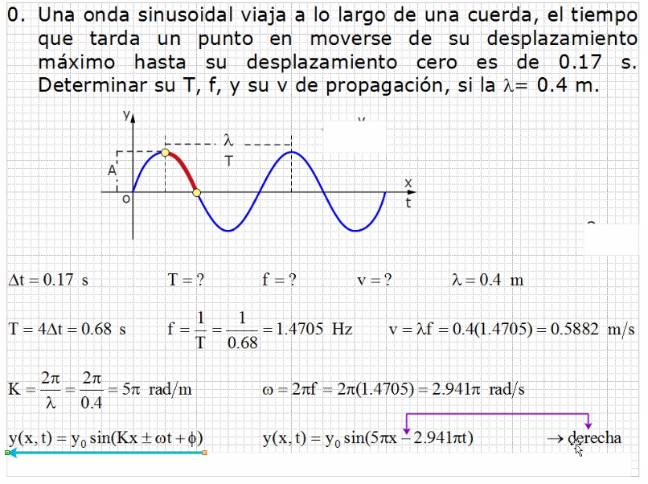

# Ondas

## Péndulo físico

### Ejercicios

## Resumen de ondas

- `T` es periodo
- `f` es frecuencia
- `y0` es amplitud, la parte de oscilación, que esta vibrando
- `ɸ` es angulo de desface
- `ω` es frecuencia angular, cuantas veces oscila o gira la particula
- `K` es número de onda o vector de posición, la relación de cuantas veces
 la particula en un ciclo pasa por el mismo punto
- `v` es velocidad de fase
- `µ` es densidad lineal de la cuerda
- `vy` es velocidad de la particula (es valor absoluto)
- `ay` es aceleración de la particula (es valor absoluto)

> Convencionalmente se atribuye el signo menos en las ecuaciones de onda.

Recordar que :

Velocidad | Punto | Aceleracion
--- | --- | ---
vmax=0 | A | amax
vmax | x=0 | amax=0
vmax=0 | -A | amax

- `x` es la posición del resorte cuando se alarga o comprime
- `A` es amplitud

- `Ie` es momento inercial

## Ejercicios repaso

> Cuando se resuelve `K` y `ω` el 2π ya va en radianes
