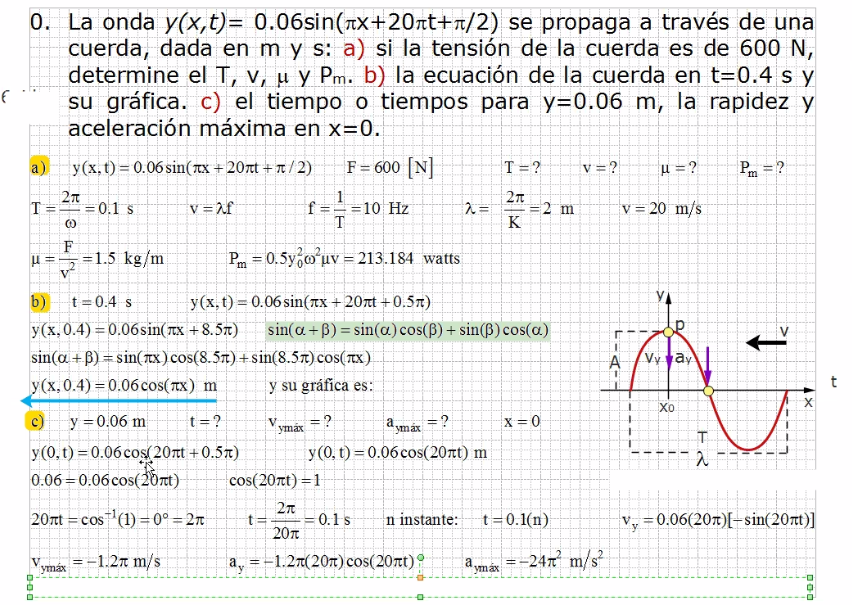
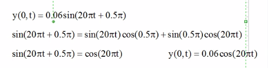
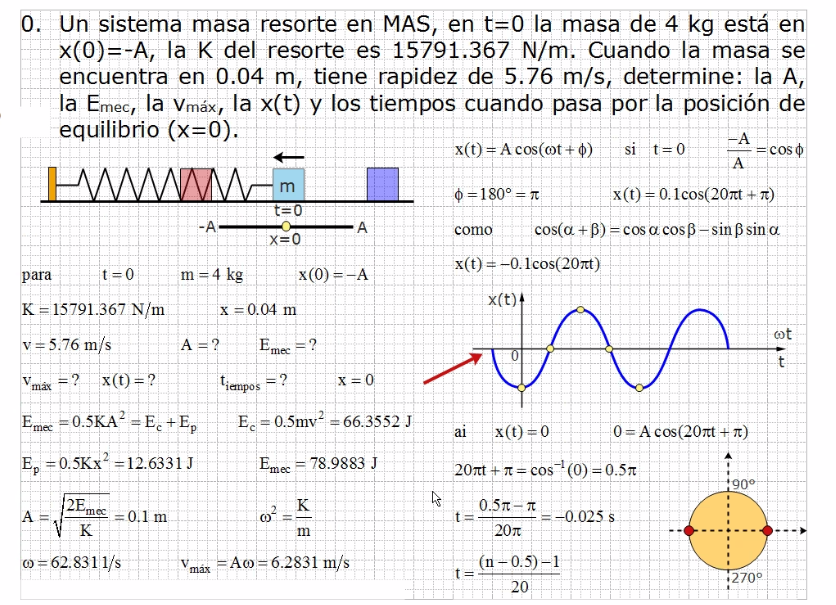

# Ondas Repaso

## Ejercicio 1

Para deshacernos del 0.5π en la sección C:

> Lo verde es una identidad trigonometrica

## Ejercicio 2

El tipo de onda es x(t) por que el resorte es horizontal.

Al obtener la frecuencia angular, en valores de π
 se divide el resultado entre π pero al usarlo para
 obtener el valor de vmax, se usa las unidades
 obtenidas.

