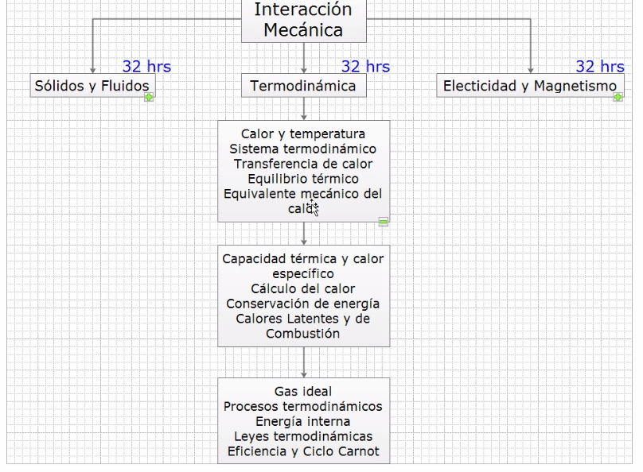
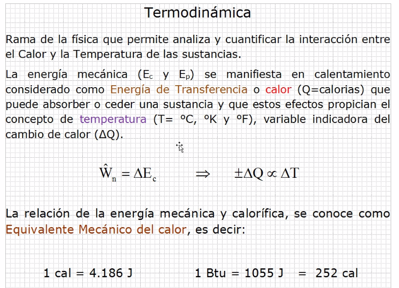
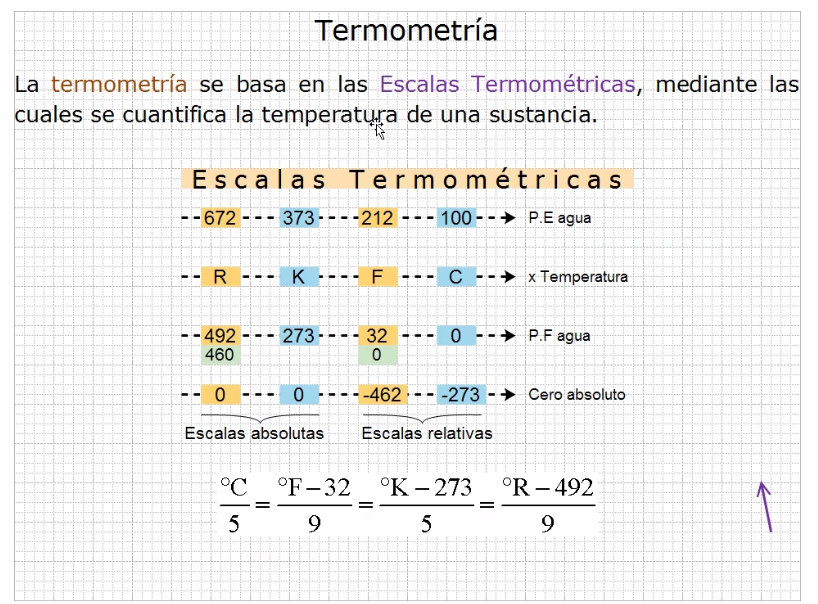
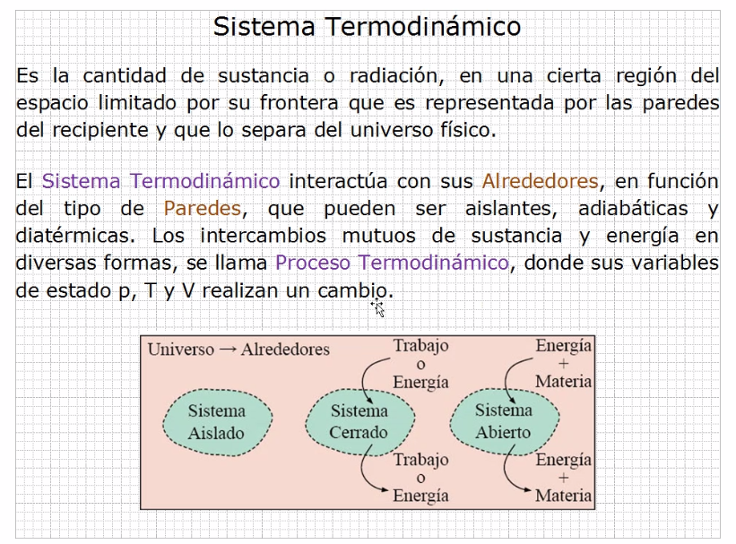
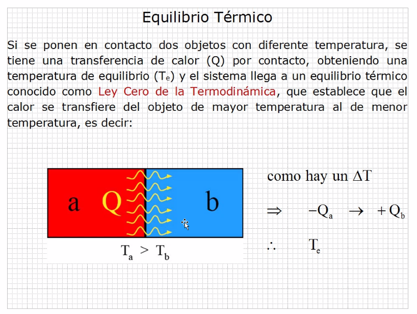
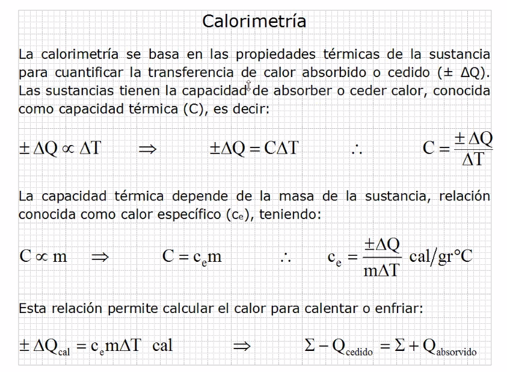
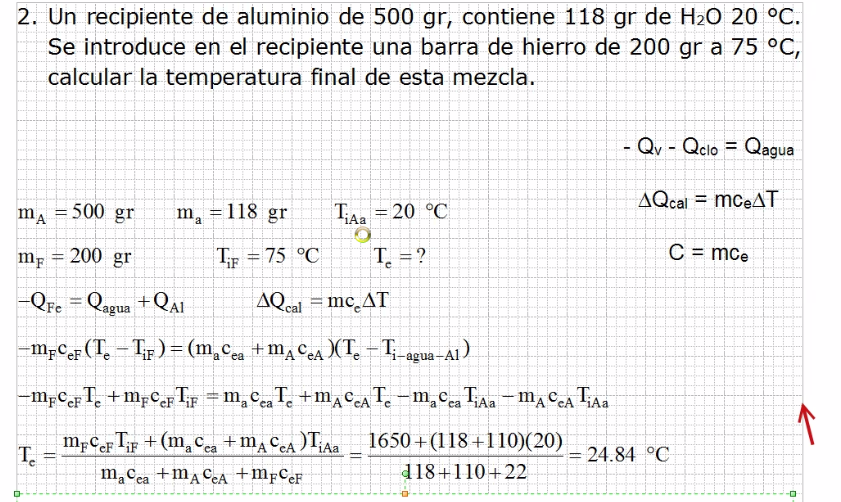

# Termodinamica

El calor es la suma de todas las energías.

La temperatura es un indicador del cambio de calor.

BTU = Unidad termica britanica

En clase se manejara la conversión como:

    1 cal = 4.2 Joules

- El sistema Aislado no permite ninguna interacción
- El sistema Cerrado no permite que entre o salga materia
- El sistema Abierto permite casi todo

El calor especifico es suministrar una caloria a un
 gramo masa para elevar su temperatura un grado centigrado.

## Ejercicio 1

