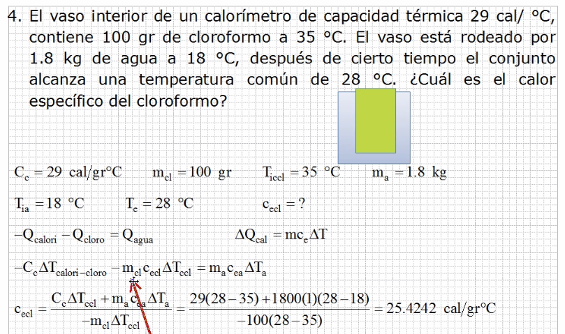
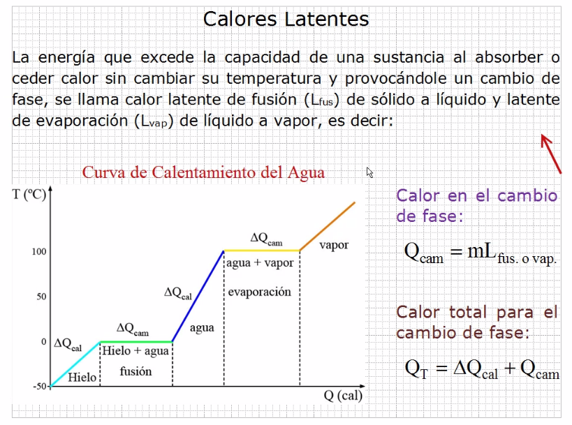
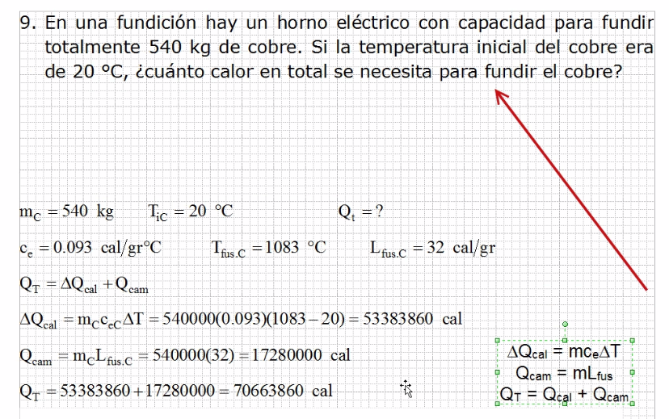
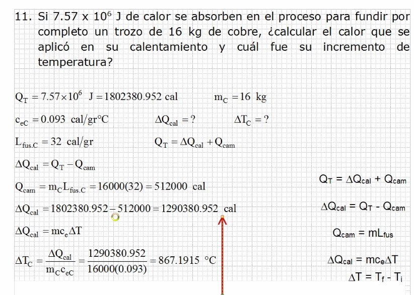
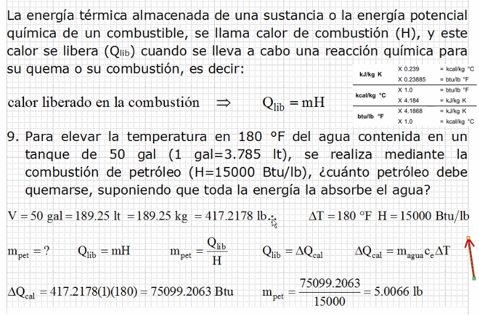
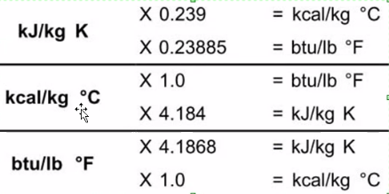

# Termodinamica

## Ejercicio

## Calor latente

Qcal es el calor para calentar en una misma fase.
Qcam es el calor para cambiar de fase.

### Ejercicio 1

### Ejercicio 2

## Calor de combustion

