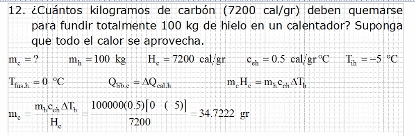
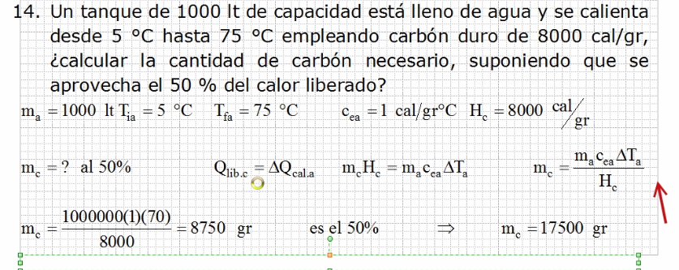
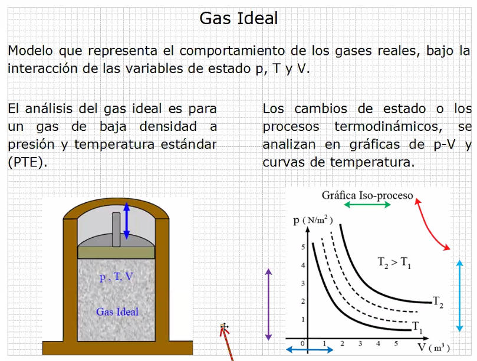
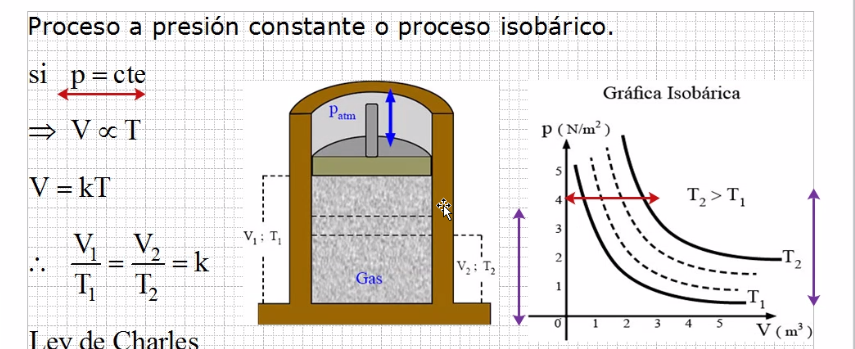
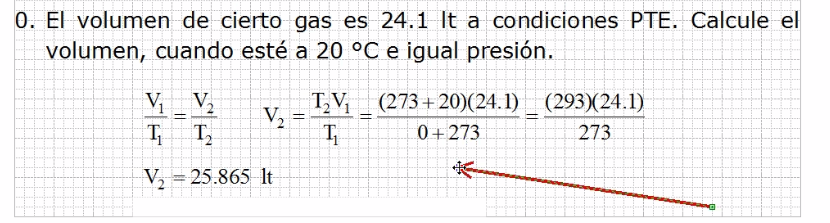

# Termodinamica

## Ejercicio 1

## Ejercicio 2

# Gas Ideal

La temperatura estandard del gas es 0 grados centigrados.
La presion estandard es a una atmosfera.

## Ejercicio 1

> Es una simple regla de 3
