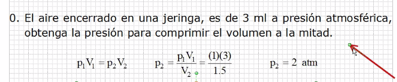

# Temodinamica

## Proceso a temperatura constante o Proceso isotermico

A mayor presión, menor volumen y viceversa.

## Proceso a volumen constante o Proceso isovolumétrico o isocórico

Se debe de convertir a kelvin pues se sigue la temperatura ideal.

## Ecuación general

### Ejercicio 1

### Ejercicio 2

> Recordar siempre pasar de centigrados a kelvin

### Ejercicio 3

Condiciones en PTE = 1 atm y 273 grados kelvin

El profe se quedó con duda xd.
