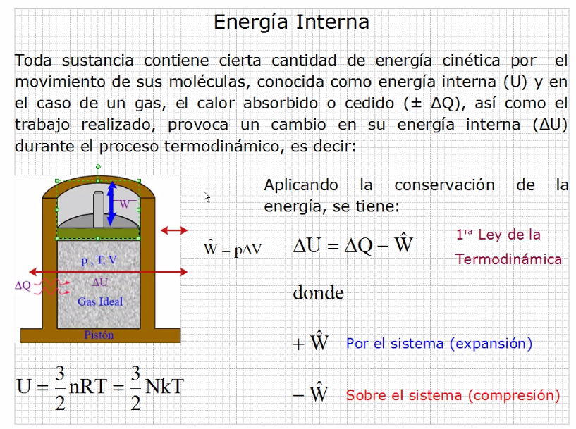
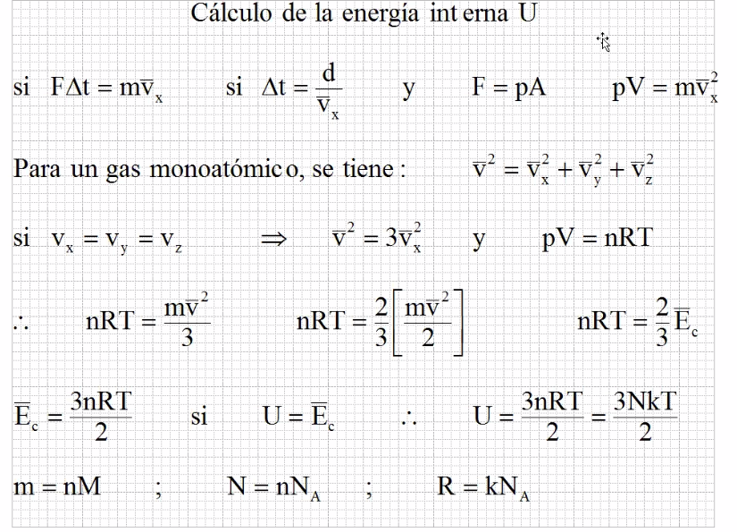
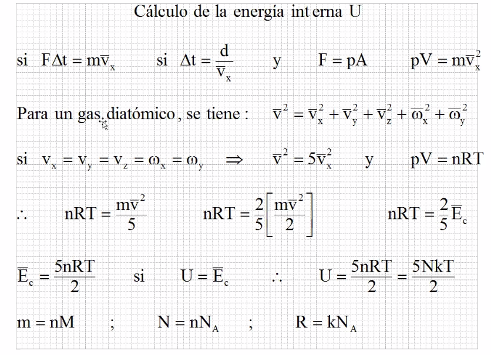
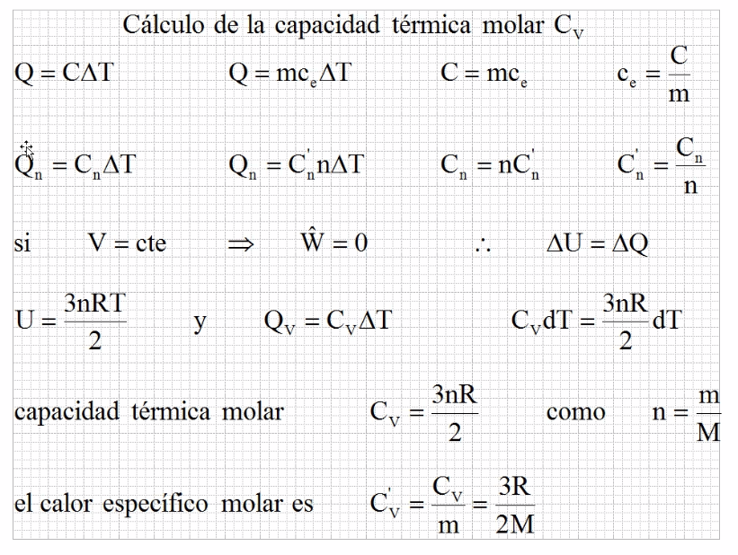
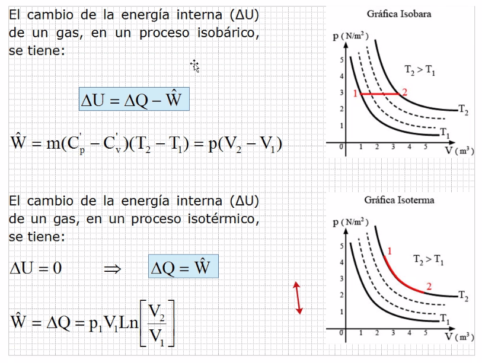
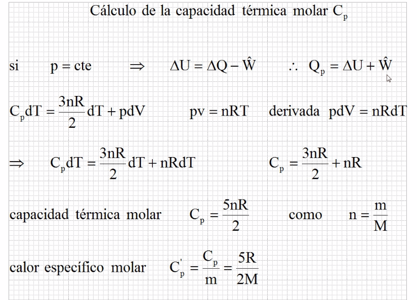
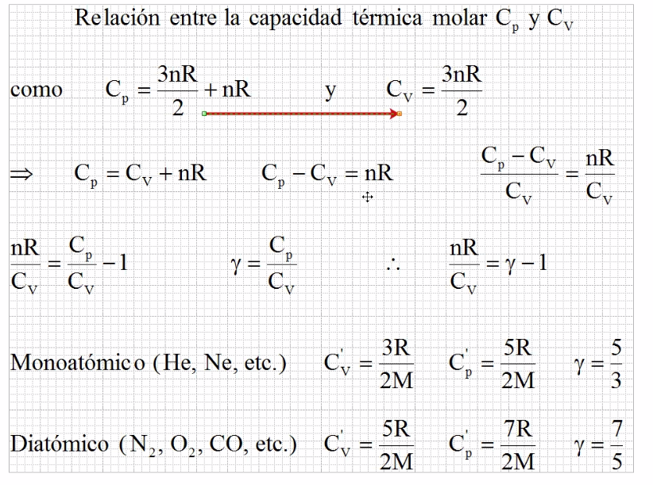
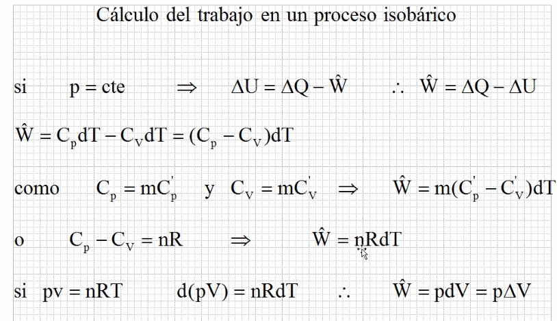
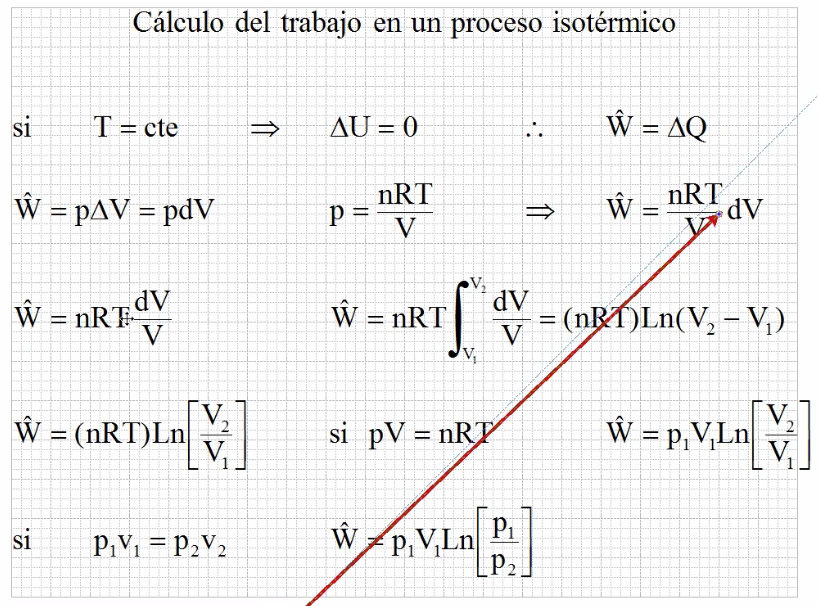

# Energía Interna

Con trabajo para comprimir, el trabajo se considera negativo,
 si es trabajo para expander, se considera positivo.

## Calculo de la energía interna

## Procesos

## Calculo de capacidad termica 

