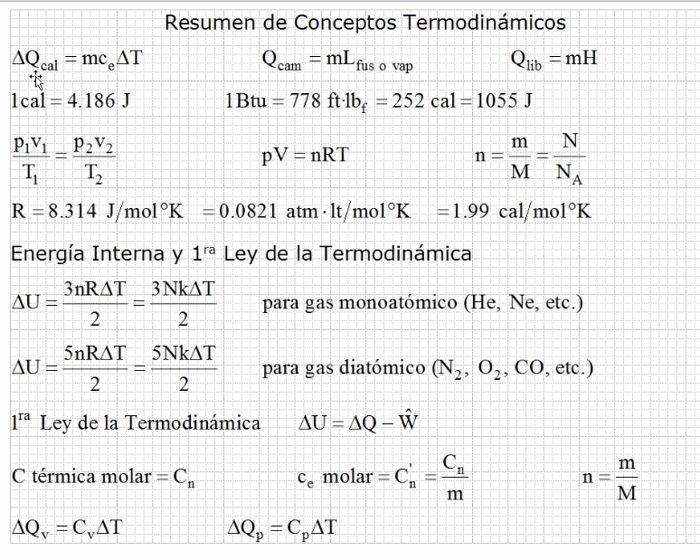

# Termodinamica

## Maquina ideal

Esta máquina suele ser la de máxima eficiencia.

### Ejercicios

Recordar que no se puede trabajar con centigrados, se tiene
 que usar kelvin.

Como la compresión Isotermica se da de menos a mas, por lo que la
 primera pregunta habla de la temperatura baja.

## Resumen del tema

### Ejercicios series

