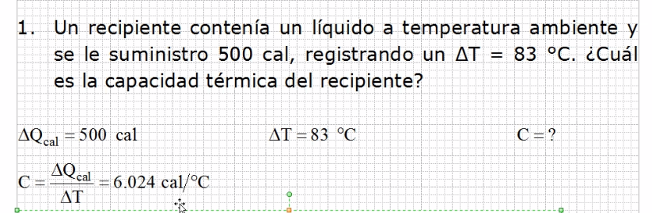
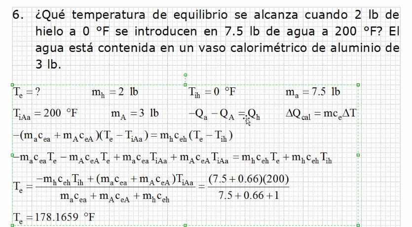
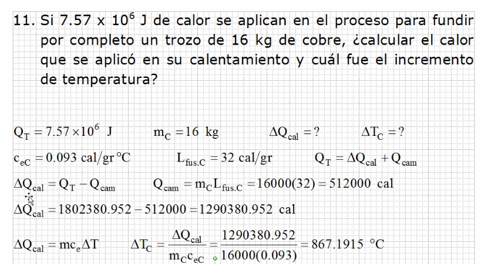
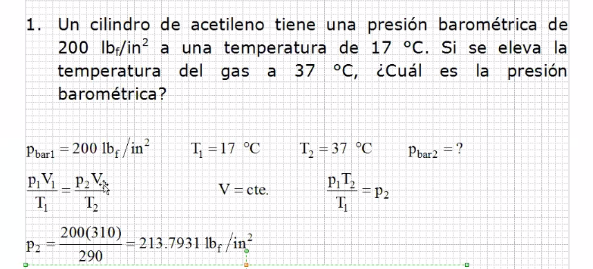
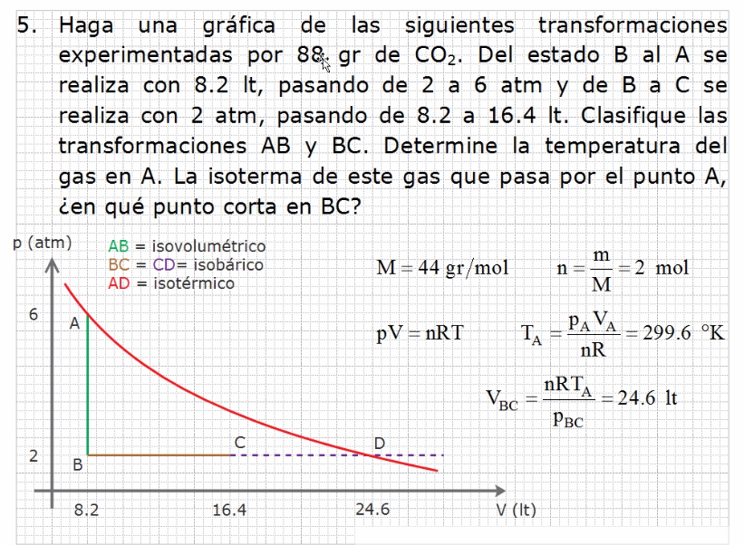
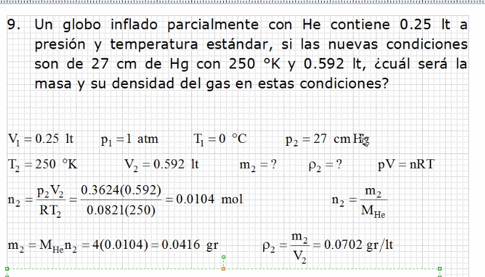
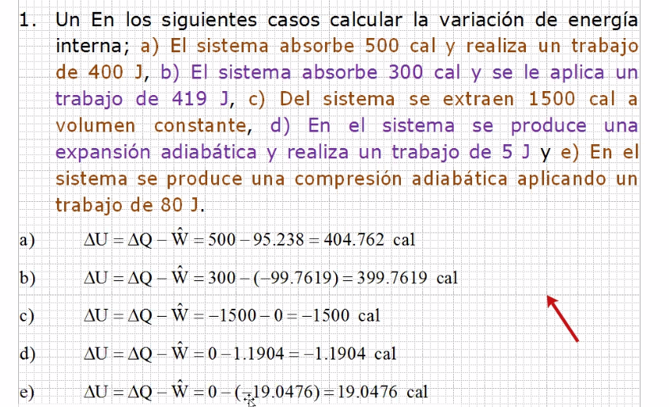
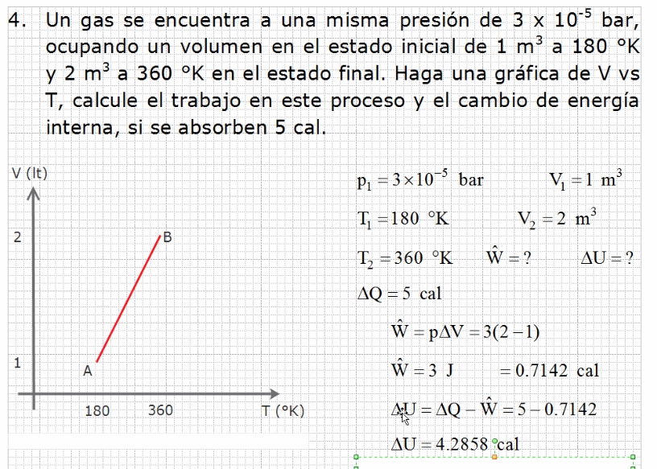

# Repaso

## Calorimetria serie 6

### Calorimetria - Ejercicio 1

### Calorimetria - Ejercicio 6

En este caso el recipiente del agua tiene la misma temperatura
 del agua en si por que la contiene.

- Qcal = Calor para calentar
- ΔT = Calor final - Calor inicial
- Te = Temperatura de equilibrio

La ecuación de calorimetria se aplica a la ecuación de equilibrio.

### Calorimetria - Ejercicio 11

En primer lugar se busca el calor para calentar, por lo que el
 primer valor es el **Calor TOTAL**, por lo que en tabla se tiene
 que buscar el calor especifico, calor de fusión, calor de cambio
 y temperatura de fusión del cobre.

Recordar cambiar Joules a Calorias y Kilogramos a gramos, esto para
 facilitar calculos.

## Gas Ideal Serie 7

### Gas Ideal - Ejercicio 1

**No se pueden trabajar con grados centigrados en gas ideal.**

Como no se menciona el volumen se asume que no hay cambio de
 volumen, el material del recipiente nos lo confirma.

Se identifica el proceso, en este caso proceso isovolumetrico.

Como no cambia el volumen los volumenes se cancelan y solo quedan
 presiones y temperaturas, con eso se calcula la presión final.

### Gas Ideal - Ejercicio 5

La gráfica tiene como variables la *presión* y el *volumen*.

Para calcular la linea de proceso isotermico se debe calcular
 su volumen, el punto donde se corta en BC.

Se puede usar la ecuación de estado para trabajar con un solo punto,
 calculando la temperatura del punto A se puede calcular cualquier
 otro punto, como ya se conoce la presión, el volumen, el numero
 de moles y la constante R, se puede obtener la temperatura y con
 esa misma expresión se revisa el volumen en el punto BC.

### Gas Ideal - Ejercicio 9

> La temperatura estandar es **0 grados centigrados**
> La presión estandar es **1 atmosfera**

Como se tiene el nombre del elemento, se puede calcular la masa
 molecular del elemento.

> 0.27 (metros del mecurio) x 13600 (del mercurio) x 10 (gravedad)
> para obtener pascales a partir de mercurio.
> Para convertir de pascales a atm el factor es 1.013 x 10⁻⁵

## Termodinamica serie 8

### Termodinamica - Ejercicio 1

> Se convierten Joules a calorias y viceversa

1. Como el sistema realiza el trabajo es positivo.
2. Como el trabajo se aplica al sistema, es negativo.
3. Como se extraen calorias es negativo se resuelve solo.
4. Como es adiabatico, el calor no cambia por lo que es 0.
5. Se hace lo mismo que en el cuatro pero cambia signo

### Termodinamica - Ejercicio 4

> El trabajo depende de la presión por el cambio de volumen.

El sistema es el que realiza el trabajo por que es el que aumenta
 el volumen sin aumentar la presión.
