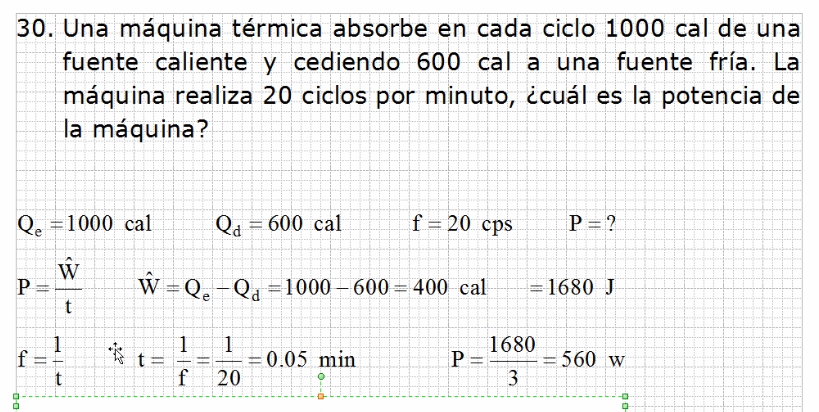

# Repaso

## Termodinamica o no se - serie 8

### Termodinamica - Ejercicio 12

Fundir totalmente se refiere al calor total.

### Termodinamica - Ejercicio 17

Los watts son joules sobre segundo por lo que se podría decir
 que la potencia es de 550 Joules por Segundo por Metro cuadrado.

El calor liberado por el sol es el calor para calentar.

### Termodinamica - Ejercicio 7

Como el frasco esta abierto, se considera la presión de una
 atmosfera. La masa 2 es menor que la masa 1 por que ya se
 escaparon moleculas pero la masa molar no cambia. La masa
 molar no cambia, el volumen sigue siendo mismo al igual que
 la presión por lo que solo queda la masa 1 y 2 y la temperatura
 1 y 2.

## Termodinamica ahora si - serie 8

### Termodinamica - Ejercicio 14

> Corrección, el enunciado tiene un 0 de mas en el agua

### Termodinamica - Ejercicio 23

Se multiplica por 3600 para convertir los watts de segundos a horas.
 Las calorias se convierten a joules. para obtener el resultado.

### Termodinamica - Ejercicio 28

### Termodinamica - Ejercicio 30

### Termodinamica - Ejercicio 3

