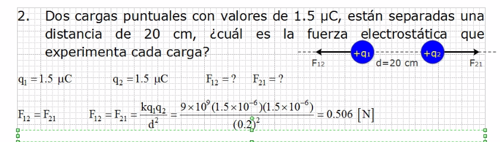

# Electricidad y Magnetismo

El **EXAMEN** será a mas tardar el viernes 25 de marzo.
 Teniendo entre el 4 o 5 de abril los promedios finales.

La serie a mas tardar será el 24 de marzo. Al menos 16 problemas
 por equipo.

## Teoría

Mayormente veremos la parte electrica y poco del magnetismo.

En el mundo electrico no se pueden manejar protones y electrones,
 se usan solo cargas, ya sea positivas o negativas.

Frotación es con contacto, conducción es igual con contacto, un
 ejemplo son los toques, la inducción es a distancia.

La fuerza que aplica de la carga 1 a la carga 2 (Fuerza 12), es
 la misma que de la carga 2 a la carga 1 (Fuerza 21).

La distancia se mide en metros.

Cuando la fuerza sale negativa, se esta haciendo mencion de cargas
 de signos diferente, cuando sale positiva se hace mencion de
 cargas de igual signo.

## Ejercicios

