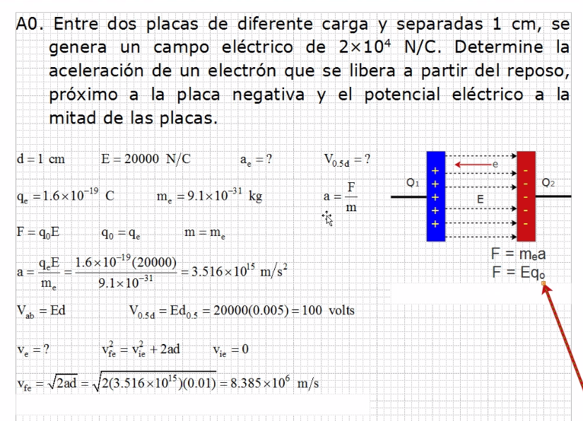

# Electricidad y Magnetismo

## Ejercicios

## Teoria

La carga positiva va al exterior y la negativa al interior.

Diferencia de potencial, tensión, o comunmente llamado voltaje.

Dependiendo de la distancia se va a generar un voltaje, y eso
 va a generar el campo que es como tal la manifestación de
 la energía.

## Ejercicios 2

Si quiero conocer el voltaje solo necesito el campo y la distancia.

