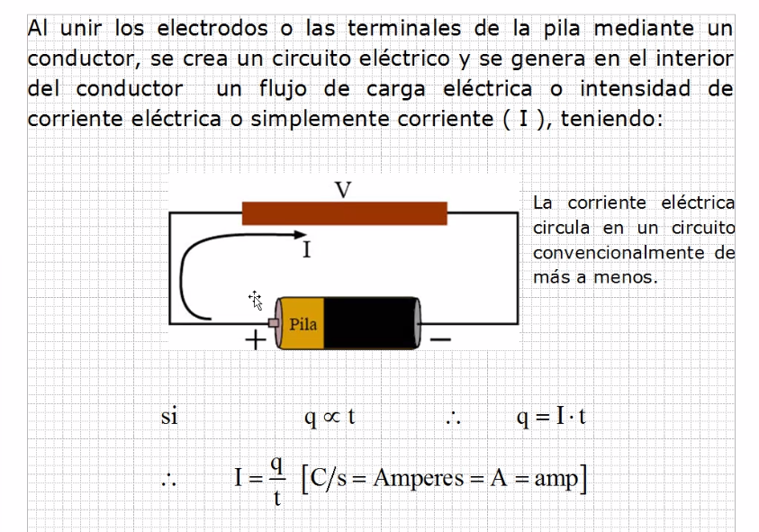
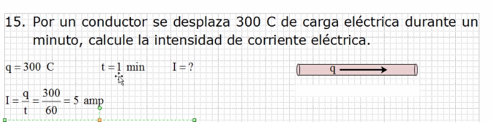

# Electricidad

## Teoria 1

Con pilas es corriente directa o continua. La de casa suele ser
 alterna.

Las pilas son una fuente de energía y se representa con una
 diferencia de potencial.

Los electrones siempre intentan viajar de mas a menos.

Los electrones no se mueven, solo se excitan (vibran) haciendo que
 la energía pase.

## Problemas

La carga como tal no viaja pero se habla así en los problemas.

## Teoria 2

La ρ (rho) representa la resistividad electrica.

Si la resistencia es mayor, el paso de corriente es menor y
 viceversa.

Cuanso se pone la figura es una representación pictorica y cuando
 se ponen los valores es representación simbolica.

El 4to determina la incertidumbre o tolerancia

Por ejemplo:

El cafe en primer lugar vale 1, el amarillo en segundo lugar 4 y el
 rojo en tercer lugar vale 100 por lo que el valor es 1400, como
 el dorado esta en 4ta, el valor mínimo es 1330 y el máximo es 1470.

## Problema 2

Si no pregunta los valores maximos y minimos no se escribe como
 resultado.

## Teoria 3

## Problema 3

Todas las baterias tienen una resistencia interna, por lo que en
 los ejercicios anteriores se consideran un circuito ideal.

## Resumen de conceptos eléctricos

