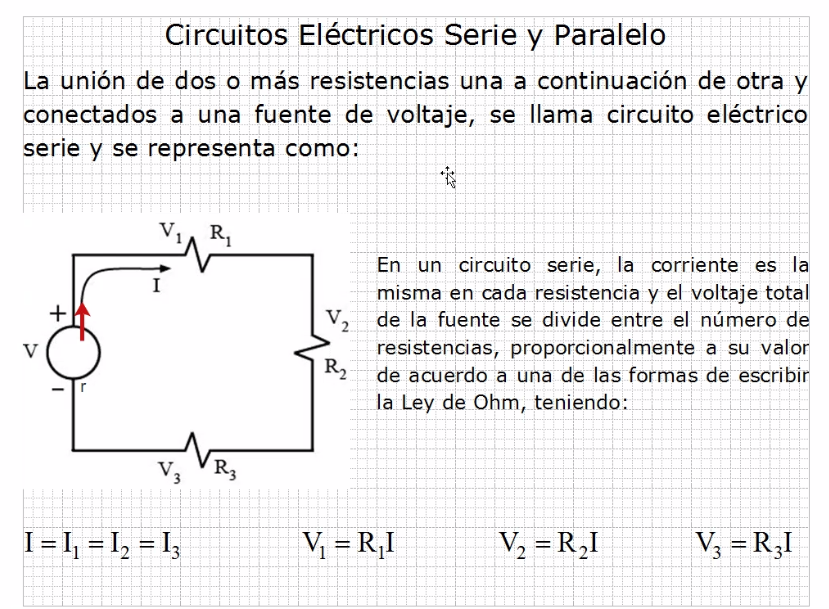
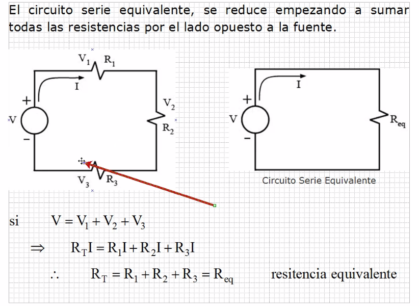
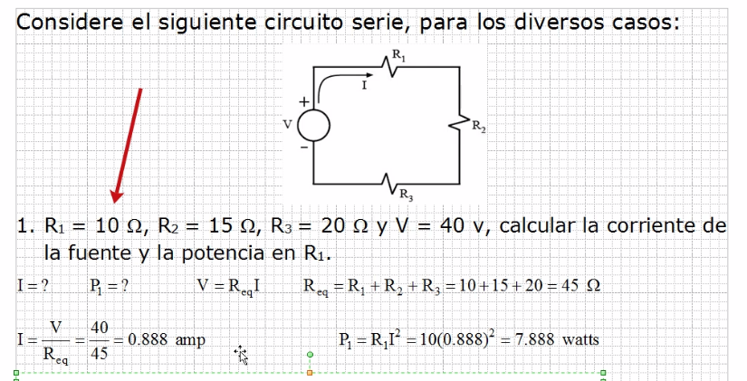
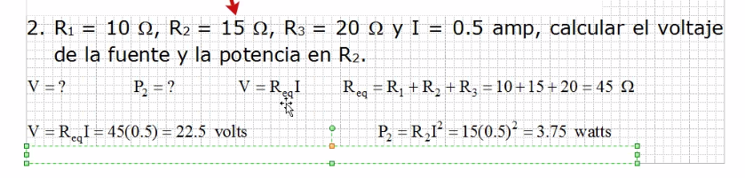
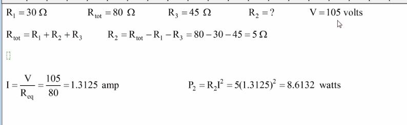
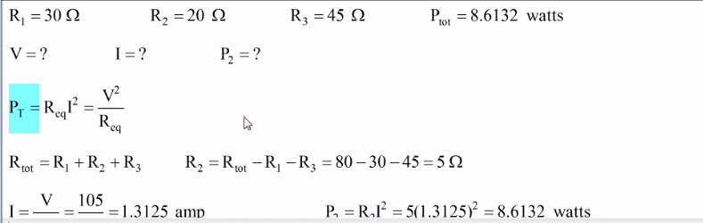
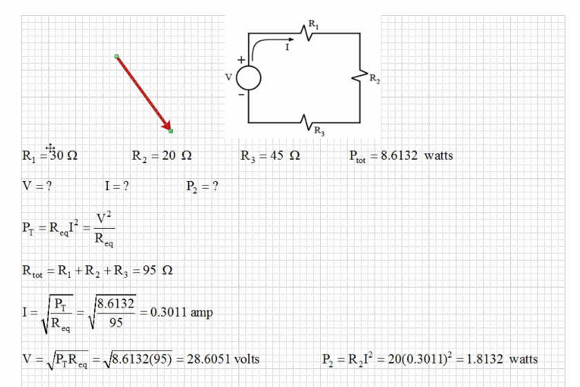
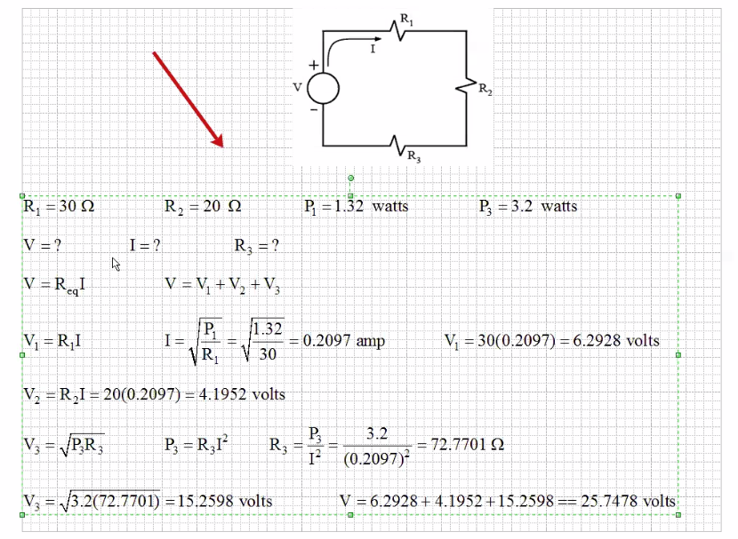

# Electricidad

## Teoria 1

El espacio entre resistencias y fuente, se le llama malla.

Se suman en resistencias totales.

## Ejercicios 1

La corriente de la fuente es la corriente total.

La potencia total del circuito, se reparte linealmente en las
 resistencias, la suma de las potencias de las resistencias
 es la potencia total.

