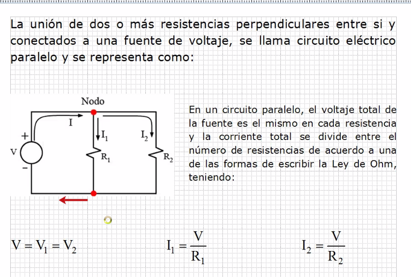

# Circuitos

## Circuitos en paralelo

Un rio forma un delta cuando se divide en 2. En este caso el delta
 son los 2 nodos, tanto la separación a dos vias como la unión de
 dos vias.

Un circuito paralelo esta formado por dos o mas mallas.

Una resistencia se opone al paso de corriente. Mientras mayor sea
 la resistencia, menos corriente va a pasar.

La corriente es lo que cambia, el voltaje se mantiene la corriente
 total es la suma de las dos corrientes.

Los voltajes son iguales (si no hay una resistencia intermedia)

## Ejercicios

