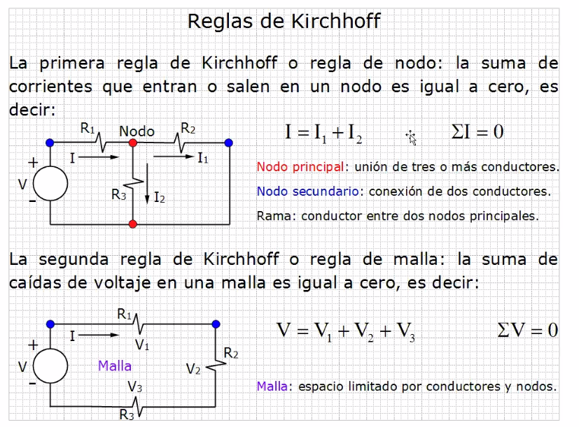
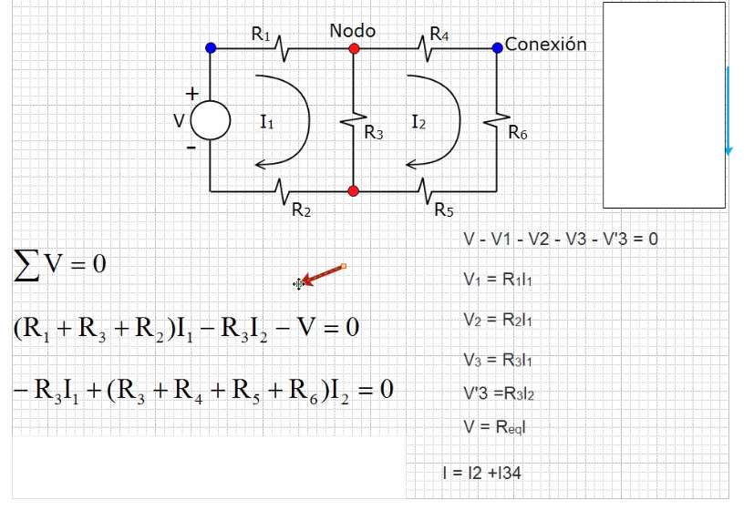
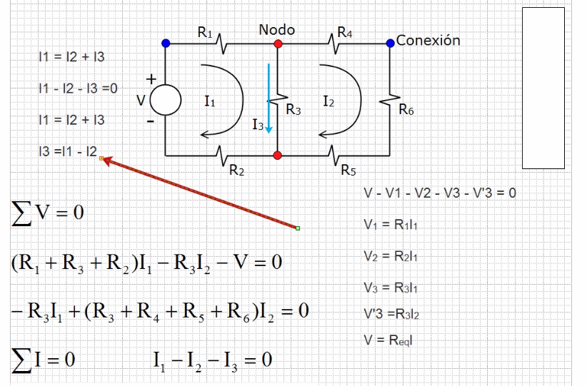
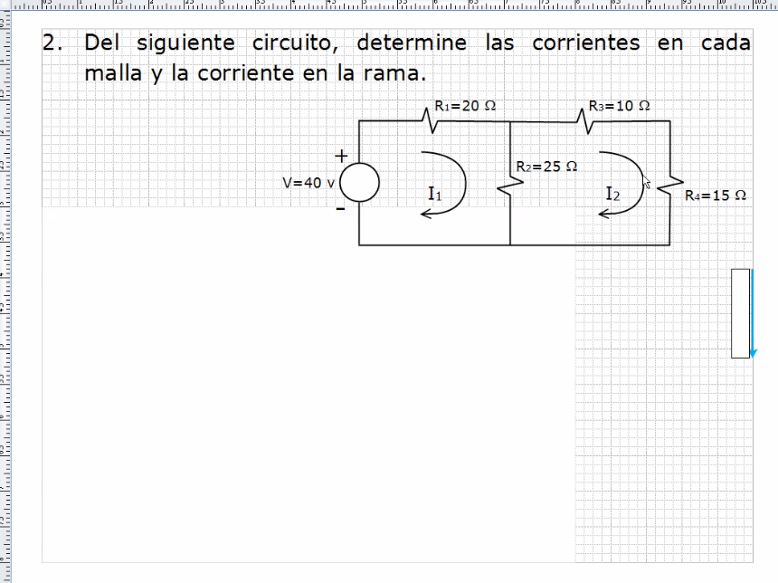

# Circuitos

## Teoria

- A los nodos tambien se les conoce como punto de unión.
- Por cada nodo principal, siempre va a haber un nodo secundario.
- Si la corriente entra por menos y sale por mas, para la suma es menos

1. Suma todas las resistencias de la malla1
2. Multiplicalos por I1
3. Resta I2

- La primer malla siempre es en sentido horario
- La segunda malla siempre es en sentido horario
- Para la corriente 3 es la diferencia de I1 y I2, siempre saliendo
 I1 del nodo.

