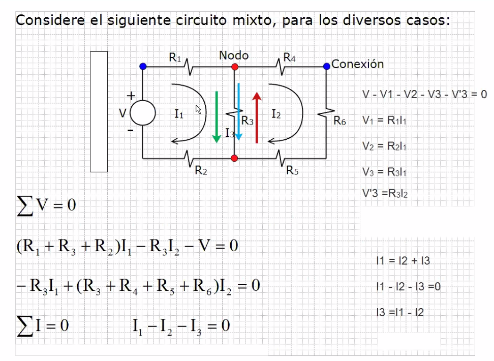
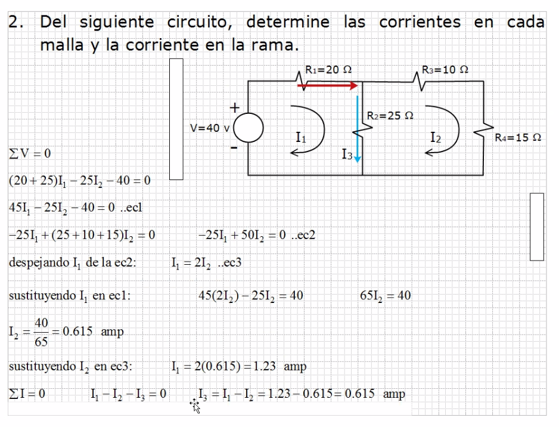
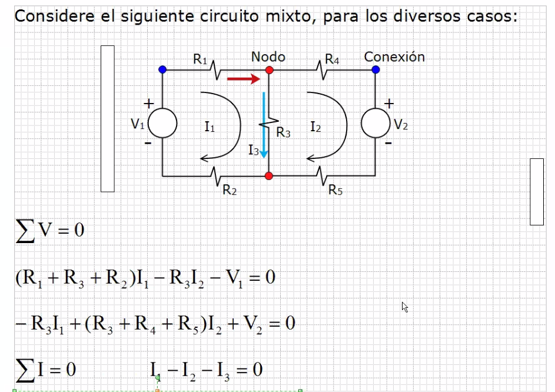
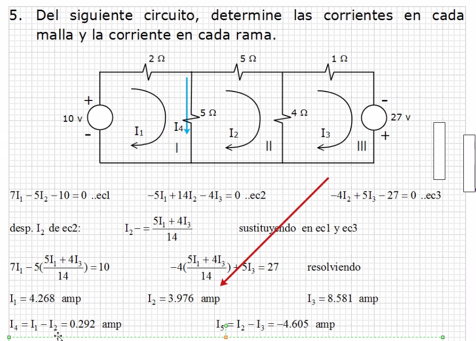
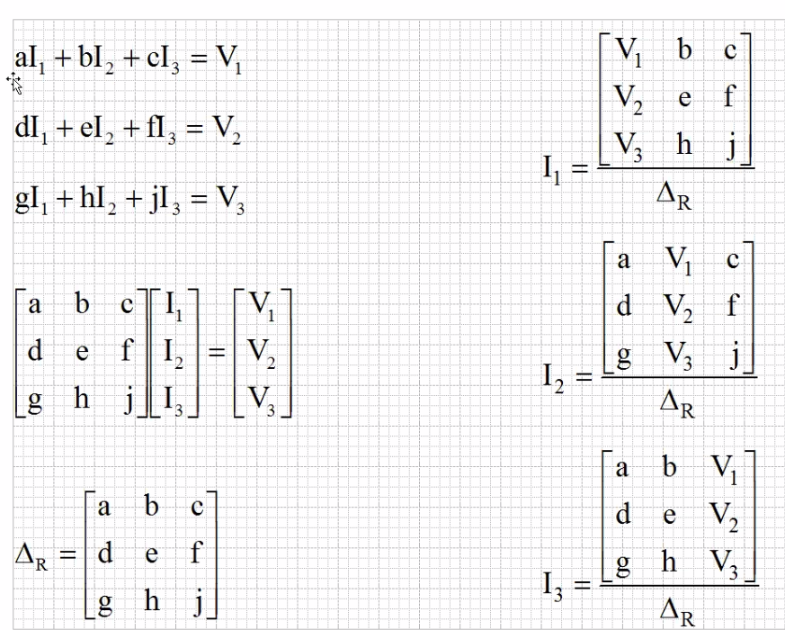
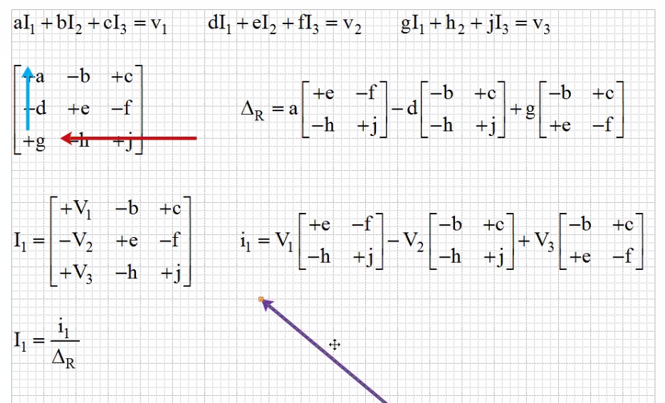

# Circuitos

## Teoria

Recordando ...

La tierra puede ser cualquier punto de abajo, ya sea Fuente-R2,
 Nodo o R5-R6.

## Ejercicios

Si los resultados fueran negativos significaría que son de sentido
 contrario.

## Determinantes

