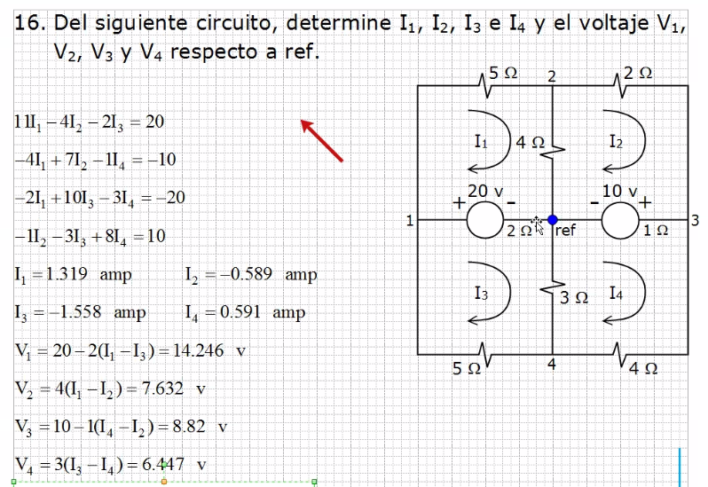

# Circuitos

## Ejercicio anterior

## Series

Pasos:

1. Sumar resistencias
2. Restar corriente contraria
3. Sumar/Restar (dependiendo el polo de la fuente por el que entra
 la corriente).
4. Sistema de ecuaciones para obtener las corrientes.

