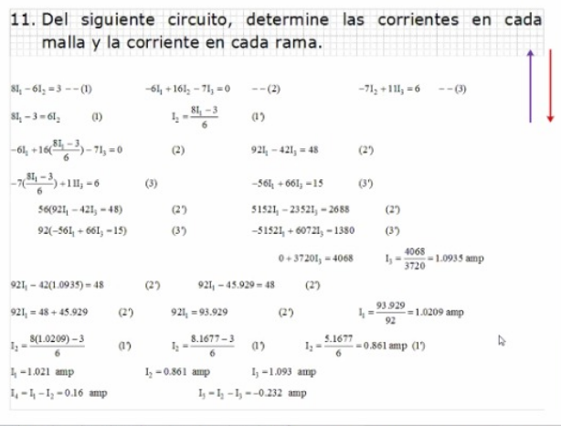
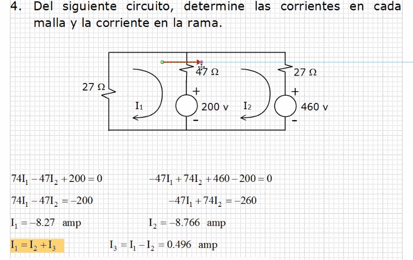
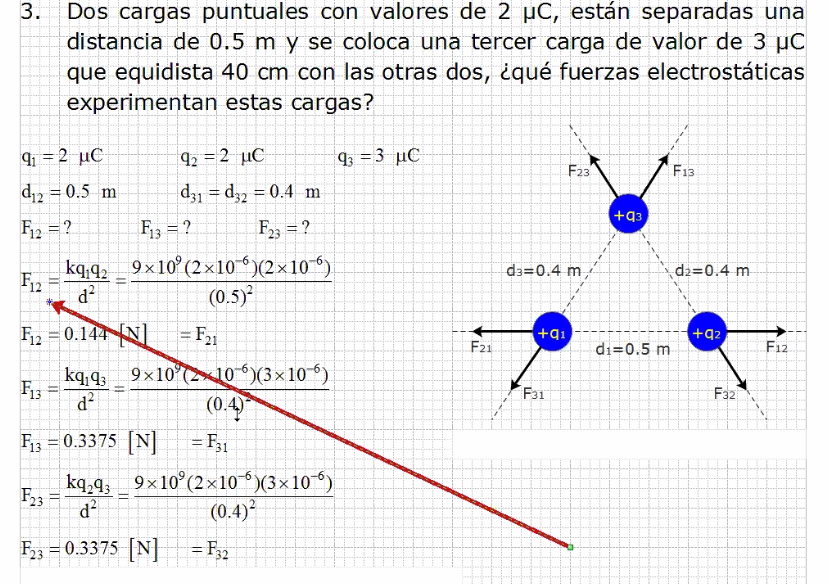
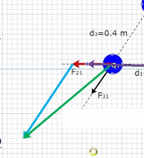
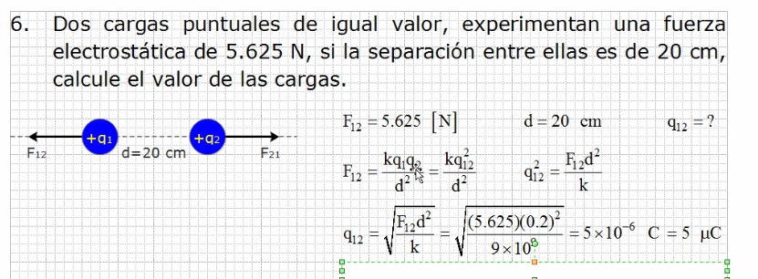
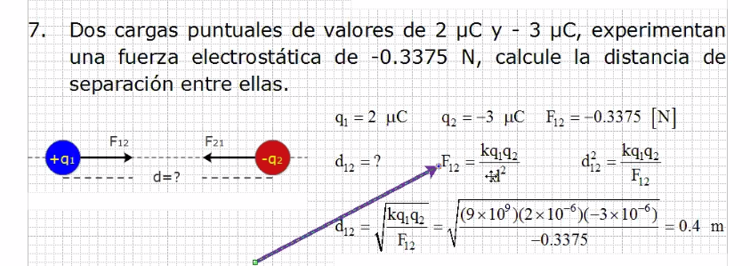
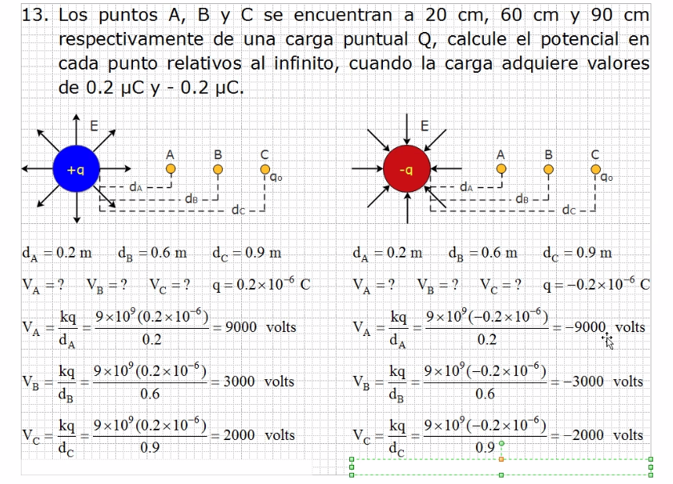
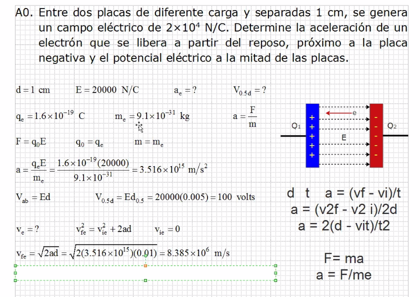

# Repaso Series

## Circuitos

### Ejercicio 11

### Ejercicio 4

1. Sentido de la corriente
2. Checar por que polo de la fuente entra la corriente, si entra
 por mas se suma y si entra por menos se resta
3. Plantear ecuaciones
4. Obtener corrientes
5. Si sale negativa nos damos cuenta que el sentido era contrario

## Cargas

### Ejercicio 3

Para fuerza resultante:

1. Formar triangulo rectangulo
2. Asignar los valores de la fuerza
3. Juntar los dos vectores
4. El angulo se calcula de rojo a verde, con el seno encuentro
 el ángulo
5. La magnitud de la fuerza es el vector verde

### Ejercicio 6

### Ejercicio 7

### Ejercicio 13

### Ejercicio A0

