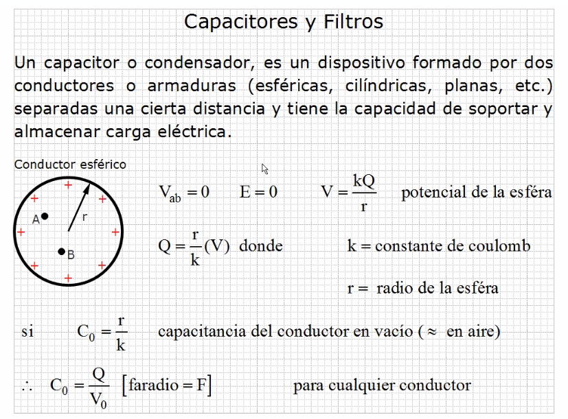
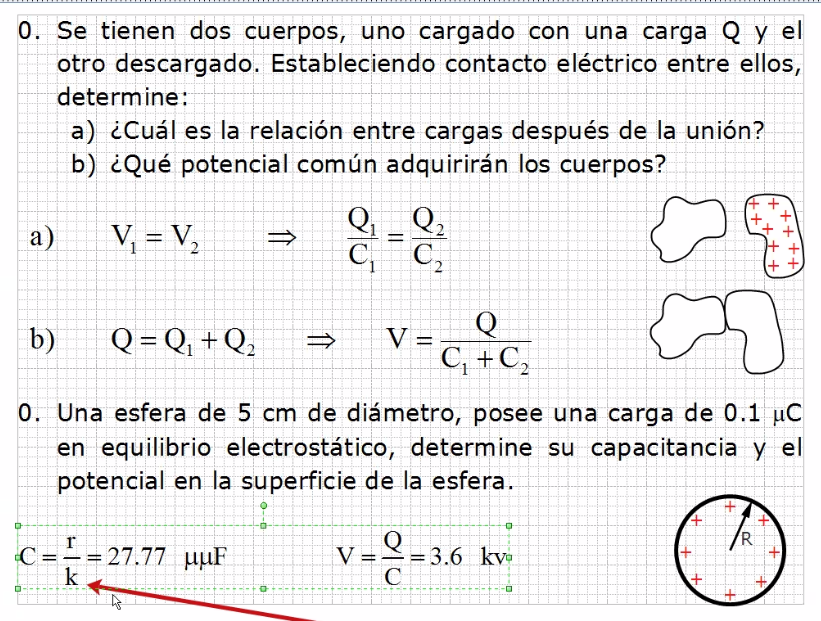
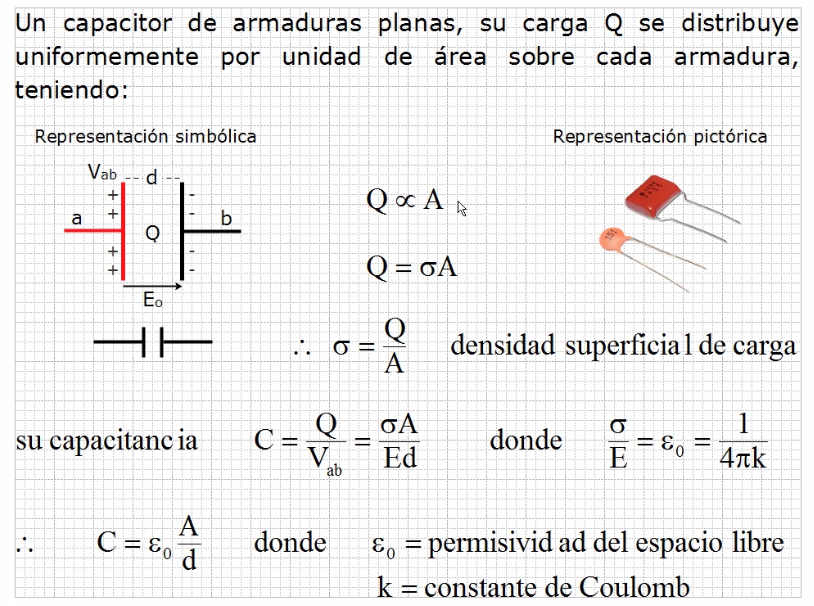
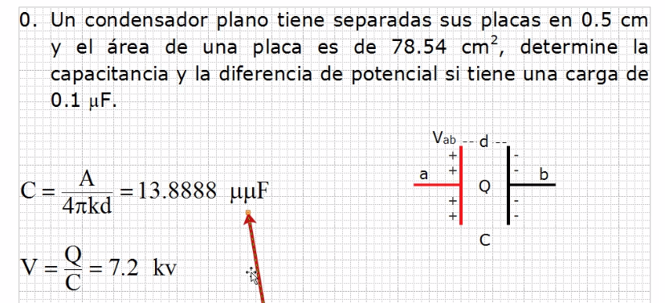
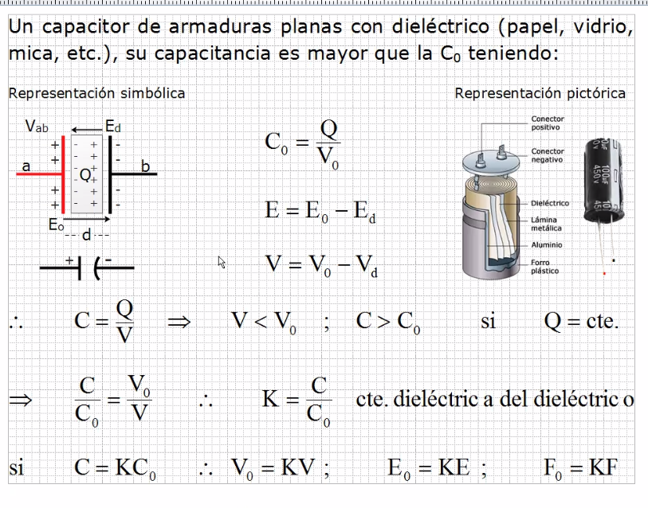

# Capacitores y filtros

## Ejemplo 1

Normalmente los resultados de un capacitor son muy pequeños, por
 lo que en el mercado se suele usar el micro µ faradios o incluso
 como  en este ejercicio que se usa el micro-micro-raradio µµF.
 Otras opciones son nano y pico Faradios.

En hogares se usan un maximo de 125 volts para el uso de aparatos
 electricos, si se reciben mas volts de los necesarios afectan
 la vida útil de los dispositivos.

> Para el valor de la constante dyye coulomb usamos 9x10⁹ N·m²/C²
>
> El profe menciona que el examen aprox para el 25

Los capacitores no tienen polaridad, tienen la capacidad de
 almacenar momentaneamente carga.

> Para el valor de la constante de coulomb usamos 8.8x10⁻¹²

## Ejemplo 2

> En el medio comun, se le puede llamar tanto capacitor como
 condensador.
>
> Se puede dejar tanto en micro-micro como en notación cientifica.

## Para la proxima

