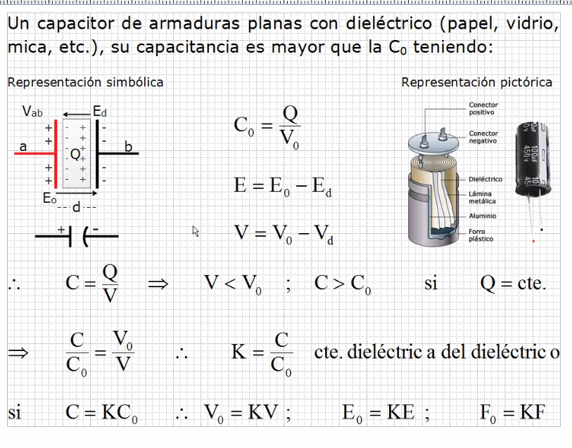

# Capacitores y filtros

## Constante de permisibilidad

## Ejercicio

Al momento de conectar un dispositivo a la corriente, se dice que
 se esta polarizando.

## Repaso

Fijo | elecrtrolítico | variable
--- | --- | ---
No almacena energía | Almacena energía | No almacena energía
No polaridad | Polaridad | No polaridad

