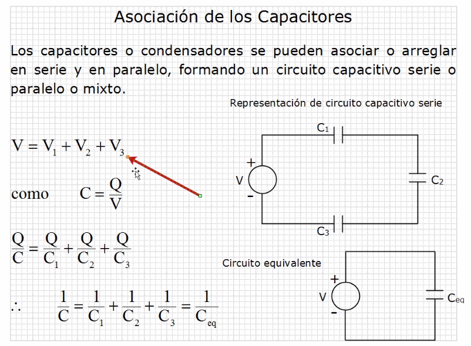
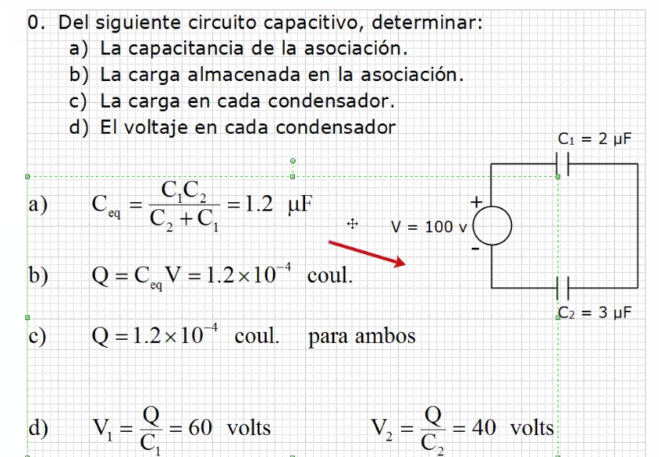
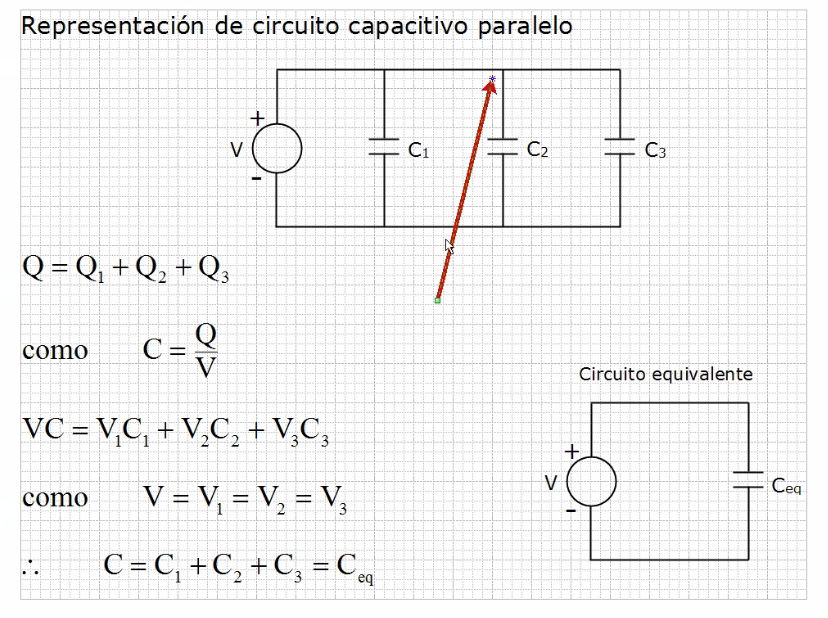
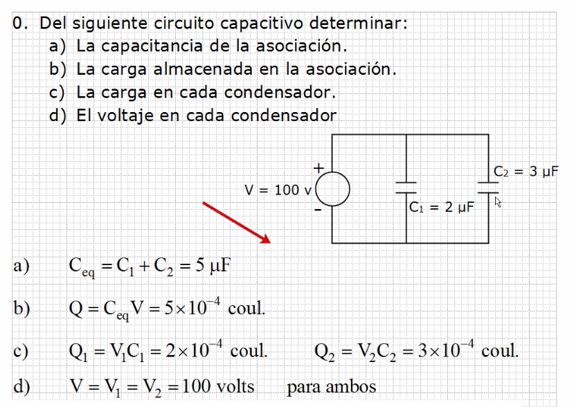
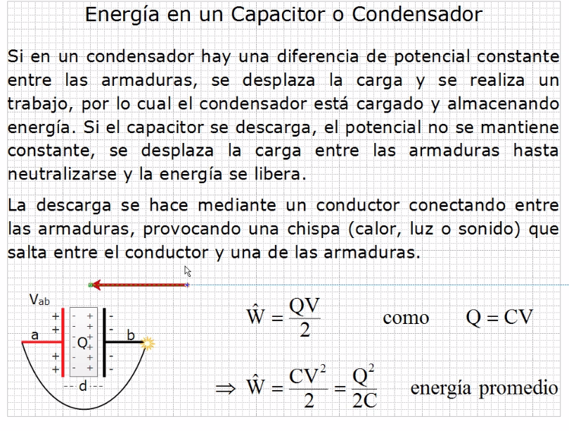
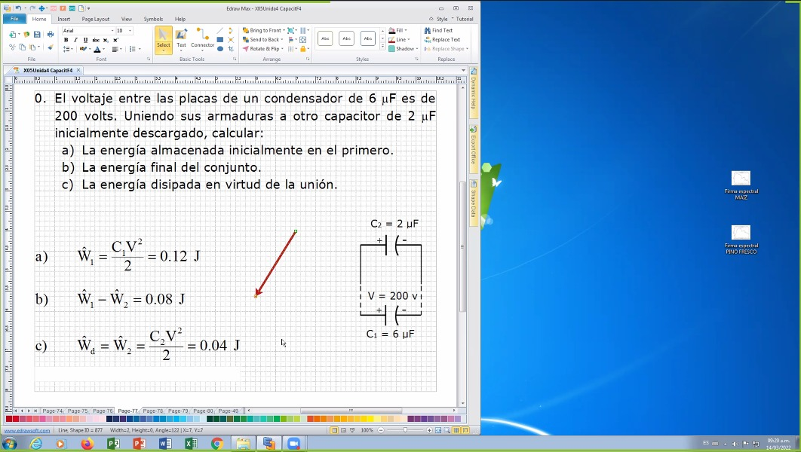
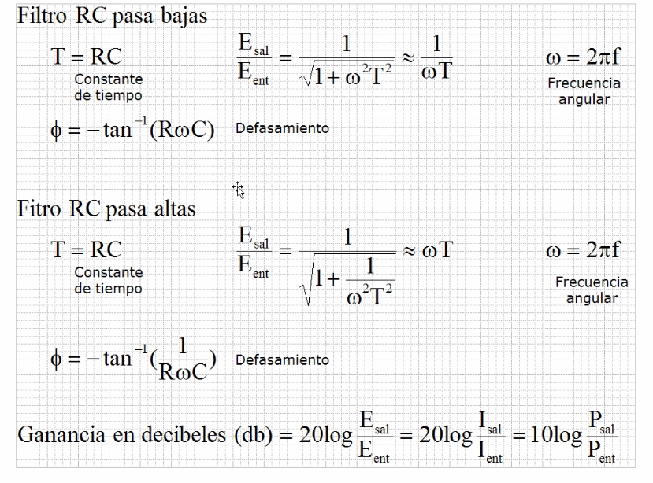

# Capacitores

## Teoria 1

## Ejemplo 1

La capacitancia de la asociación es la capasitancia total

## Teoria 2

## Ejemplo 2

## Teoria 3

## Ejemplo 3

---

**Hasta aquí el examen** el resto es extra

---

## Arreglos

