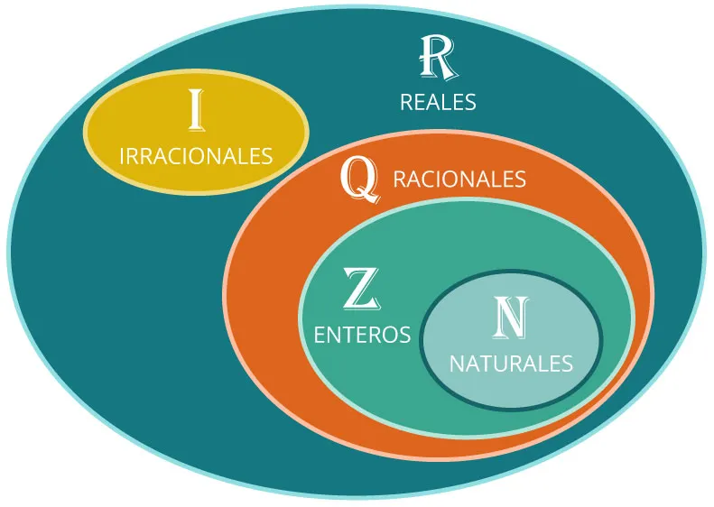
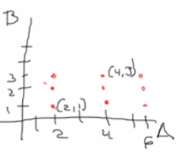
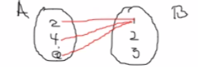
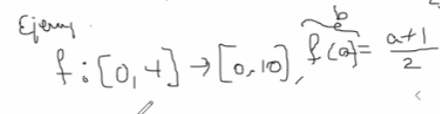

## ¿Qué es una función?

- Herramienta que ayuda a asignar un valor
- Una regla de correspondencia de un dominio a un codominio
- Un valor relacionado que dependía de otro valor
- Demostrar la dependencia de dos valores
- Ley que relaciona una o más independintes con una dependiente

**Dominio** : Valores para los que esta definida la función

**Conjuntos** : Colección de objetos en los cuales se establece claramente y sin lugar a dudad si un elemente perteneco o no a un conjunto

## Conjuntos numéricos

1. **D** Los dígitos {0,1,2,3,4,5,6,7,8,9}
2. **N** Los naturales(AKA enteros positivos)
3. **Z** Los enteros (tanto positivos como negativos) 
4. **Q** Los racionales
4. **R** Los útimos son los números reales

## Relación

Una relación es un subconjunto del producto cartesiano

**Ejemplo** |
--- | 
A = {2,4,6} |
B = {1,2,3} |
*Producto cartesiano* |
A x B = {(2,1),(2,2),(2,3),(4,1),(4,2),(4,3)(6,1),(6,2)(6,3)} |
 |

Regla de correspondencia => condición

En este ejemplo puede haber 29=512 relaciones diferentes

Algunas relaciones pueden ser:

- Una colección de parejas se cada elemente a con el 1 en B = {(2,1),(4,1),(6,1)} = 
- Una relacion de cada elemento de A con su igual en B = {(2,2)} = a=b
- Una relación de cada elemento de A con su mitad en B = {(2,1),(4,2).(6,3)} = b=a/2

**Dominio** 1er conjunto del producto cartesiano, conjunto de salida (calores a los cuales se aplica la regla de correspondencia) siempre se ubica en el eje x (horizontal)

**Contradominio** 2do conjunto del producto cartesiano, conjunto de llegada (valores obtenidos depués de aplicar la ley de correspondencia) siempre se ubica en el eje y (vertical)

**Función** Relación entre dos conjuntos que asigna a cada valor del dominio uno y solo un valor del contradominio a través de la regla de correspondecia

## Clasificación de funciones por su regla de correspondencia

Algebraicas | Trascendentes
--- | ---
contantes | Trigonometricas {directas, reciprocas, inversas}
lineales | Exponenciales
cuadraticas | Logarítmicas
cúbicas |
polinomiales |
radicales |
valor absoluto |
racionales |

## Notación de una función

f : A -> B , f(a) = regla de correspondencia
> A es el domino y B el contradominio

Ejemplo:

a | b 
--- | --- 
0 | 1/2
1 | 1
2 | 3/2
4 | 2

El conjunto de salida es de 0 a 4 por lo que no existiran 

## Tarea 

- Revisar el punto 1.5 de classroom
- Realizar tarea en Khan Academy