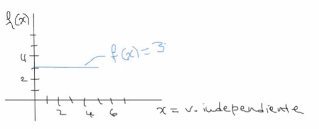
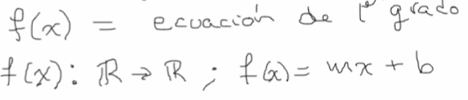
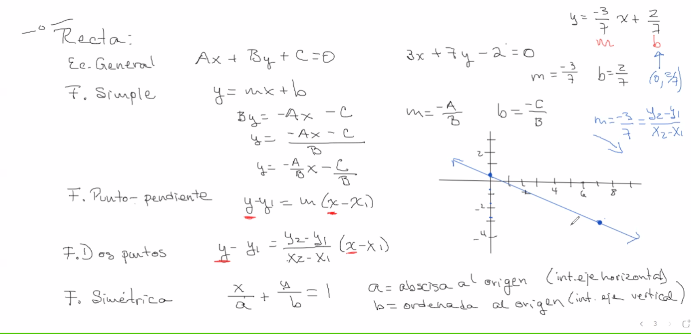
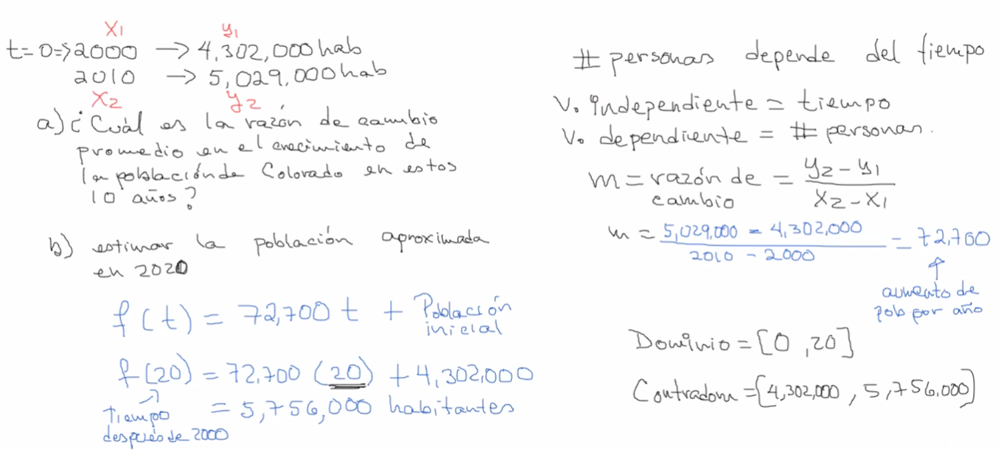

### Clasificación de funciones de acuerdo a dominio y contradominio

- Inyectivas
- Suprayectivas o sobreyectivas
- Biyectivas → función inversa

Funciones | Definición | Ilustración
--- | --- | ---
**Constante** | Es una función que ascocia a todos los valores del dominio con un solo valor en el contradominio |  
**Lineal** | Se representa como una recta, no tiene mas de dos variables, las claves son identificar a la pendiente y a la ordenada al origen  |      
