### Extra

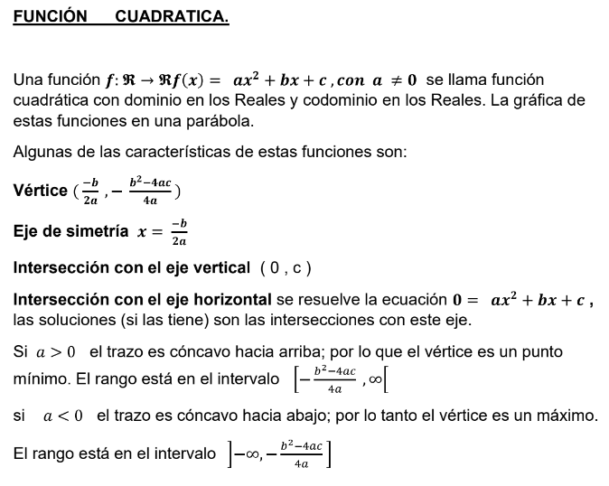  

### Ecuación de segundo grado

    Ax²+Bxy+Cy²+Dx+Ey+F=0

### Función de segundo grado

    f(x)= ax² + by + c : R → R

La definición de función dice que solo es función si a acada valor del dominio le asignas uno en el contradominio, por lo que las parabolas que se encuentran de forma no vertical no son funciones, parafraseando, si tiene dos puntos "y" en un solo "x" no es función.

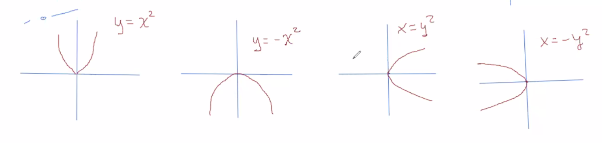 
 

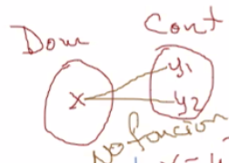 

### Función cuadratica

- El termino independiente indica el cruce con el ejer vertical
- El coeficiente indica a que lado abre la parabola, si es positivo la parabola tiene un mínimo y si es negativo tienen un máximo

**Ejemplo**

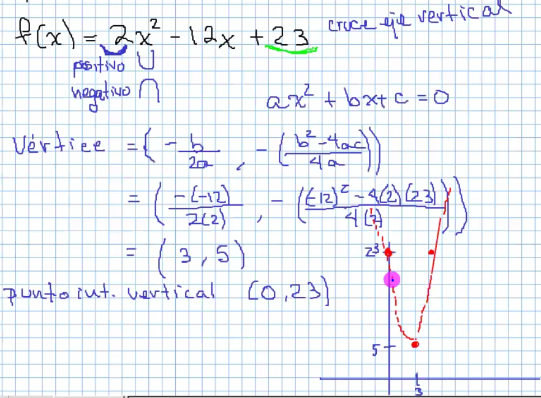 

**Ejemplo de forma canónica de parabola vertical**

Pasos:
1. Separar al termino independiente
2. Sacar un factor común 
3. Obtener un trinomio cuadrado perfecto
4. Acomodad la ecuación

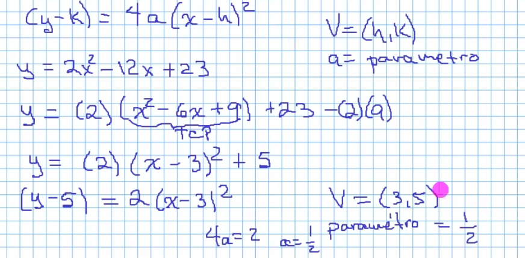 

### Analisis de transformaciones

Ecuación | Grafica
--- | ---
f(x)= x² | 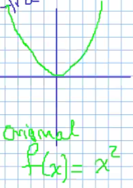 
f(x)= x² - 4 | 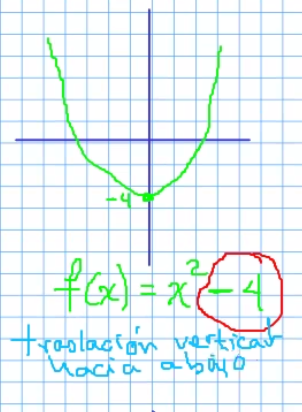 
f(x)= x² + 5 | 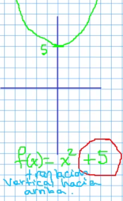
f(x)= (x - 4)² | 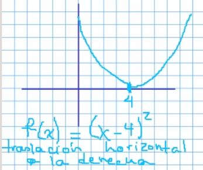 
f(x)= (x + 2)² | 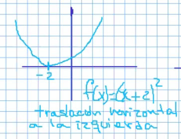
f(x)= -(x)² | 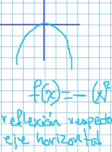
f(x)= (-x)² | 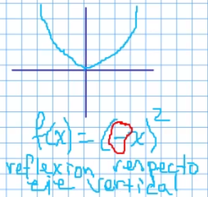 
f(x)= -(-x)² | 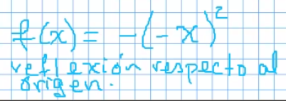 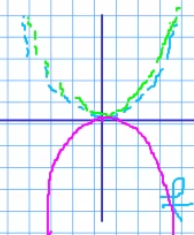

