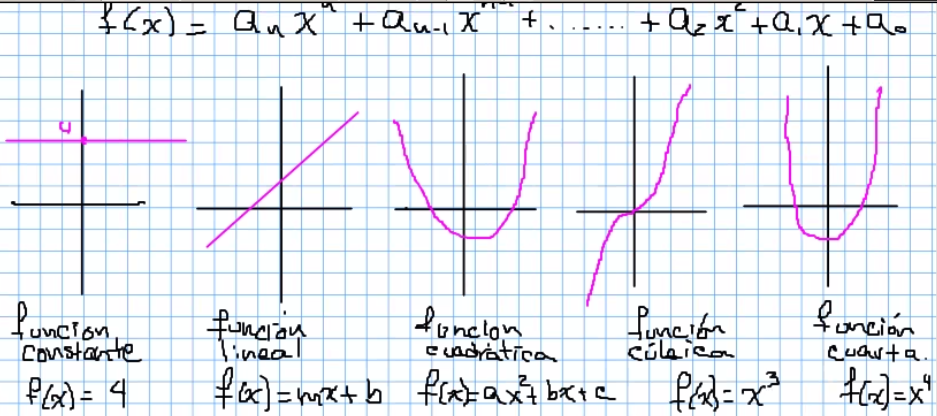
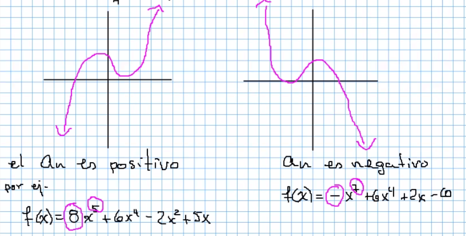
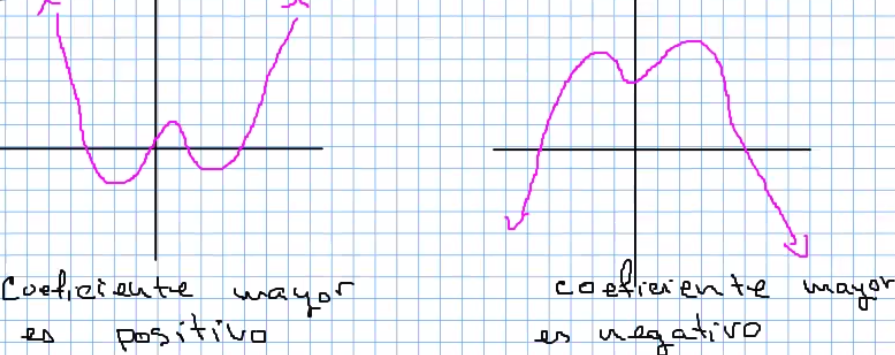
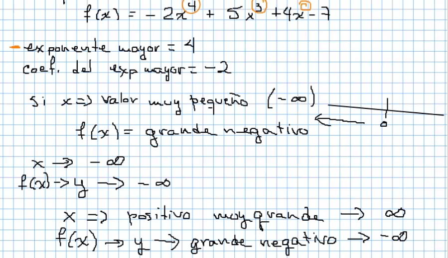
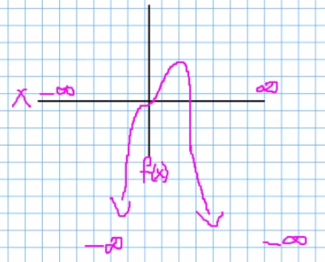

### Repaso de funciones

  

## Función polinomial

> N tiene que ser positivo y entero para ser número raciuonal

Cuando la potencia mayor (n) sea impar, el trazo que predomina es el de la cúbica.

  

Polinomiales con exponente mayor (n) par, el trazo que predomina es el de la parábola (U).

  

**Ejemplo:**

  

  

Cuando en los puntos donde la gráfica toca el eje "x" hay un cambio de signo en el valor de "y" , el exponente es inpar. En caso de que no haya cambio de signo, el exponente es par.
