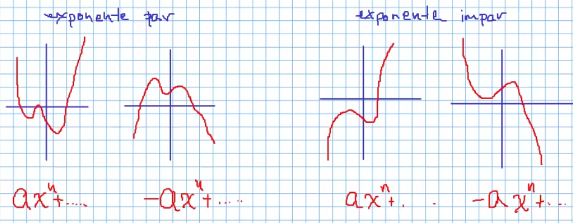
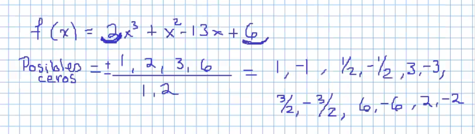
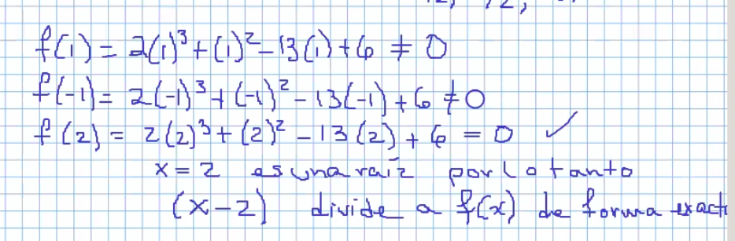
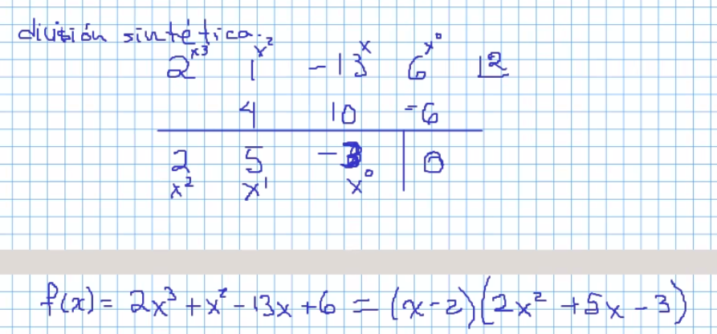
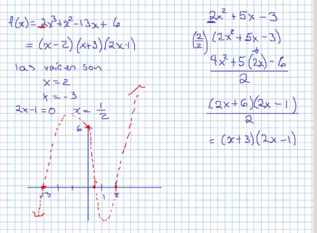
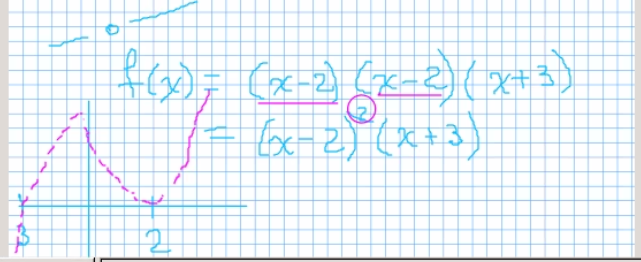

### Recordando ...

  

---

#### Los posibles 0 se obteinen, dividiendo a los divisores del termino independiente entre los divisores del coeficiente del termino con exponente mayor

En este ejemplo los numeros de arriba son los divisores del número independiente, en este caso 6 y los de abajo son los divisores del coeficiente del termino con exponente mayor. en este caso 2x³, esto se resuelve:

Todas las raices cruzan el eje x,  solo en casos donde un factor se encuentre un número par de veces en las raices, la grafica "rebotará"

