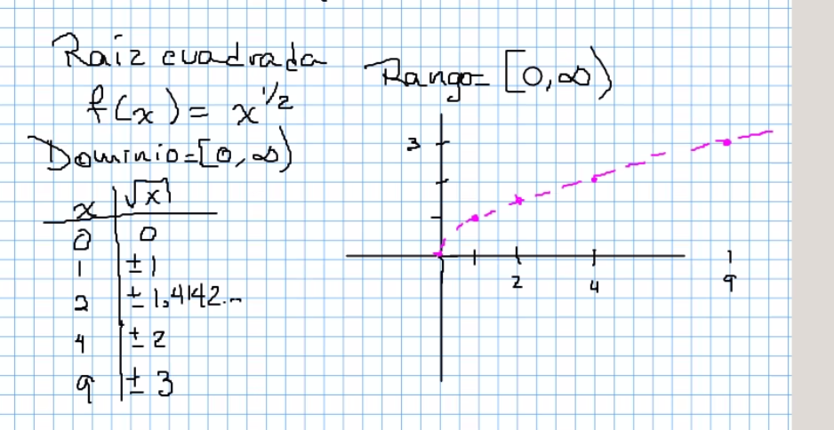
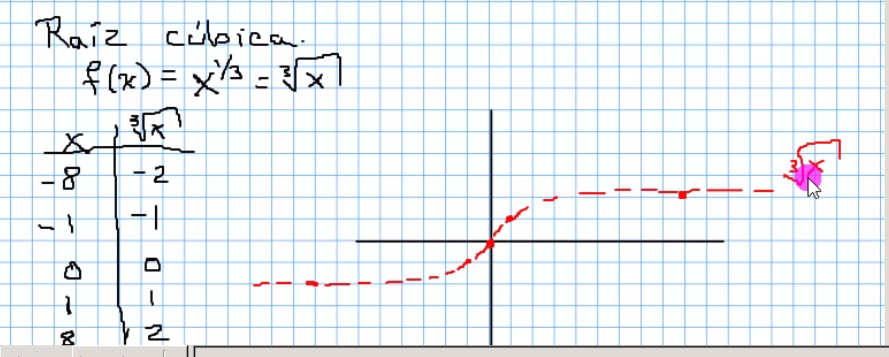
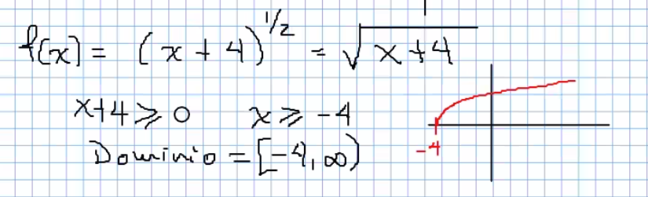
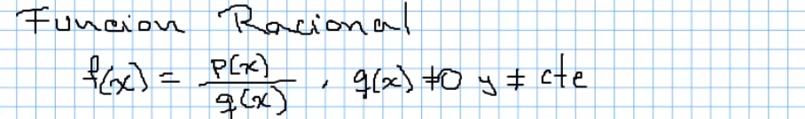
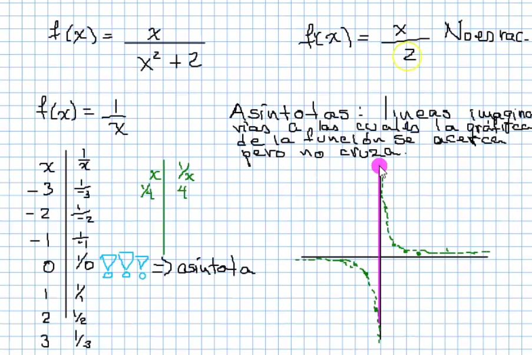
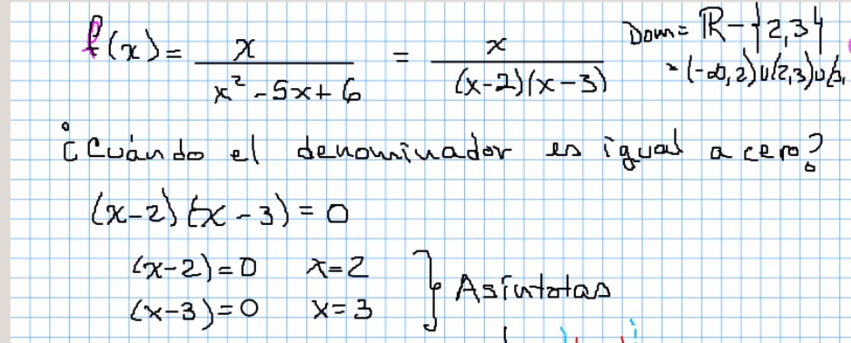
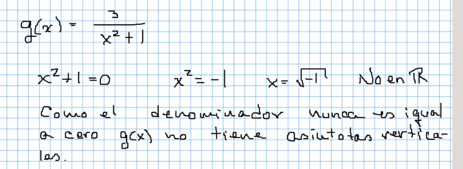
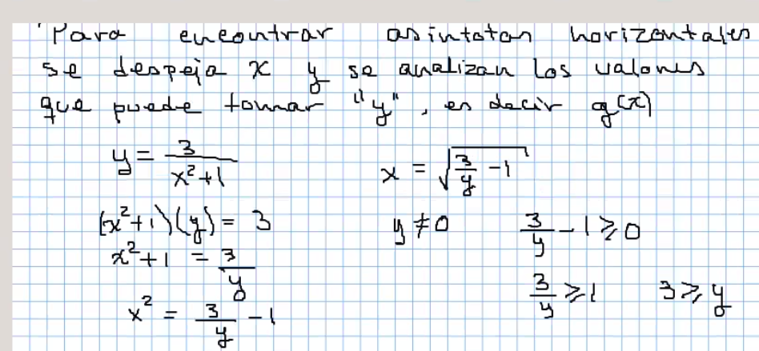
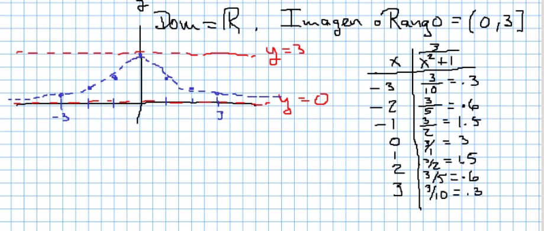

Las funciones que tengan como exponente una fracción par, limitan su dominio a solo valores postitivos

Dominio= [0,infinito]

En raices de orden impar si es posible usar valores negativos

En funciones con suma de constante

## Funciones Racionales

> Una asintota son líneas imaginarias, a las cuales la gráfica de la función se acerca pero no cruza

En funciones racionales analizamos cuando el denominador toma el valor 0

Hay casos sin asintotas verticales

> **Funciones acotadas**, donde se limita los valores a un intervalo.

## Las asintotas son líneas imaginarias que marcan un cambio, nos ayudan a su estudio pero no forman parte de la funcion.