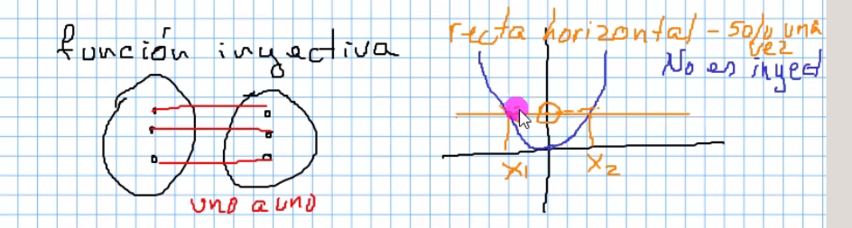
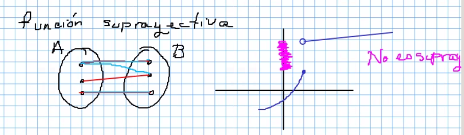
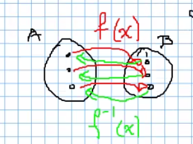
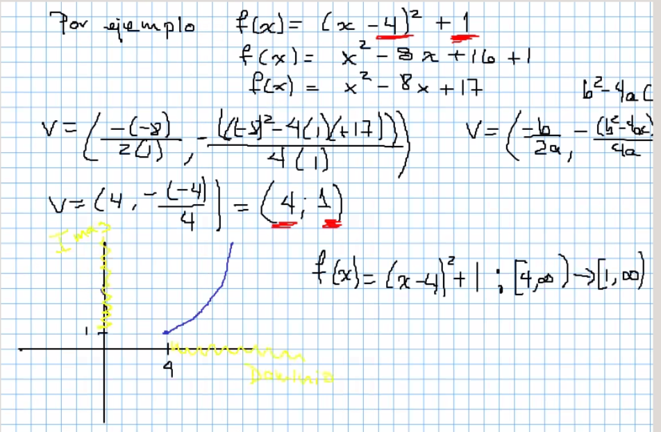
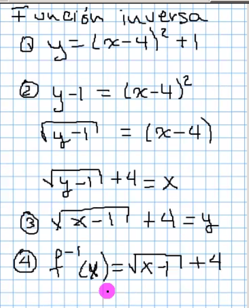
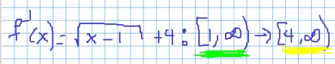
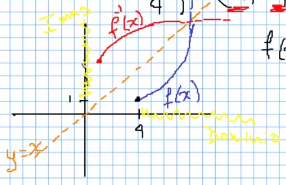
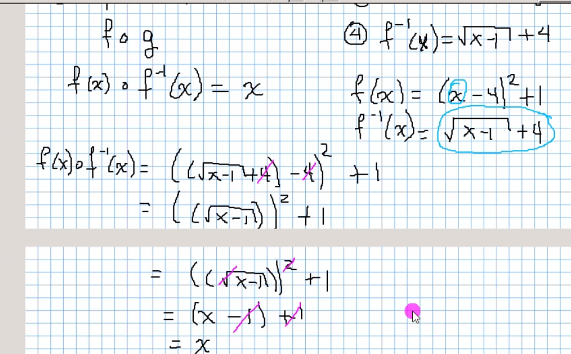

## Inyectivas

TOdo valor en A tiene uno y solo un valor en B.

Para ver gráficamente si una función es inyectiva, trazo líneas horizontales, si estas líneas cruzan la gráfica una solo vez, la función si es inyectiva.

El ejemplo claro son las rectas:

## Suprayectiva

No existen valores en B que no tengan un valor en A.

Gráficamente se representa cuando no existen saltos de valores de y. El trazo debe ser continuo.

## Biyectiva

Debe ser Inyectiva y Suprayectiva, es decir, se deben cumplir ambas condiciones.

Si es Biyectiva, podemos asegurar que tiene una función inversa (permite ir del conjunto imagen al conjunto dominio).

Para encontrar la regla de correspondencia de la función inversa: sustituimos f(x) con y, despejamos a la x, intercambiamos variables, la y obtenida es la función inversa, se escrive como f⁻¹(x).

### Ejemplo

La recta naranja es la recta de identidad

## Composición "o", fog = f compuesta con g

Cuando hacemos la composición de la función original con la función inversa, si se obtienen como resultado "x", se puede afirmar que las funciones son inversas.

### Repaso para examen

Esta en el apartado 1.16 :)