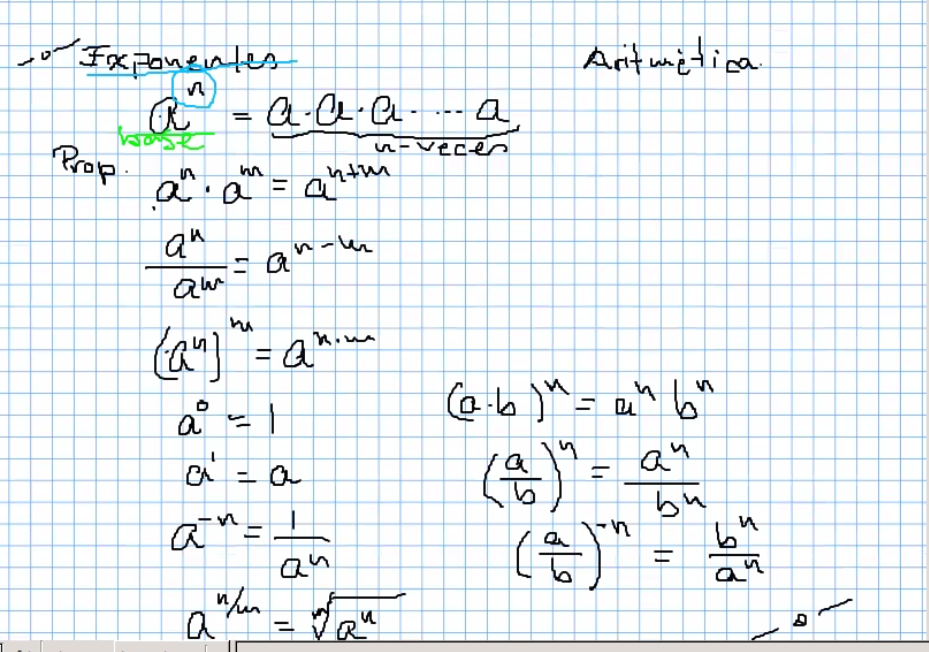
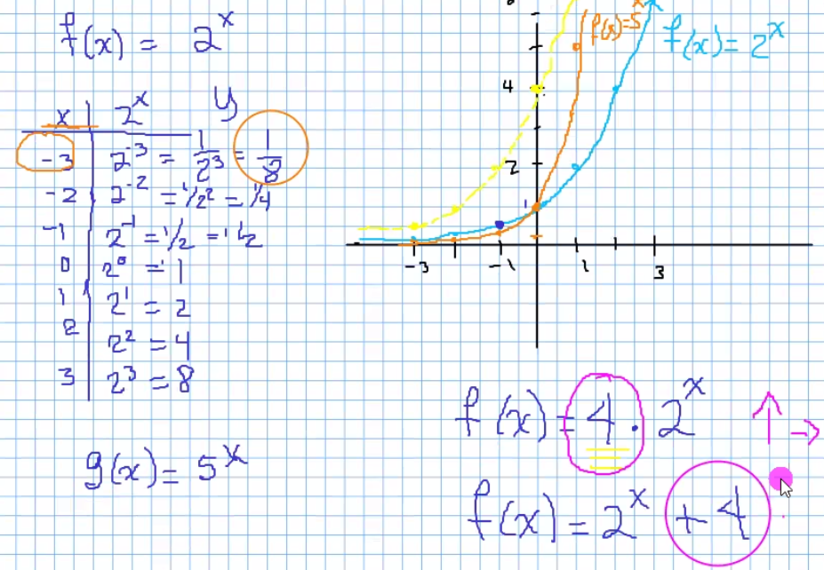
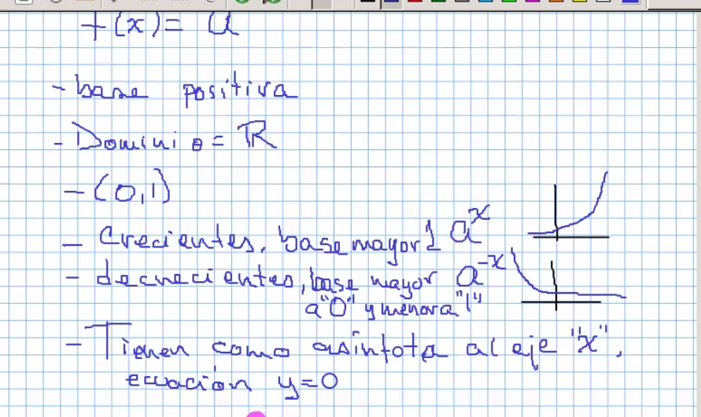
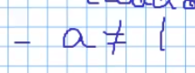
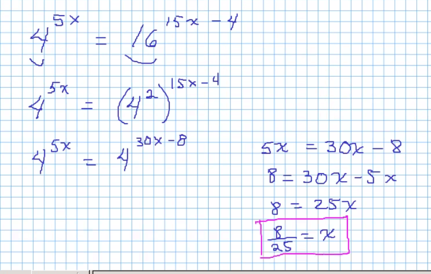
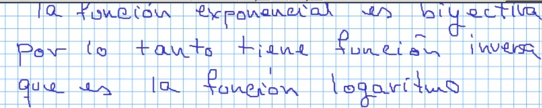
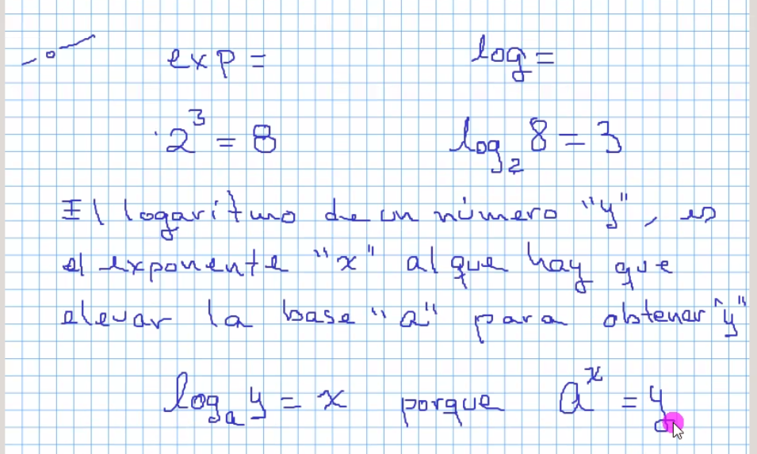
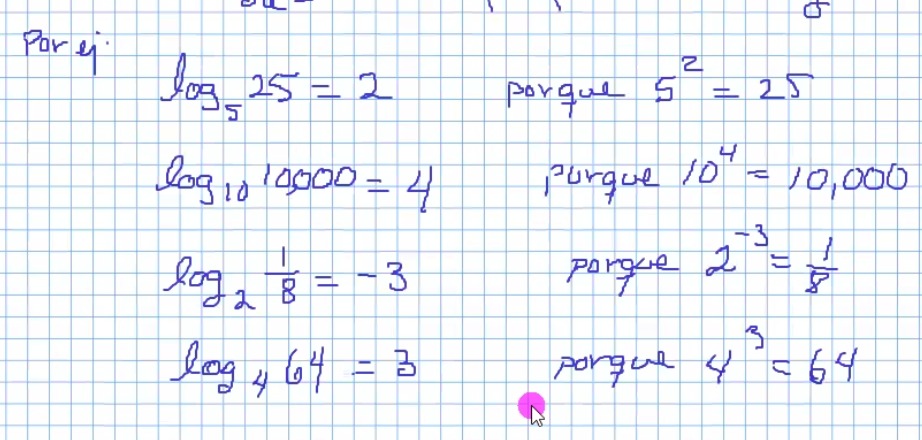
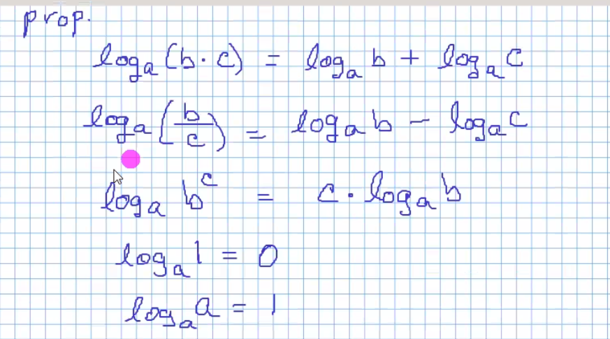

# Funciones exponenciales

## Exponentes

El exponente es el que indica cuantas veces se va a multiplicar por si mismo.

## Funciones

La variable independiente esta en el exponente. 

> Siempre tienen como base un número positivo, si fuera negativa no sería función.

Propiedades:

La forma facil de comprobar una igualdad es si los exponentes son iguales.

### Ejemplos 

Si las bases no son iguales:

Si ni las bases ni los exponentes son iguales se usan logaritmos

## Logaritmos

