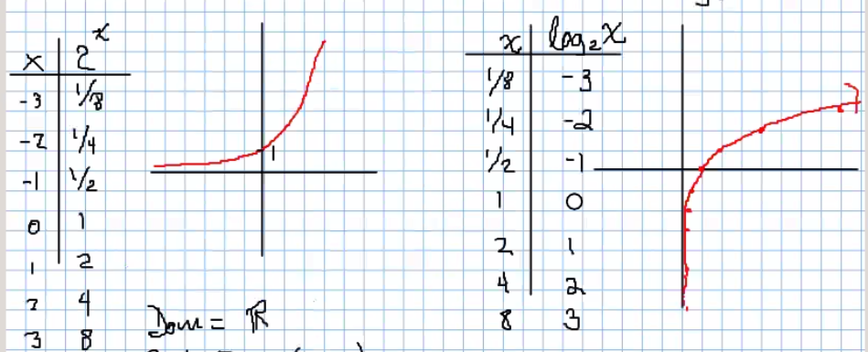
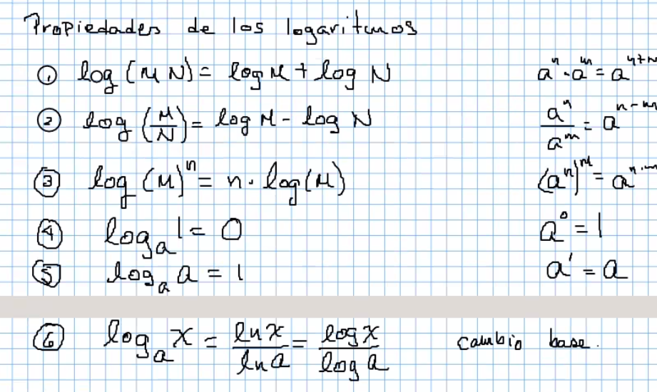
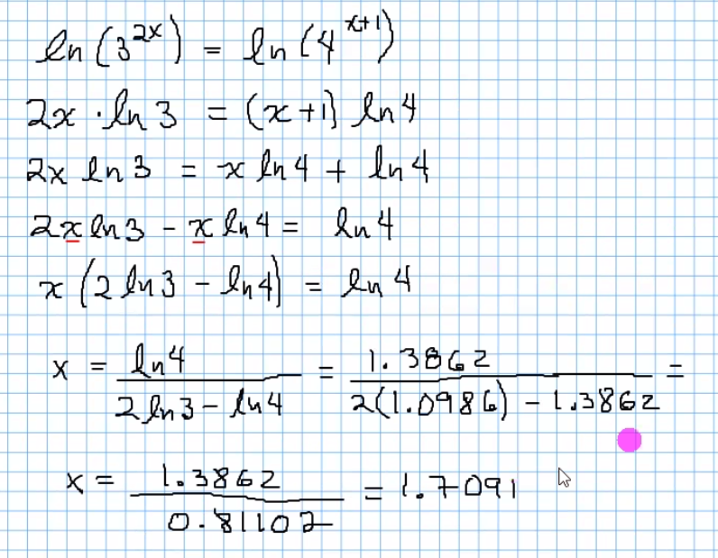
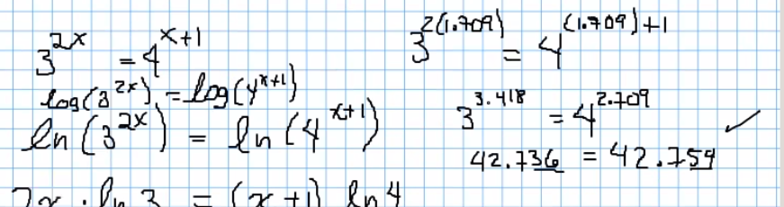
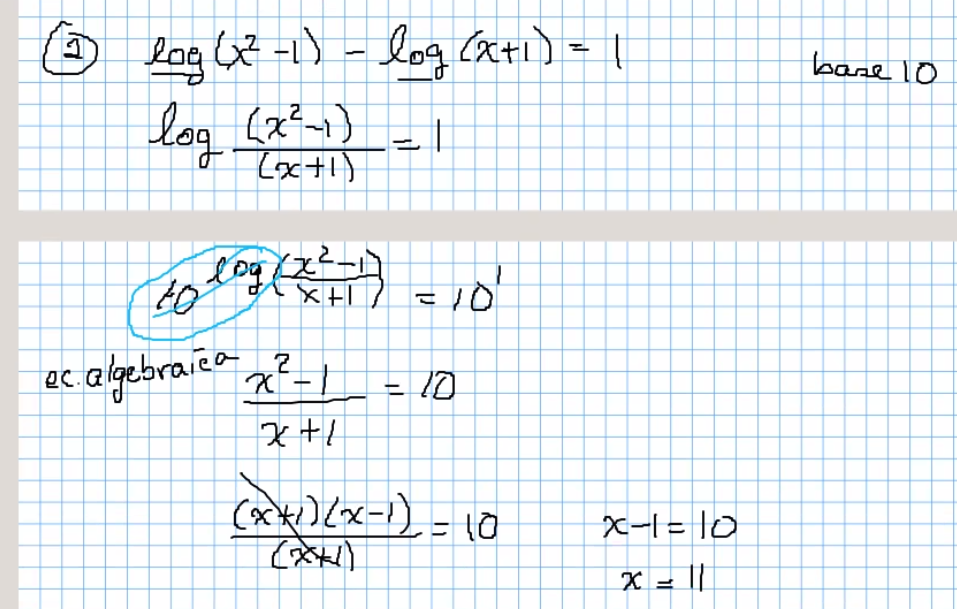

# Funciones logaritmicas

La función exponencial es la inversa de la función logaritmica.

## Graficas

No se puede calcular logaritmos de números negativos

Exponenciales | Logaritmicas
--- | ---
Dominios: Reales | Dominios: (0,infinito)
Cruza: (0,1) | Cruza: (1,0)
Creciente: a>1 | Creciente: Una onda
decreciente 0 < a < 1 | Contradominio=Imagen=Reales
Asintota: Eje horizontal | Asintota: Eje vertical

## Propiedades de los logaritmos

    ln = logaritmo natural → base "e"
    log = logaritmo base "10"

## Ecuaciones exponenciales de base diferente

### Ejercicio 1

### Ejercicio 2

