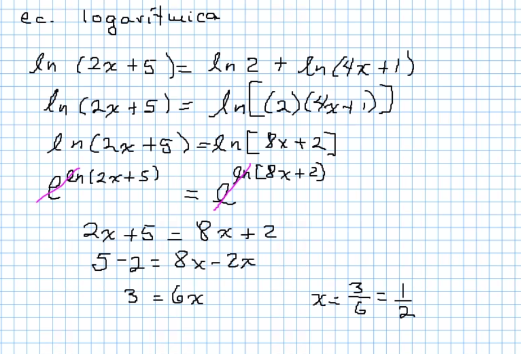
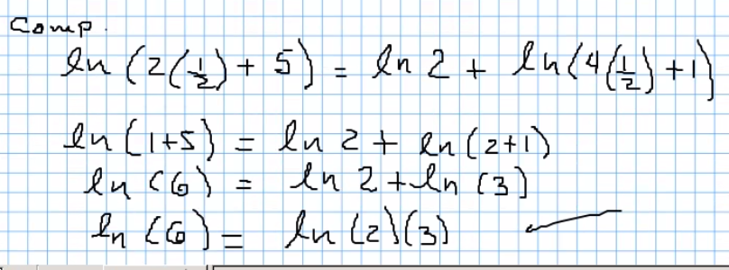
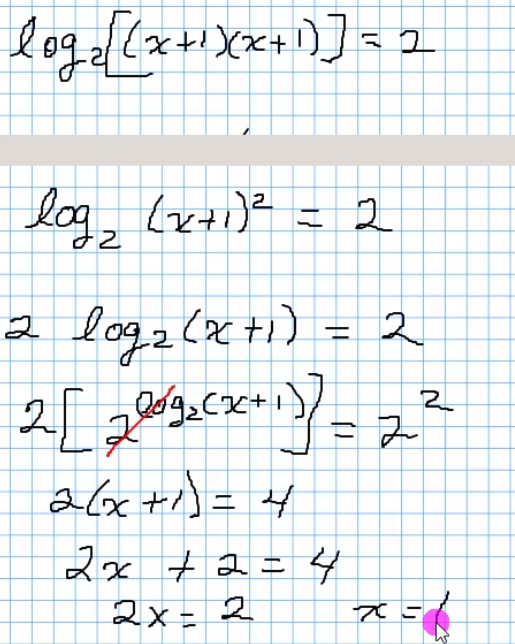
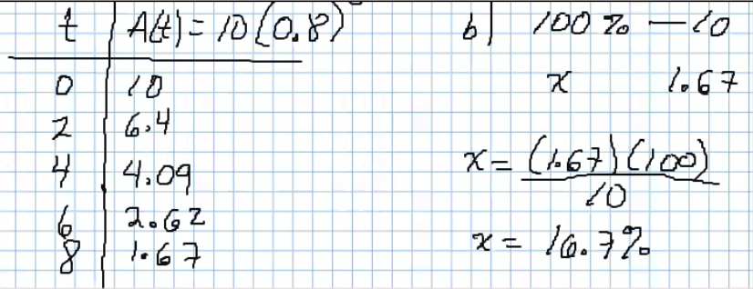
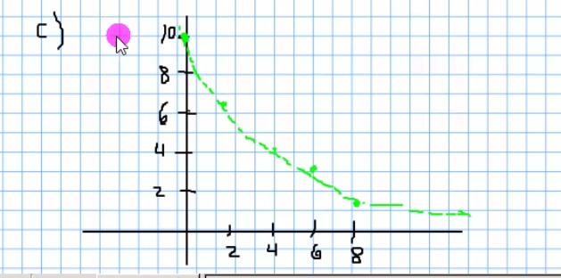
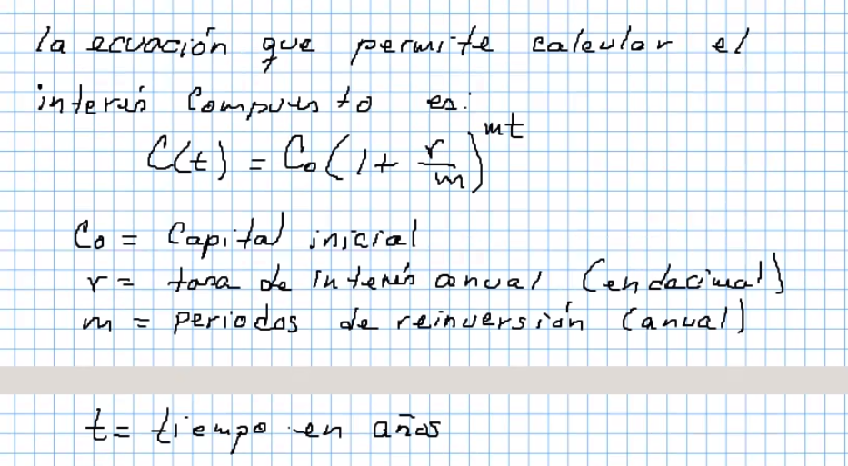
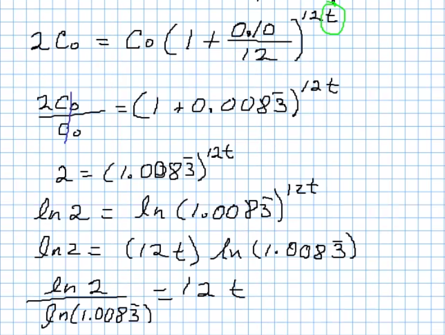
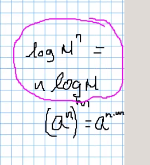
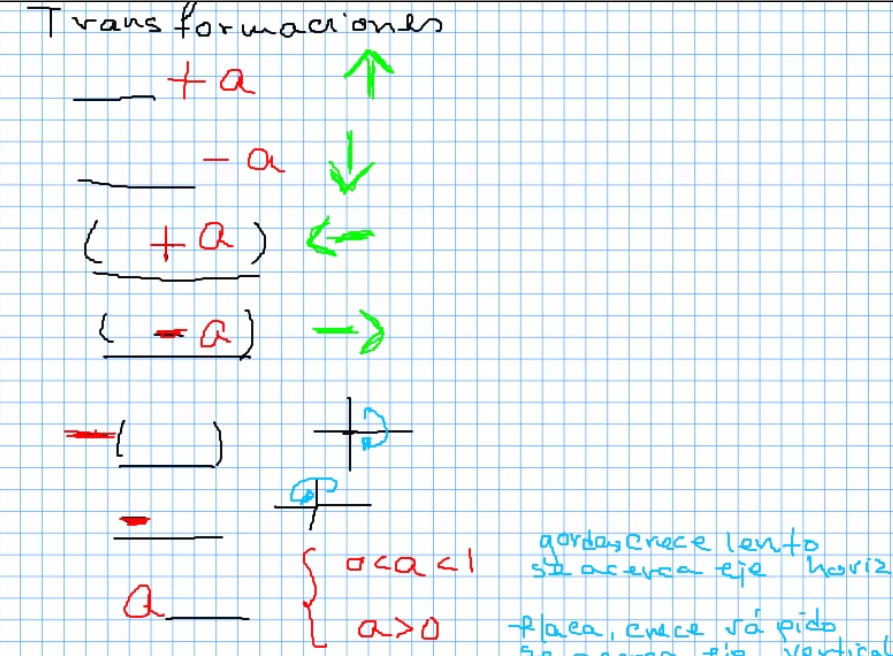

# Funciones logaritmicas

## Ejercicio1

Comprobación:

## Ejercicio2

## Problema 1

Un medicamento se elimina a través de la orina siguiendo la función
 `A(t) = 10(0.8)^t` si la cantidad inicial del farmaco en el cuerpo,
 es unadosis de 12 miligramos, y el tiempo esta dado en horas:

- a) Calcular la cantidad del farmaco cada 2 horas, desde que se administra,
 hasta pasadas 8 horas.
- b) Que porcentaje del medicamento, esta aún presente después de 8 horas?
- c) Representar graficamente como se va eliminando el medicamento.

## Problema 2

Quiero invertir $10,000 a plazo fijo durante un año y mensualmente
 de interés es el 20%

- 0 mes → 10,000
- 1 mes → 12,000
- 2 mes → 14,400

Cuantos años se tardara, en años, en duplicar una cantidad
 que esta invertida a un 10% de interes anual compuesto?

## Transformaciones

