# Funciones trigonometricas

## Razones trignomoetricas

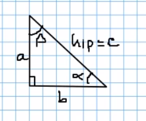
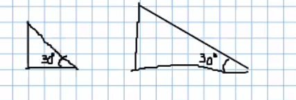

## Razones trigonometricas y las reciprocas

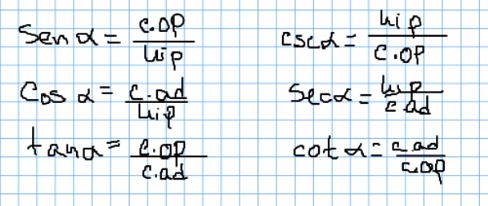

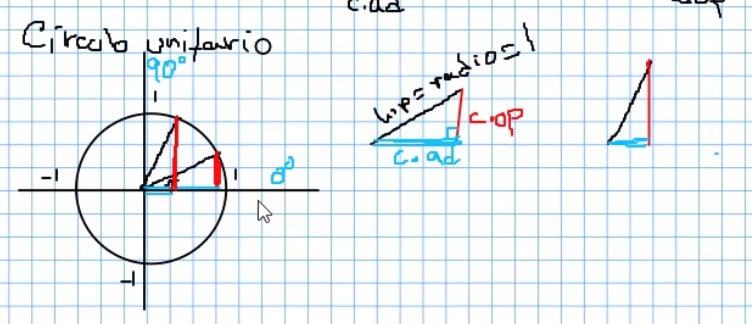

> El rango son los valores que toma en "y"

## Radianes

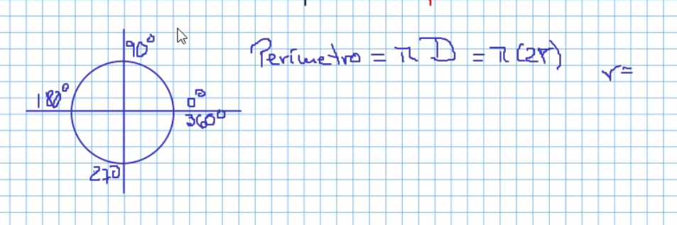

### Conversiones ejemplo

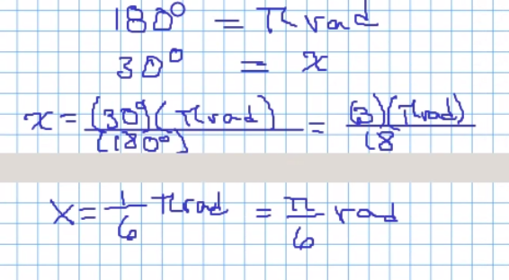
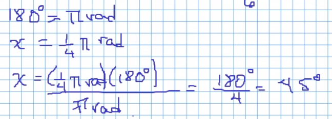

### Seno

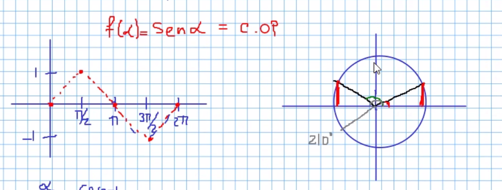
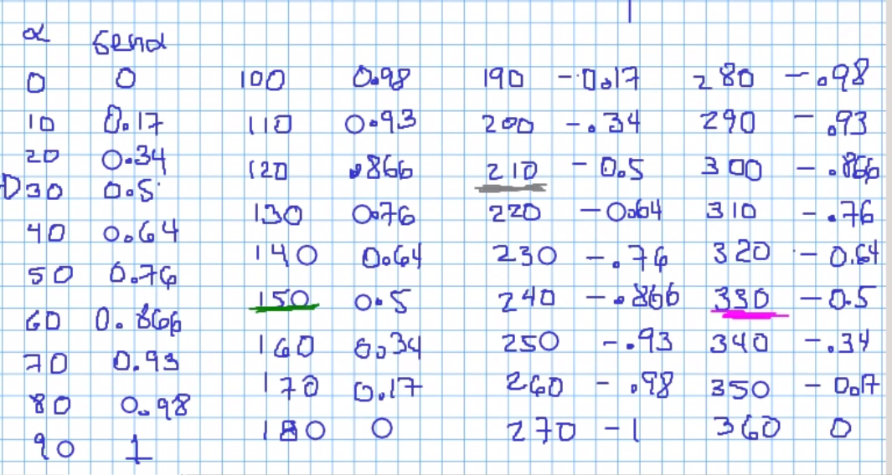

### Coseno

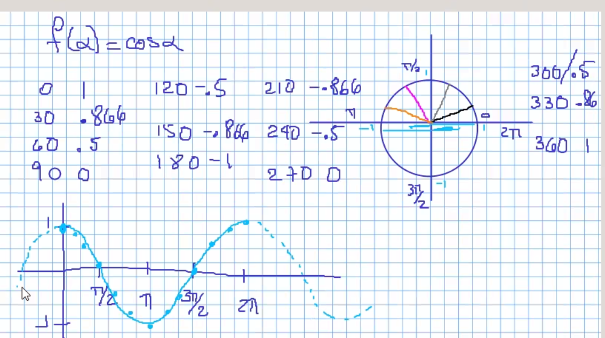

### Seno y Coseno

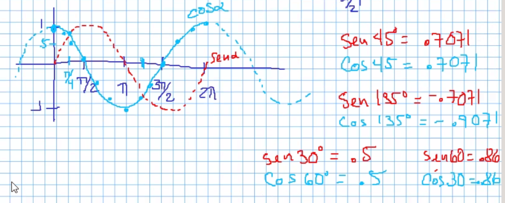

