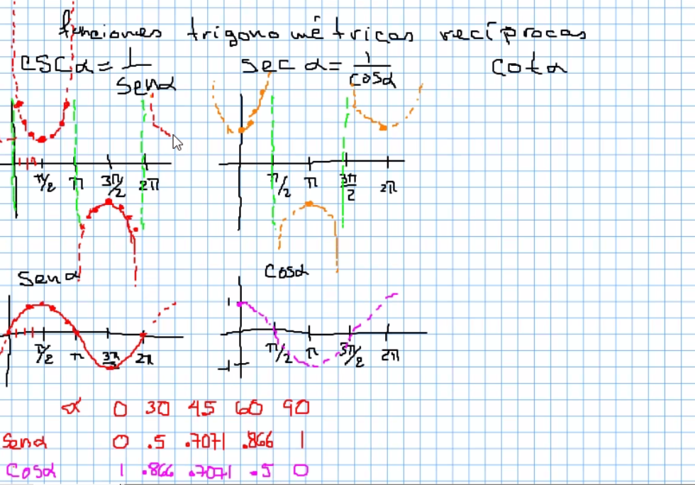
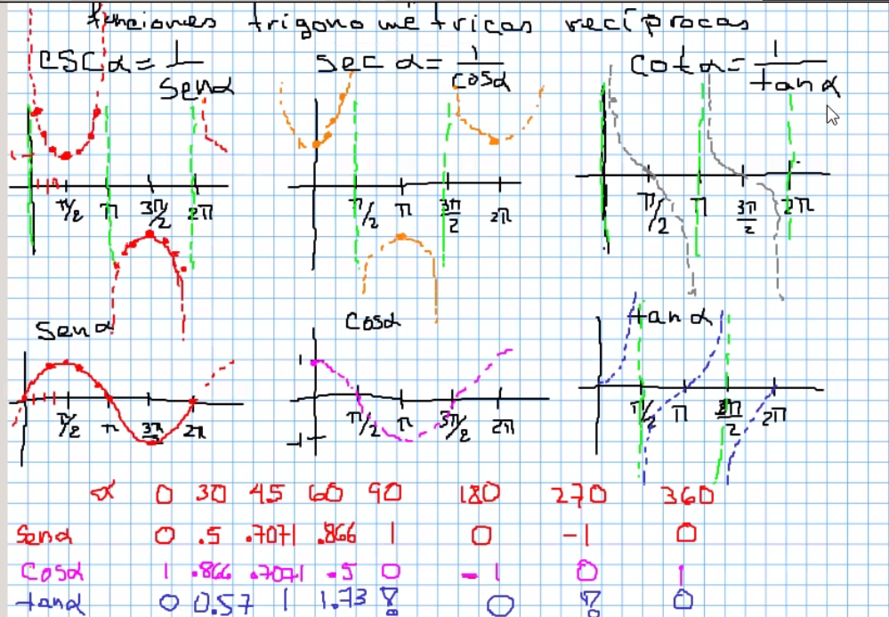
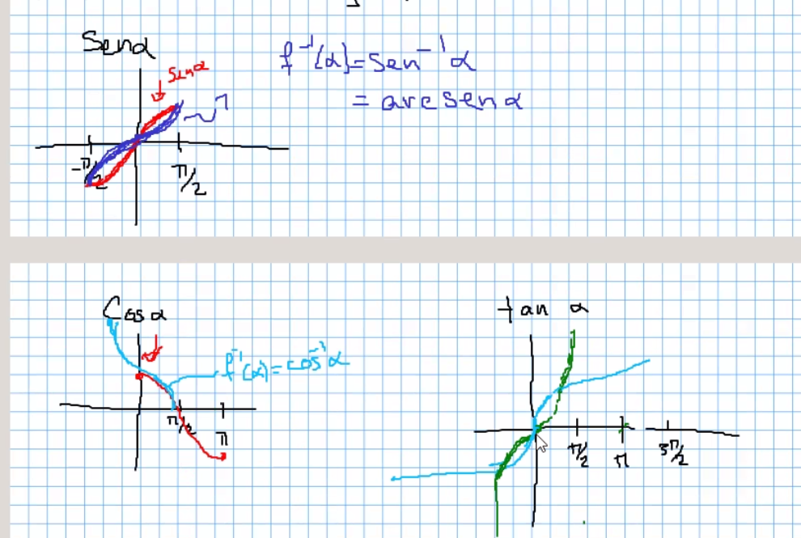
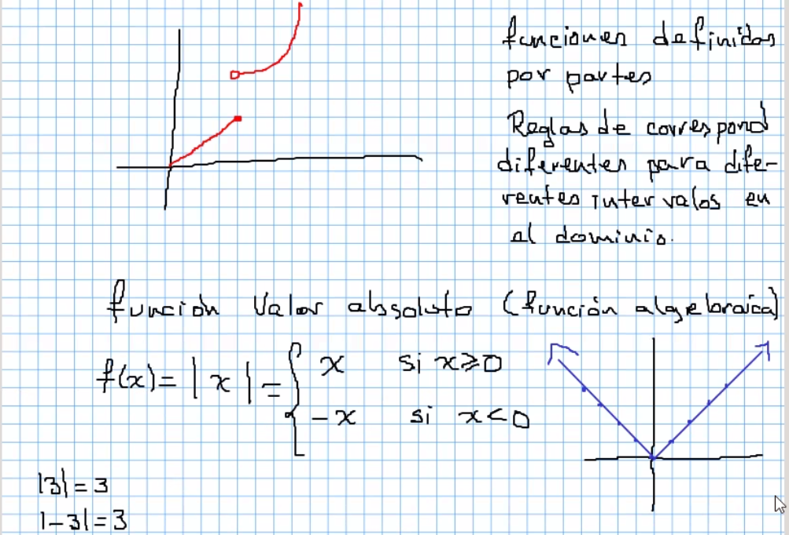

# Funciones trigonometricas reciprocas

## Seno y coseno

Seno y coseno son contrarios, uno se puede mover para obtener al otro.

## Con tangente

## Funciones inversas

Se limita el dominio a un subconjunto del periodo original
 para garantizar que la función sea biyectiva.

## Funciones escalonadas

