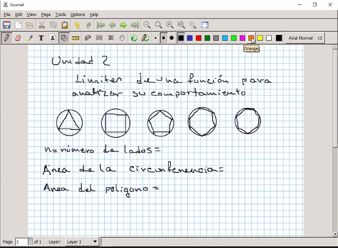
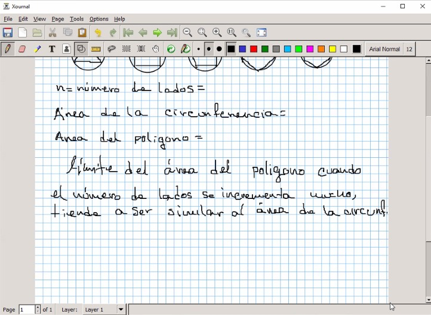
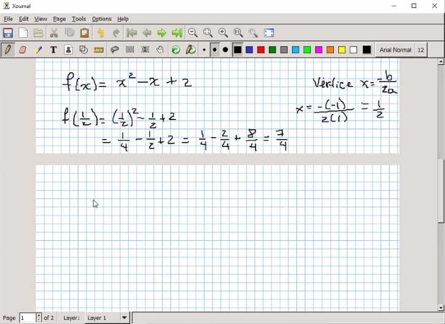
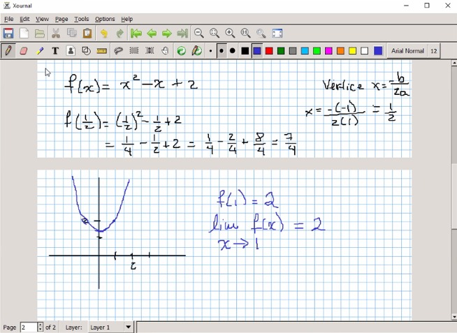
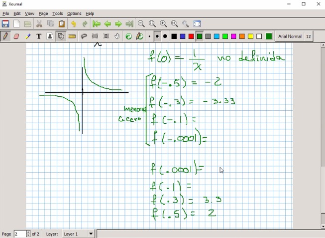
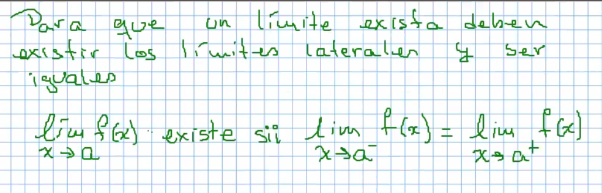
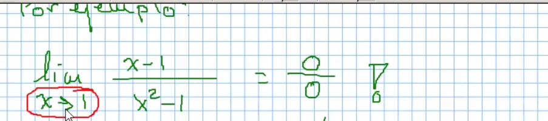
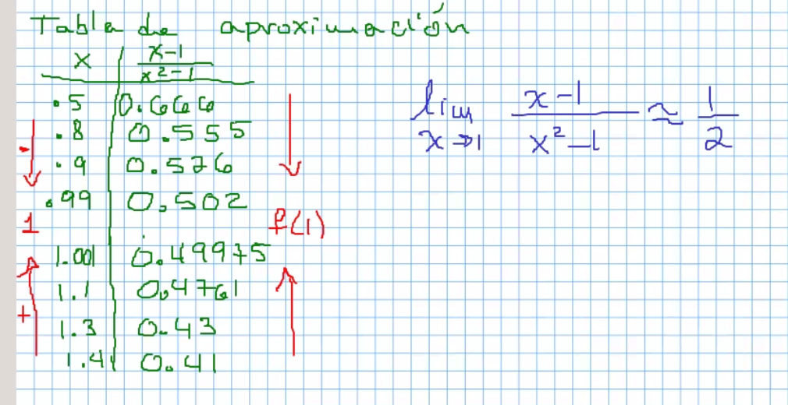
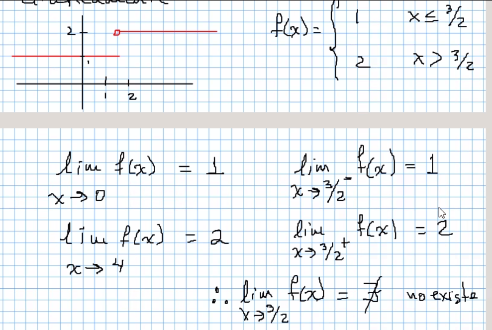
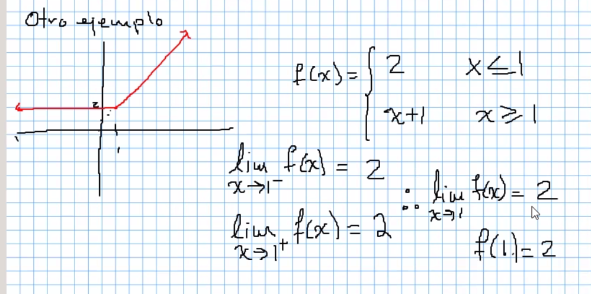

# Unidad 2 Limites

Evaluar la función : simplemente sustituir el valor en la tabla de correspondencia.

Calcular un límite por aproximaciones : tomar un intervalo de valores mas grandes
 que la variable y analizar que pasa con la función, si los valores se acercan a
 un mismo valor, quiere decir que el límite existe.

