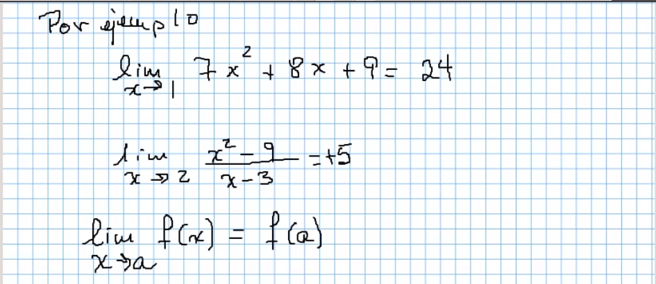
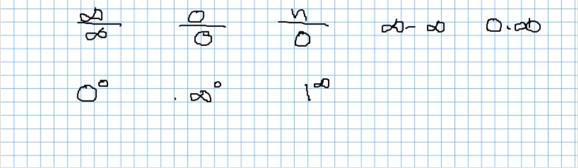
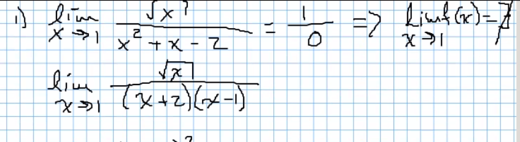
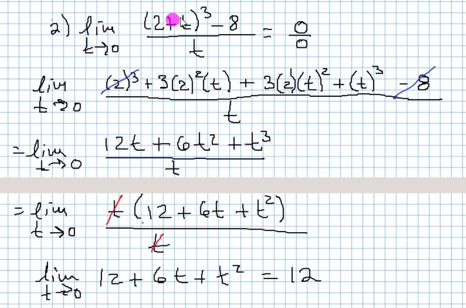

# Unidad 2 Limites

## Para calcular limites algebraicamente

### Sustituir el valor de "a"

Cuando al sustituir el valor "a" aparece una
 "indetermincación" podemos recurrir a un
 "truco algebraico" para identificar si es
 una indetermincación absoluta o removible.

#### Indeterminación

El resultado puede ser infinito, el resultado
 no esta definido.

Para resolver estos limites indeterminados, podemos recurrir a:

- Factorización y simplificación de expesiones algebraicas.
- Racionalización del denominador.
- Multiplicación por el conjugago cuando aparece una
 diferencia de terminos que contengan a un radical. (orden par)

Ejemplo:

